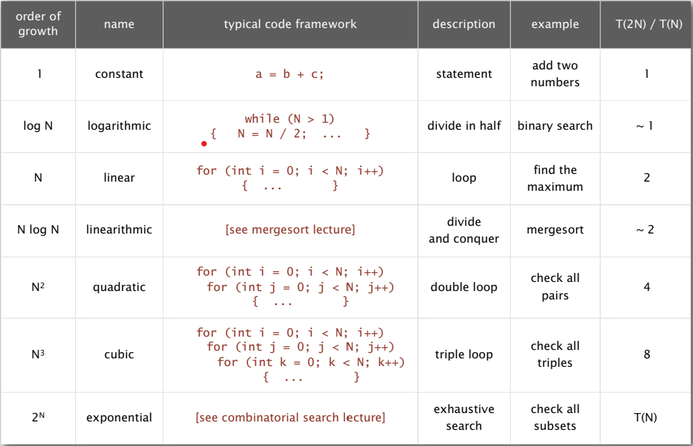
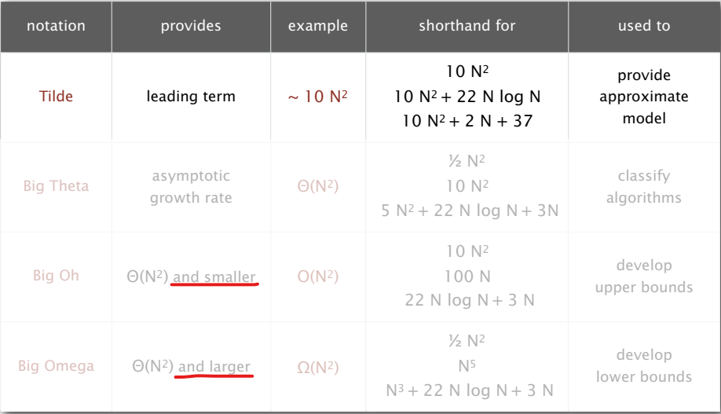
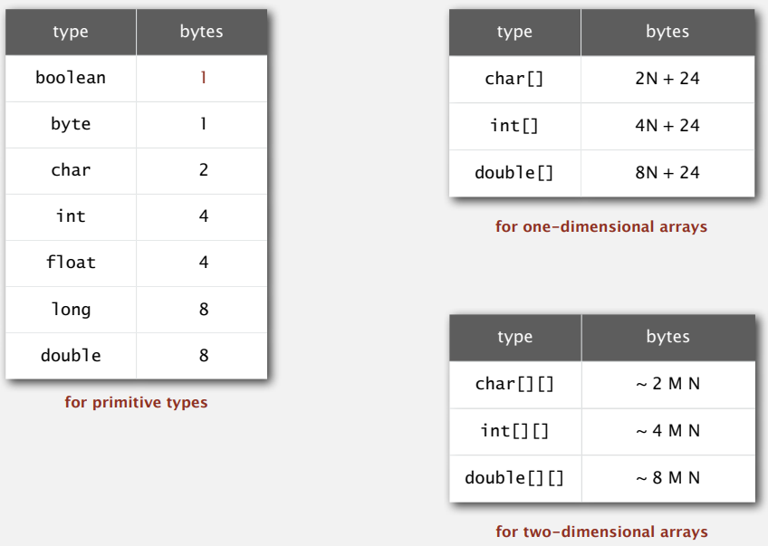
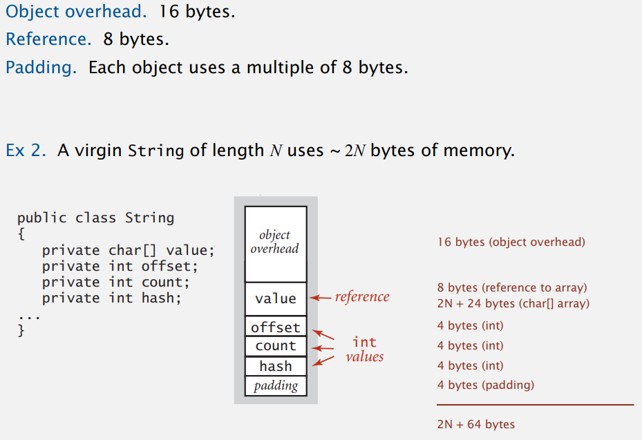

# 1.4 Analysis of Algorithms

## observation

透過實驗輸入量與運行時間的關係，用 log log plot 能找出斜率，假設大約是 3

$lg(T(N)) = b\ lg N + c$ 

 $T(N) = a\ N^b$

$51.1 = a * 8000^3$

$a = 0.995 * 10^-10$ (power law)


## mathematical models

The Art of Computer Programming - Donald Knuth

  

## order-of-growth classifications

介紹常見時間複雜度，現今資料量越來越多的情況下，只有包括$NlogN$ 與更好增長階數的算法才能求解巨大問題。  

常見的時間複雜度




  

## theory of algorithms

算法的分析中，會遇到幾種情形，包括 best case, worst case，畢竟輸入的資料有時會需要不同處理時間，而我們又需要一個 average case 來表示該算法對於隨機輸入的性能表現。  

於是計算機科學家提出一種方法，盡可能去掉細節，把分析精度做到只差一個常數的倍數，並且忽略掉不同輸入的情況，只針對 worst case ，如此便能單純使用時間複雜度來討論算法的性能。  

  

因此確認一個算法是否為該問題最好的算法是，

1. 使用不同輸入都能將運行時間的浮動控制在一個常數時間內，這就代表了 worst case
2. 確認沒有其他算法能夠提供更好的性能保證

  

用來表示算法理論的常見的符號



常搞混的概念

- BigO 是 upper bound，也包含以下
- 運行時間是 Tilde 而不是 BigO

  

現在新設計的算法都是在降低 upper bound，使其對 worst case 有更好的性能；此外要提升 lower bound 是非常困難的；如果 upper bound 與 lower bound 仍存在間隔，那就存在著算法改進的可能性。  

  

## memory

Java 資料型態使用的記憶體



​    

Java 物件使用的記憶體



10 個字的 string 就是 char[10] 所以有 2 * 10 + 24 的記憶體使用量 

   

練習

```java
public class WeightQuickUnionUF {
    private int[] id;
    private int[] sz;
    private int count;
    
    public WeightQuickUnionUF(int N) {
        id = new int[N];
        sz = new int[N];
        for (int i = 0; i < N; i++) id[i] = i;
        for (int i = 0; i < N; i++) sz[i] = 1;
    }
    ...
}
```

- object overhead : 16
- id : 8 + 4 * N + 24
- sz : 8 + 4 * N + 24
- count : 4
- padding : 4

total : ~ 8N


## summary

經驗分析

- 執行程式，透過假設 power law 模擬出執行時間的假說，來對執行時間做出**預測**

數學分析

- 分析昂貴成本的操作之頻率，使用 taild notation 簡化分析，來預測甚至解釋程式的行為

  

數學分析能夠獨立於特定機器，甚至對不存在的機器做也適用，但使用經驗分析驗證數學模型仍是必要的，這樣在預測與分析算法時會更有保證。


