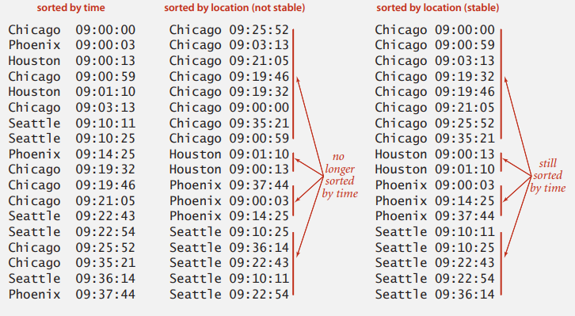

# SORT SUMMARY

## 常見排序類型

依照時間複雜度來分類可以分為  

| 時間複雜度 | 算法                                                    |
| ---------- | ------------------------------------------------------- |
| $O(N^2)$   | Bubble sort、Selection sort、Insertion sort、Shell sort |
| $O(NlogN)$ | Merge sort、Quick sort                                  |
| $O(N)$     | Bucket sort、計數、基數                                 |

備註: $O(N)$ 量級不是基於比較的排序


> Insertion sort 與 Selection sort 的時間複雜度都是平方級，為甚麼在實際應用上，大多使用 Insertion sort?


其實，分析排序算法時並非只考量時間複雜度而已，那麼在分析排序算法時，還有甚麼其他考量呢?

## 如何分析排序算法

對於排序算法可以從下幾個方面分析

### 1. 最好情況、最壞情況、平均時間複雜度

不同的資料，例如有序、無序的資料，會影響不同的排序算法的性能，因此在分析時要能夠知道排序算法在不同資料上的性能表現。


### 2. 時間複雜度的係數、常數、低階

時間複雜度反映的是資料規模很大時的增長趨勢，但實際應用中，對於中小量規模的資料，即使算法的時間複雜度屬於同一個量級，還是要把係數、常數、低階考慮進去。


### 3. 比較次數和交換次數

基於比較的排序算法的執行過程中，會有比較與交換二種操作，所以在分析不同的排序算法時，要把比較與交換次數也考慮進去。


### 4. 記憶體消耗

排序算法若不消耗額外空間，稱為**原地排序 (Sorted in place)**。


### 5. 排序穩定性

若排序的序列中存在相等的值，經過排序後，相等元素之間的前後順序不變，則是穩定的排序算法。


## Stability

stability 指的是重複的元素(用來排序的 key 重複)經過排序後，彼此間的相對位置不變

```
before	 			2* 3  2  4  1
stable sort			1  2* 2  3  4
not stable sort		1  2  2* 3  4	
```

有時候我們需要的是 stable sort，例如先對買票地點排序，再對購買時間排序



  

判斷一個排序方法是否穩定的方法，通常是看過程中調換元素位置的方式，如有長距離的調換導致可能會越過(與調換元素)重複的元素，就會造成不穩定

- stable

  - selection sort
    - 比較 i 左邊的元素，比 i 大則對調，直到左邊元素小於**等於** i，或到開頭；不會越過相同的元素
  - mergesort
    - merge 時若 i, j 相同則取 i 放入 k

- not stable

  - insertion sort
    - 找 i 右半部最小的跟 i 換，但中間可能有跟 i 一樣的元素

  - shellsort
    - increment 大於 1 時，調換元素之間可能有重複的


## system sort

java 的 sort `Arrays.sort(a)`

- primitive types: quicksort

- reference types : mergesort

  - 因為 java 設計者認為當 client 使用 object 時，sort 會需要 stable，而空間也許不是最重要的，所以 mergesort 使用額外空間不成問題

  

排序算法有上百種，其實並單純不只是將數據排列而已，關鍵在於排序的思想，看應用在甚麼問題上，就需要依照排序的屬性去找到適合的方法

- stable?
- parallel?
- key all dintinct?
- linked list or arrays?
- large or small items?
- need guaranteed performance?
- 陣列是否是亂序?


## Summary

|                     | 是原地排序? | 是否穩定? | 最好     | 最壞     | 平均     |
| ------------------- | ----------- | --------- | -------- | -------- | -------- |
| Bubble sort(優化版) | 是          | 是        | $O(N)$   | $O(N^2)$ | $O(N^2)$ |
| Selection sort      | 是          | 否        | $O(N^2)$ | $O(N^2)$ | $O(N^2)$ |
| Insertion sort      | 是          | 是        | $O(N)$   | $O(N^2)$ | $O(N^2)$ |

