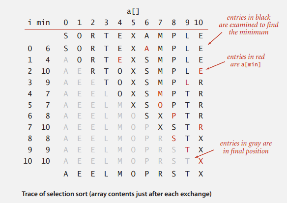
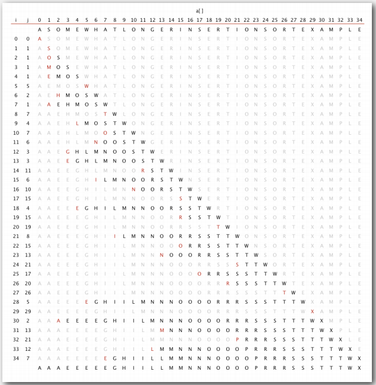
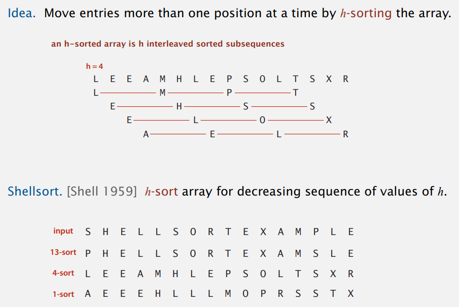
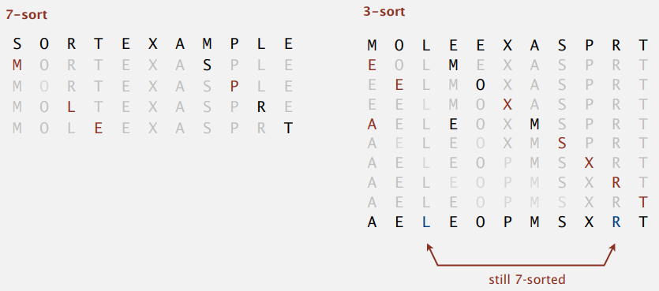

# Elementary Sorts

## rules of game

假設有三個 client ，一個要排序浮點數，第二個要排序傳入的字串，第三個傳入資料夾目錄要排序目錄內檔案，我們必須開發能為任何資料型態排序的算法

  

### Callbacks

目標是要能夠排序任何資料型態，問題是我們的 `sort()` 如何比對傳入元素的大小?  

答案是把比對大小功能由 client 實作  

  

Callback = reference to executable code = 把函數當成參數，傳給其他函數

  

各程式語言的 callback 機制

- Java: Interfaces
- C: function pointer
- C#: delegates
- Python, JavaScript: first-class functions

  

Java 裡有隱含的機制，任何物件陣列有`compareTo() ` 方法，排序函數就會在比較大小時去呼叫`compareTo()`

- Client passes array of objects to sort() function
- The sort() function calls back object’s compareTo() method as needed.

  

Java 實作 callback 的方式還是值得學習的，因為它讓我們能以類型安全的方式開發為任何資料型態排序的算法  


### Callbacks: roadmap

client 將目錄傳入，`sort()`必須排序目錄內的檔案

```java
import java.io.File;
public class FileSorter 
{
    public static void main(String[] args)
    {
        File directory = new File(args[0]);
        File[] files = directory.listFiles();
        Insertion.sort(files);
        for (int i = 0; i < files.length; i++)
        StdOut.println(files[i].getName());
    }
}
```

  

Java 中有 `Comparable` Interface

```java
public interface Comparable<Item>
{
    public int compareTo(Item that);
}
```

  

client 的 `File` 類別必須實作 `Comparable`

```java
public class File implements Comparable<File>{
    ...
    public int compareTo(File that)
    {
        ...
        return -1;
        ...
        return 1;
        ...
        return 0;
    }
}
```

  

我們的 `sort()` 使用`compareTo()` 

```java
public static void sort(Comparable[] a)
{
    int N = a.length;
    for (int i = 0; i < N; i++) {
        for (int j = i; j > 0; j++) {
            if (a[j].compareTo(a[j-1]) < 0) {
                exch(a, j, j-1);
            } else {
                break;
            }
        }
    }
}
```

  

### Total order

`compareTo()`必須滿足 total order

- Antisymmetry: if *v <= w* and *w <= v*, then *v = w*
- Transitivity: if *v <= w* and *w <= x*, then *v <= x*
- Totality: either *v <= w* or *w <= v* or both

剪刀石頭布就不符合，因為 *布 > 石頭* , *石頭 > 剪刀*，但布沒大於剪刀

  

### Implementing the Comparable interface

陽春版的 `java.utiil.Date`

```java
public class Date implements Comparable<Date>
{
    private final int month, day, year;
    
    public Date(int m, int d, int y) {
        month = m;
        day = d;
        year = y;
    }
    
    public int compareTo(Date that)
    {
        if (this.year  < that.year ) return -1;
        if (this.year  > that.year ) return +1;
        if (this.month < that.month) return -1;
        if (this.month > that.month) return +1;
        if (this.day   < that.day  ) return -1;
        if (this.day   > that.day  ) return +1;
        return 0;
    }
}
```

  

### Two useful sorting abstractions

Helper functions. 

**Less**

```java
public static boolean less(Comparable v, Comparable w)
{
	return v.compareTo(w) < 0;
}    
```

  

**Exchange**

```java
public static void exch(Comparable[] a, int i, int j)
{
    Comparable swap = a[i];
    a[i] = a[j];
    a[j] = swap;
}
```

  

### Test

測試是否排序好

```java
private static boolean isSorted(Comparable[] a)
{
    for (int i = 1; i < a.length; i++)
        if (less(a[i], a[i-1])) return false;
    return true;
}
```

  

之所以要用 helper function 的原因是，不要去直接改變 `sort()`中的元素，使用封裝好的函數能確保陣列中元素的值在排序前後是一樣的；如果`sort()`能夠在陣列中儲存任何資料，例如全部覆蓋成 0，那仍然能通過上面的測試。

  

## Bubble Sort

每次冒泡操作，對相鄰二個元素做比較，看是否滿足大小要求，若不滿足則互換，一次冒泡操作至少會讓一個元素移動到正確的位置，重複 n 次就完成 n 個元素的排序。


```java
public class BubbleSort {
    public static void sort(Comparable[] a) {
        for (int i = 0; i < a.length; i++) {
            for (int j = 0; j < a.length - i - 1; j++) {
                if (less(a[j+1], a[j])) {
                    exch(a, j+1, j);
                }
            }
        }
    }
}
```


可以優化，當某次冒泡操作沒有資料交換，代表元素已經有序，不需要在進行後續冒泡操作。

```java
public static void sort(Comparable[] a) {
    int N = a.length;
    for (int i = 0; i < N; i++) {
        boolean isOrder = true;
        for (int j = 0; j < N - i - 1; j++) {
            if (less(a[j+1], a[j])) {
                isOrder = false;
                exch(a, j+1, j);
            }
        }
        if (isOrder) {
            break;
        }
    }
}
```


### 分析

**冒泡排序是原地算法**，因為只需要交換操作用到臨時變數的空間，空間複雜度為 $O(1)$。  

**冒泡排序是穩定的算法**，相鄰資料大小相同時，不做交換，因此大小相同的資料前後的相對順序不會改變。  

**冒泡排序(優化版)的最好時間複雜度是 $O(N)$，最差時間複雜度是 $O(N^2)$**。

## Selection sort

```java
public class Selection {
    public static void sort(Comparable[] a) {
		int N = a.length;
        for (int i = 0; i < N; i++) {
            int min = i;
            for (int j = i+1; j < N; j++) {
               if (less(a[j], a[min])) {
                   min = j
               }                  
               exch(a, i, min);  
            }
        }
    }
}
```

  

### 思考

**algorithm**

指針 i 從左到右掃描元素

  

**invariants 不變性**

- i 左邊(包括 i)的元素是升序的
- i 右邊沒有比 i 還小的元素


**matain algorithm invariants**

- 當 i 向右移動，可能會破壞不變性，因為右邊的元素可能比 i 小
- 維護不變性的方式是，找出 i 右邊最小元素與 i 調換

  

### Selection sort: mathematical analysis

使用 $(N-1)+(N-2)+...+1+0$   ~$N^2/2$ 次比較大小，$N$ 次調換，圖片證明中明顯得看到 ~$N^2/2$ 



  

**選擇排序是原地算法，空間複雜度為 $O(1)$。  

**選擇排序是不穩定的算法**，例如 5 8 5 2 9，第一次找最小的元素 2 與第一個 5 交換，這時二個 5 之間的相對順序就改變了。  

**選擇排序的runtime 跟資料無關，就算資料已經是排序過的仍然需要 $\dfrac{1}{2} N^2$**。  

**選擇排序搬移資料次數最少**，只需要線性的搬移次數；每個資料只交換一次就排序好位置


## Insertion sort

```java
public class Insertion {
    public static void sort(Comparable[] a) {
        int N = a.length;
        for (int i = 1; i < N; i++) {
            for (int j = i; j > 0; j--) {
                if (less(a[j], a[j-1])) {
                    exch(a, j, j-1)
                } else {
                    break;
                }
            }
        }
    }
}
```

  

### 思考

**algorithm**

指針 i 從左到右掃描元素

  

**invariants**

- i 左邊(包括 i)的元素是升序


**matain algorithm invariants**

- 當 i 向右移動，不變性可能被破壞，因為 i 可能比 i 左邊小
- 維護不變性的方式是，從 i 開始向左掃描，兩兩對調直到右邊元素不小於左邊

  

### Insertion sort: mathematical analysis

平均而言(不重複且隨機序)，使用 ~$1/4N^2$ 比較， ~$1/4N^2$次調換



圖片可以看到跟 selection sort 類似的 pattern 但對角線只剩一半的元素，因為平均而言，維護有序區間的元素需要檢查一半的 i 左邊的元素，所以大概是對角線  ~$1/2N^2$ 個元素的一半

  

### 分析

**插入排序是原地算法**。  

**插入排序是穩定的算法，因為後面出現的相同大小元素，往前二二路互換時，大小相同時不互換**。  

**插入排序的時間複雜度**分析如下  

best case 

- 已經排序好的陣列只需要檢查每個元素都比左邊那個元素大即可，共 N-1 次檢查，0 次調換

worst case

- 降序陣列需要  $1/2N^2$ 次檢查，~$1/2N^2$ 調換，每次維護不變性時，二二對調都要排到最左邊
- 比 selection sort 還慢，因為需要更多次調換

  

### Insertion sort: partially-sorted array

Insertion sort 對調次數=逆序數對數量，比較次數=對調數量 + 1  

因此，陣列是 partially-sort 情況下，較適合使用 insertion sort，只需要線性時間  

partially-sort 定義: 陣列如果其中 inversion(逆序數對)數量小於 $cN$，也就是說其中的 inversion 數量是線性的，例如

- 有序的陣列 append 少數無序陣列
- 只有幾項不在最終位置

  

## Shellsort

shellsort 是對 insertion sort 的改進，insertion sort 的瓶頸在於，每次只向前一個位置，當這個元素需要被移很多次時效率就很差；shellsort 是將陣列分為多組進行 insertion sort，例如一個長度 16 的陣列分成 4 組，0,4,8,12 一組，1,5,9,13一組，以此類推。



insertion sort 加上這個特性後，有很好的性能提升

- 每次移動多步 > 把大陣列拆分成小陣列 
- 最後每次移動少步 > 經過前面排序後，已經接近有序陣列

  

### Shellsort: intution

有趣的地方是 g-sorted array 再使用 s-sort 變成 s-sorted array 後，g-sorted array 裡有排序過的元素會維持原本位置



  

### Shellsort: which increment sequence to use?

shellsort 的關鍵是增量的序列要如何設計? 

- Powers of two minus one 1, 3, 7, 15, 31, 63…
  
  - Shell 自己想的，效率普通
- $3x + 1$ 1, 4, 13, 40, 121…
  - 找出小於陣列長度的最大增量值，然後遞減增量值作排序
  - Knuth 想的，效率還可以，優點是好寫

  

### Shellsort: Java implementation

首先找出小於陣列長度的最大增量值，使用該增量進行 insertion sort，然後增量值逐漸遞減，當`h = 1`時就是標準的 insertion sort，此時陣列經過前面幾次排序後已經接近有序，效率會提高很多。

```java
public class Shell
{
    public static void sort(Comparable[] a)
    {
		int N = a.length;
        int h = 1;
        
        while (h < N) h = 3*h + 1;
        
		while (h >= 1) {
            for (int i = h; i < N; i++) {
                for (int j = i; j >= h; j -= h) {
                    if (less(a[j], a[j-h])) {
                        exch(a, j, j-1);
                    } else {
                        break;
                    }              
                }
            }
            h = h/3;
        }
    }
}
```

  

### Shellsort: analysis

這個算法還沒被研究透徹，因為沒有辦法構建精確模型來證明算法的效率，僅知道少部分，例如使用 $3x+1$ 的 increment 的 worst case 是 $O(N^{3/2})$

  

這個算法的想法很簡單，但效率相當好(除了巨大陣列)，甚至贏過那些複雜的算法。

  

## Shuffing

### Shuffle sort

- 生成不重複隨機數給每一張牌
- 依照隨機數大小做排序

缺點是排序比較耗效時  


### 常見的 bug

```
 for i := 1 to 52 do begin
     r := random(51) + 1;	// between 1 and 51
     swap := card[r];
     card[r] := card[i];
     card[i] := swap;
 end;
```

- 最後一張牌沒洗到
- `random()` uses 32-bit seed 只有 $2^{32}$ 種可能，但撲克牌必須有 $52!$ 種排列方式
- 生成隨機樹的 Seed 是 milliseconds since midnight，使得洗牌方式又更少


### Knuth shuffle

- i 由左往右
- 每次在 0 ~ i 隨機選一個，互相調換

可以在線性時間得到均勻隨機的排列

```java
public class StdRandom
{
    ...
    public static void shuffle(Object[] a)
    {
        int N = a.length;
        for (int i = 0; i < N; i++)
        {
            int r = StdRandom.uniform(i + 1);	// between 0 and i
            exch(a, i, r);
        }
    }
}
```