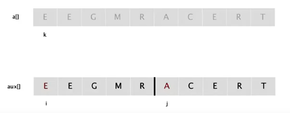
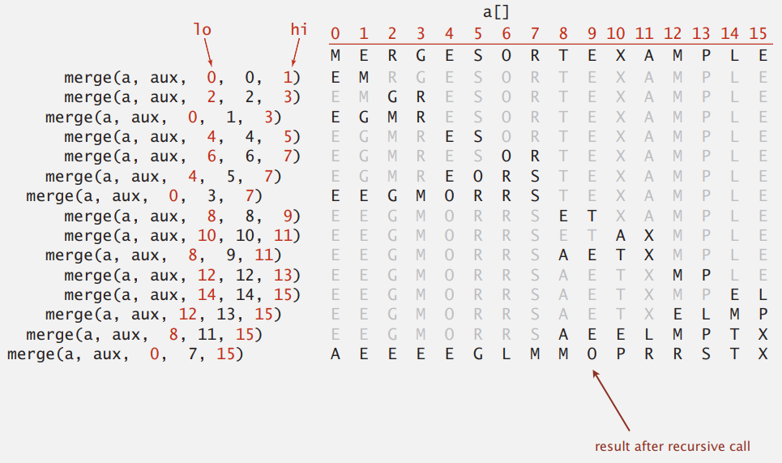
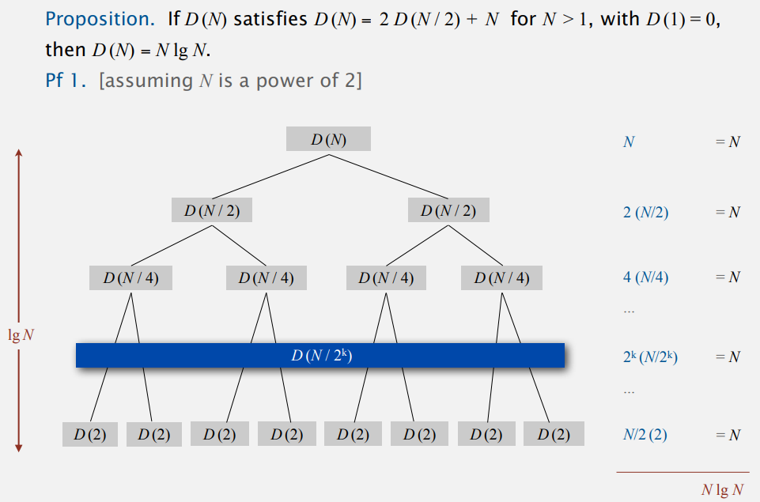
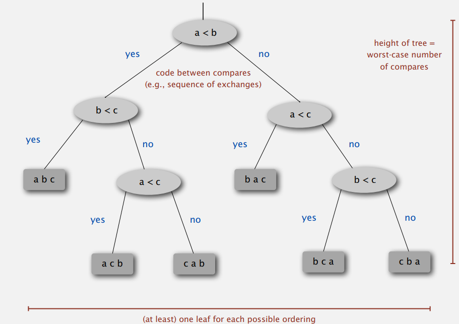

# MERGESORT

## Mergesort

mergesort 使用是分治思想，將陣列一分為二，各自排序後再進行合併。  

分治一般是使用遞迴來實現的，分治是一種解決問題的處理思想，遞迴是一種編碼技巧。  


### Inplace merge

要實作 mergesort 前，需要先實作將二個已排序好的陣列進行合併的功能

- 建立一個暫存的 auxiliary array，複製所有元素
- i 指向左邊子陣列, j 指向右邊子陣列, k 指向排序好的陣列
- 比較 i, j，將較小的放入 k 中
- 若一樣大就把 i 放入 k



```java
private static void merge(Comparable[] a, Comparable[] aux, int lo, int mid, int hi)
{
    assert isSorted(a, lo, mid);
    assert isSorted(a, mid+1, hi);
    
	for (int k = lo; k <= hi; k++) {
        aux[k] = a[k];
    }
    
    int i = lo, j = mid+1;
    for (int k = lo; k <= hi; k++) {
        if      (i > mid)              a[k] = aux[j++];
        else if (j > hi)               a[k] = aux[i++];
        else if (less(aux[j], aux[i])) a[k] = aux[j++];
        else                           a[k] = aux[i++];
    }
}
```

  

有了`merge()`後，排序就相當容易實現

```java
public class Merge
{
    private static void merge(...)
    { /* as before */ }
    
    private static void sort(Comparable[] a, Comparable[] aux, int lo, int hi)
    {
        /* 相同代表只剩一個元素 */
        if (hi <= lo) return;
        int mid = lo + (hi - lo) / 2;
        
        /* 用 0 ~ mid, mid+1 ~ hi divide，不整除時數量比較平均  */
        sort(a, aux, lo, mid);
        sort(a, aux, mid+1, hi);
        merge(a, aux, lo, mid, hi);
    }
    
    public static void sort(Comparable[] a)
    {
        /* 在此建立陣列，而非遞迴裡 */
        Comparable[] aux = new Comparable[a.length];
        sort(a, aux, 0, a.length-1);
    }
}
```

  

### Mergesort: trace



假設排序 [0, 15]，順序會是

- divide 成 [0, 7] > [0, 3] > [0, 1]
  - [0] 與 [1] 排序然後合併
  - [2] 與 [3] 排序然後合併
  - [0, 1] 與 [2, 3] 排序然後合併
- 以此類推


### Divide-and-conquer recurrence: proof by picture

- merge 二個長度為 $N/2$ 的子陣列時，需要 N 次 compare
- divide 後的每一層的 compare 次數加總都是 N
- 整個 sort 需要總共 $logN$ 層
- 整個 sort 需要 $NlogN$ 次 compare



  

### 性能分析

**合併排序是穩定排序算法嗎?**，由於元素交換在 `merge()` 中，所以要看其中的實作方法；上面做法中比較二個相同大小元素時，總是將 `lo`  到 `mid-1` 的元素放入有序陣列中，因此是穩定的算法。  


合併排序的時間複雜度任何情況下都是 $O(NlogN)$ ，但實際應用卻不如快速排序廣泛，因為需要額外輔助空間，**合併排序的空間複雜度是 $O(N)$**，就算是在遞迴中去創建空間，但每次函式完成後就會釋放，因此同一時間 CPU 只有一個函式在執行，臨時的空間不會超過 n 個資料大小，結論仍然相同。


### Practical improvements

有幾種優化方法  

#### Use insertion sort for small subarrays

- mergesort 對很小的陣列而言太複雜
- 若陣列長度 <=7 可以改用 insertion sort

```java
private static void sort(Comparable[] a, Comarable[] aux, int lo, int hi)
{
    if (hi <= lo + CUTOFF - 1)
    {
        Insertsion.sort(a, lo, hi);		// 改用 insertsion sort
        return;
    }
    int mid = lo + (hi - lo) / 2;
    sort(a, aux, lo, mid);
    sort(a, aux, mid+1, hi);
    merge(a, aux, lo, mid, hi);
}
```

  

#### Stop if already sorted

以下情形就是已排序好，不需要再一一比較

```
［A　Ｂ　Ｃ］［Ｄ　Ｅ　Ｆ］　
```

```java
private static void sort(Comparable[] a, Comarable[] aux, int lo, int hi)
{
    if (hi <= lo) return;
    int mid = lo + (hi - lo) / 2;
    sort(a, aux, lo, mid);
    sort(a, aux, mid+1, hi);
    if (!less(a[mid+1], a[mid])) return;	// 右子陣列的第一個比左子陣列的最後一個還大
    merge(a, aux, lo, mid, hi);
}
```

  

#### Eliminate the copy to the auxiliary array

改進方式是省下 a 複製到 aux 的部分，之前 merge 作法因為 a 需要排序(會改變元素位置)，所以需要 aux 來儲存原本的左右子陣列，現在改成不動 a 陣列，直接將排序後元素插入 aux，merge 完成後 aux 會變成排序好的陣列，每一輪遞迴會對調 a 與 aux 的角色

```java
private static void merge(Comparable[] a, Comparable[] aux, int lo, int mid, int hi)
{
    assert isSorted(a, lo, mid);
    assert isSorted(a, mid+1, hi);
    
    //for (int k = lo; k <= hi; k++)	// 不需要複製
    //    aux[k] = a[k];
    
    int i = lo, j = mid + 1;
    for (int k = lo; k < hi; k++)
    {
        if (i > mid)              aux[k] = a[j++];
        if (j > hi)               aux[k] = a[i++];
        if (less(a[j], a[i]))     aux[k] = a[j++];
        else                      aux[k] = a[i++];
    }    
}
```

```java
private static void sort(Comparable[] a, Comarable[] aux, int lo, int hi)
{
    if (hi <= lo) return;
    int mid = lo + (hi - lo) / 2;
    sort(aux, a, lo, mid);
    sort(aux, a, mid+1, hi);
    merge(a, aux, lo, mid, hi);
}
```

  

## bottom-up mergesort

跳過 divide 過程，直接把每個元素想成長度 1，開始 merge，計算過程是

- sz = 1，[0] [1] merge，[2] [3] merge，[4] [5] merge …
- sz = 2，[0, 1] [2, 3] merge，[4, 5] [6, 7] merge… [12, 13] [14, 15] merge
- sz = 4，[0, 3] [4, 7] merge，[8, 11] [12, 15] merge
- 以此類推，最後一次合併的第二個陣列可能會比第一個小，但不影響合併

```java
public class MergeBU
{
    private static void merge(...)
    { /* as before */ }
    
    public static void sort(Comparable[] a)
    {
        int N = a.length;
        Comparable[] aux = new Comparable[a.length];
        // 每組陣列長度 sz = 1, 2, 4... 
        for (int sz = 1; sz <= N; sz = sz+sz) {
            // sz = 2，merge [0, 1] [2, 3] 後，下一組是 [4, 5] [6, 7]，迴圈增量是 sz 的二倍
            for (int lo = 0; lo < N-sz; lo += sz+sz) {
                merge(a, aux, lo, lo+sz-1, Math.min(lo+sz+sz-1, N-1));            
            }
        }
    }
}
```


## sorting complexity

Computational complexity(計算複雜度)是一種用來討論對於求解某問題 X 的算法效率的 framework，包含

- Model of Computation 計算模型: 計算的操作。以排序而言，我們的 model 是計算比較次數
- Cost model: 操作次數
- Upper bound: 上界
- Lower bound: 下界，最低成本
- Optimal algorithm: upper bound = lower bound，那就代表該算法是 X 問題的最佳算法(Algoritms with best possible cost guarantee for X)

  

Example: sort

- Model of Computation: decesion tree
- Cost model: compares
- Upper bound: 前面證明過是 $NlogN$ 
- Lower bound: ?
- Optimal algorithm: ?

​    

### Decesion tree



- 排序 N 個元素的決策樹，最少要有 $N!$ 個 node(排列結果)
- h 層的樹，最多只有 $2^h$ 個 node，因為不可能比完全樹的 node($2^h$)還多
- 所以排序 N 個元素的決策樹，$2^h >= nodes >= N!$

代數計算出 h (高度=比較操作次數)

$2^h >= nodes >= N!$ 

=> $2^h >= N!$

=> $h >= log(N!)$ ~ $NlogN$ (stirling’s 公式取 ~值)  

因此得證 mergesort 的 lower bound 是 $NlogN$

  

### Complexity results in context

根據前面證明，我們知道 mergesort is optimal sort，但是前面的 cost model 是**比較**，因此更精確的說法是**mergesort is optimal with respect to # compares**，這代表你不該嘗試去設計一個**比較操作**優於 mergesort 的排序算法，例如 lower bound 是 $1/2NlogN$ 的排序算法，這是不可能的  

但是 mergesort 的空間利用率可以改進，應為他需要 auxiliary array，我們應該嘗試去設計的一個使用 $NlogN$次比較操作，但空間利用率更好的算法，而這就是知名的 quick sort  

  

## assignment

[題目](https://coursera.cs.princeton.edu/algs4/assignments/collinear/specification.php)  

Point 依照要求完成即可

```java
import edu.princeton.cs.algs4.StdDraw;
import java.util.Comparator;

/**
 * An immutable data type for points in the plane.
 *
 * @author Mincong Huang
 */
public class Point implements Comparable<Point> {

    private final int x;     // x-coordinate of this point
    private final int y;     // y-coordinate of this point

    /**
     * Initializes a new point.
     *
     * @param  x the <em>x</em>-coordinate of the point
     * @param  y the <em>y</em>-coordinate of the point
     */
    public Point(int x, int y) {
        /* DO NOT MODIFY */
        this.x = x;
        this.y = y;
    }

    /**
     * Draws this point to standard draw.
     */
    public void draw() {
        /* DO NOT MODIFY */
        StdDraw.point(x, y);
    }

    /**
     * Draws the line segment between this point and the specified point
     * to standard draw.
     *
     * @param that the other point
     */
    public void drawTo(Point that) {
        /* DO NOT MODIFY */
        StdDraw.line(this.x, this.y, that.x, that.y);
    }

    /**
     * Returns the slope between this point and the specified point.
     * Formally, if the two points are (x0, y0) and (x1, y1), then the slope
     * is (y1 - y0) / (x1 - x0). For completeness, the slope is defined to be
     * +0.0 if the line segment connecting the two points is horizontal;
     * Double.POSITIVE_INFINITY if the line segment is vertical;
     * and Double.NEGATIVE_INFINITY if (x0, y0) and (x1, y1) are equal.
     *
     * @param  that the other point
     * @return the slope between this point and the specified point
     */
    public double slopeTo(Point that) {
        /* YOUR CODE HERE */
        if (x == that.x && y == that.y) {
            return Double.NEGATIVE_INFINITY;
        } else if (y == that.y) {
            return 0.0;
        } else if (x == that.x) {
            return Double.POSITIVE_INFINITY;
        }

        return (y - that.y) * 1.0 / (x - that.x);
    }

    /**
     * Compares two points by y-coordinate, breaking ties by x-coordinate.
     * Formally, the invoking point (x0, y0) is less than the argument point
     * (x1, y1) if and only if either y0 < y1 or if y0 = y1 and x0 < x1.
     *
     * @param  that the other point
     * @return the value <tt>0</tt> if this point is equal to the argument
     *         point (x0 = x1 and y0 = y1);
     *         a negative integer if this point is less than the argument
     *         point; and a positive integer if this point is greater than the
     *         argument point
     */
    public int compareTo(Point that) {
        /* YOUR CODE HERE */
        return y == that.y ? x - that.x : y - that.y;
    }

    /**
     * Compares two points by the slope they make with this point.
     * The slope is defined as in the slopeTo() method.
     *
     * @return the Comparator that defines this ordering on points
     */
    public Comparator<Point> slopeOrder() {
        /* YOUR CODE HERE */
        return new SlopeComparator();
    }

    private class SlopeComparator implements Comparator<Point> {
        @Override
        public int compare(Point p1, Point p2) {
            return Double.compare(slopeTo(p1), slopeTo(p1));
        }
    }

    /**
     * Returns a string representation of this point.
     * This method is provide for debugging;
     * your program should not rely on the format of the string representation.
     *
     * @return a string representation of this point
     */

    public String toString() {
        /* DO NOT MODIFY */
        return "(" + x + ", " + y + ")";
    }

    /**
     * Unit tests the Point data type.
     */
    public static void main(String[] args) {
        /* YOUR CODE HERE */
    }
}
```

  

BruteCollinearPoints 是暴力解，題目要求一次檢查 4 個點是否有相同斜率，所以 4 層迴圈窮舉即可，注意不要重複就好，例如 ABCDE 只有以下組合

- ABCD
- ABCE
- ABDE
- ACDE

```java
import java.util.List;
import java.util.Arrays;
import java.util.LinkedList;

public class BruteCollinearPoints {
    private final LineSegment[] lineSegments;

    /**
     * finds all line segments containing 4 points
     */
    public BruteCollinearPoints(Point[] points) {
        checkNull(points);
        Point[] sortedPoints = points.clone();
        Arrays.sort(sortedPoints);
        checkDuplicate(sortedPoints);

        lineSegments =getLineSegments(sortedPoints);
    }

    private LineSegment[] getLineSegments(Point[] sortedPoints) {
        final int n = sortedPoints.length;
        List<LineSegment> list = new LinkedList<>();
        for (int a = 0; a < n - 3; a++) {
            Point ptA = sortedPoints[a];

            for (int b = a + 1; b < n - 2; b++) {
                Point ptB = sortedPoints[b];
                double slopeAB = ptA.slopeTo(ptB);

                for (int c = b + 1; c < n - 1; c++) {
                    Point ptC = sortedPoints[c];
                    double slopeAC = ptA.slopeTo(ptC);

                    if (slopeAB == slopeAC) {
                        for (int d = c + 1; d < n; d++) {
                            Point ptD = sortedPoints[d];
                            double slopeAD = ptA.slopeTo(ptD);

                            if (slopeAB == slopeAD) {
                                list.add(new LineSegment(ptA, ptD));
                            }
                        }
                    }
                }
            }
        }
        return list.toArray(new LineSegment[0]);
    }

    private void checkNull(Point[] points) {
        if (points == null) {
            throw new IllegalArgumentException();
        }
        for (Point point : points) {
            if (point == null) {
                throw new IllegalArgumentException();
            }
        }
    }

    private void checkDuplicate(Point[] points) {
        for (int i = 1; i < points.length; i++) {
            if (points[i].compareTo(points[i-1]) == 0) {
                throw new IllegalArgumentException("Argument contains a repeated point");
            }
        }
    }

    /**
     * the number of line segments
     */
    public int numberOfSegments() {
        return lineSegments.length;
    }

    /**
     * the line segments
     */
    public LineSegment[] segments() {
        return lineSegments.clone();
    }
}

```

  

FastCollinearPoints 是快速解，思路如下

- 依照座標大小排序
- 第一層循環: 依大小排的 list，把每一點輪流當 origin，將點再依照與 origin 的斜率排序
- 第二層循環: 依斜率排的 list，把相同斜率的存進 candidates list
- 檢查 candidates list 是否符合
  - 超過 3 個點(加上 origin 共 4 點，題目要求 4 點才成線)
  - 確認 origin 座標小於 candidates 第一點(關鍵)
- origin 即為共線最小點，candidates 最後一點為共線最大點

補充說明關鍵點

- 假設 ABCDE 共線，我們只能存最長共線 AE，要去除例如 BE 的子共線；循環到 B 是 origin 時，candidates list 中會是 ACDE，我們只要確認 origin 的座標比 candidates list 中第一(最小)點小，就是最長的共線
- candidates list 因為經過座標大小排序，再經過斜率排序，因此相同斜率的點的順序是**由小到大**(stable sort)

```java
import java.util.List;
import java.util.Arrays;
import java.util.LinkedList;
import edu.princeton.cs.algs4.In;
import edu.princeton.cs.algs4.StdOut;
import edu.princeton.cs.algs4.StdDraw;


public class FastCollinearPoints {
    private final LineSegment[] lineSegments;

    /**
     * finds all line segments containing 4 or more points
     */
    public FastCollinearPoints(Point[] points) {
        checkNull(points);
        Point[] sortedPoints = points.clone();
        Arrays.sort(sortedPoints);
        checkDuplicate(sortedPoints);

        lineSegments = getSegments(sortedPoints);
    }

    private LineSegment[] getSegments(Point[] sortedPoints) {
        final int n = sortedPoints.length;
        final List<LineSegment> list = new LinkedList<>();
        for (int i = 0; i < n; i++) {
            Point origin = sortedPoints[i];
            Point[] slopeSortedPoints = sortedPoints.clone();
            Arrays.sort(slopeSortedPoints, origin.slopeOrder());

            int j = 1;
            while (j < n) {
                LinkedList<Point> candidates = new LinkedList<>();
                final double slopeReference = origin.slopeTo(slopeSortedPoints[j]);

                do {
                    candidates.add(slopeSortedPoints[j++]);
                } while (j < n && slopeReference == origin.slopeTo(slopeSortedPoints[j]));

                if (candidates.size() >= 3 &&
                    origin.compareTo(candidates.peek()) < 0
                ) {
                    Point min = origin;
                    Point max = candidates.removeLast();
                    list.add(new LineSegment(min, max));
                }
            }
        }
        return list.toArray(new LineSegment[0]);
    }

    private void checkNull(Point[] points) {
        if (points == null) {
            throw new IllegalArgumentException();
        }
        for (Point point : points) {
            if (point == null) {
                throw new IllegalArgumentException();
            }
        }
    }

    private void checkDuplicate(Point[] points) {
        for (int i = 1; i < points.length; i++) {
            if (points[i].compareTo(points[i-1]) == 0) {
                throw new IllegalArgumentException("Argument contains a repeated point");
            }
        }
    }

    /**
     * the number of line segments
     */
    public int numberOfSegments() {
        return lineSegments.length;
    }

    /**
     * the line segments
     */
    public LineSegment[] segments() {
        return lineSegments.clone();
    }

    public static void main(String[] args) {
        // read the n points from a file
        In in = new In(args[0]);
        int n = in.readInt();
        Point[] points = new Point[n];
        for (int i = 0; i < n; i++) {
            int x = in.readInt();
            int y = in.readInt();
            points[i] = new Point(x, y);
        }

        // draw the points
        StdDraw.enableDoubleBuffering();
        StdDraw.setXscale(0, 32768);
        StdDraw.setYscale(0, 32768);
        for (Point p : points) {
            p.draw();
        }
        StdDraw.show();

        // print and draw the line segments
        FastCollinearPoints collinear = new FastCollinearPoints(points);
        for (LineSegment segment : collinear.segments()) {
            StdOut.println(segment);
            segment.draw();
        }
        StdDraw.show();
    }
}
```

