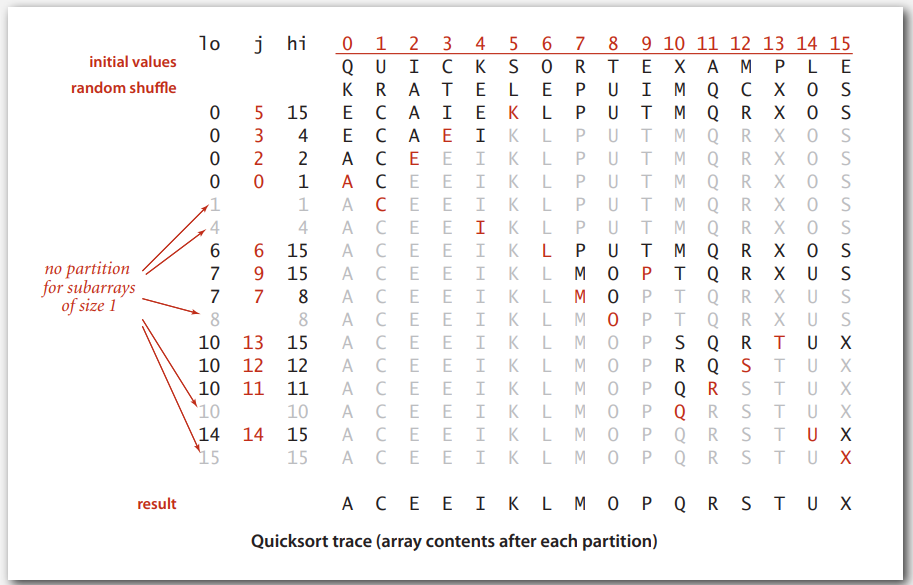
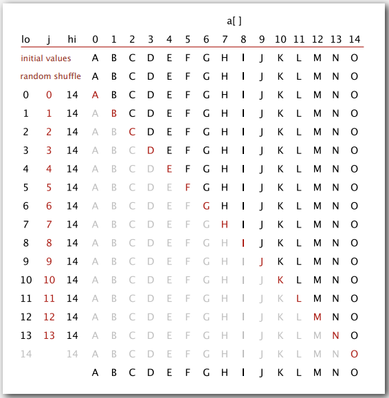

# QUICKSORT

## Quicksort

### Quicksort

Quicksort 思路是

- 打亂(shuffle)陣列，原因請看 worst case
- 找到 partition
  - p 左邊都比 p 小
  - p 右邊都比 P 大
  - ps: 找的過程會調換元素
- 遞迴左右子陣列排序

K R A T E L E P U I M Q C X O S
E C A I E <u>K</u> L P U T M Q R X O S

  

特點在於

- 不像 mergesort 取中間點切分，partition 位置取決於元素內容
- 左右子陣列(內部)排好後就完成了，因為我們已經確定左邊比 p 小，右邊比 p 大，不像 mergesort 還要在把左右子陣列一個一個比較

  

### Implementation

```java
public class Quick {
    public static void sort(Comparable[] a)
    {
        StdRandom.shuffle(a);
    	sort(a, 0, a.length-1);
    }
    
    private void sort(Comparable[] a, int lo, int hi)
    {
		if (hi <= lo) return;
        int j = patition(a, lo, hi);
        sort(a, lo, j-1);
        sort(a, j+1, hi);
    }
    
    private int patition(Comparable[] a, int lo, int hi)
    {
        int i = lo, j = hi+1;
		while (true) {
            while (less(a[++i], a[lo])) 
                if (i == hi) break;
            while (less(a[lo], a[--j])) 
                if (j == lo) break;
            
            if (i >= j) break;
            exch(a, i, j);
        }

        exch(a, lo, j);
        return j;
    }
}
```

patition 中，以第一個元素 lo 當成 partition 的值，尋找 partition 的位置，把 lo 的值換過去，

- `i` 往右掃，`j` 往左掃，直到超過邊界，或者相交錯
- `i` 遇到比 `lo` 還大就停下來， `j` 遇到比 `lo` 小就停下來，然後調換值，確保 `i` 掃過的都比 `lo` 小， `j` 掃過都比 `lo` 大
- `i` `j` 位置交錯時(包括指向同一個，因為 `i` `j` 會調換元素，當 `i` `j` 相同時沒意義)，`j` 即為 partition 的位置，把 `a[lo]` 與 `a[j]` 互換
- 解釋一下為何 partition 的位置是 `j` 而非 `i`，因為 partition 位置左邊的元素都要小於 `lo` 的值，當 `i` 與 `j` 交差時，這個交叉位置的左半邊會小於 `lo`，右半邊會大於 `lo`，因此要拿由右往左掃描，跑到左半邊的 `j` 來跟 `lo` 交換，因為 `j` 指向的元素一定比 `lo` 小


另一種 partition 寫法

```java
private static int partition(Comparable[] a, int lo, int hi) {
    Comparable v = a[hi];
    int i = lo;
    for (int j = lo; j < hi; j++) {
        if (less(a[j], v)) {
            exch(a, i, j);
            i++;
        }
    }
    exch(a, i, hi);

    return i;
}
```

- 用 `a[hi]` 當 pivot 值
- `j` 由左往右掃描，遇到比 pivot 小的就 `exch()`
- `i` 用於維護比 pivot 小的區間，`exch()` 後  `i` 向右移，因為`exch()` 會把比 pivot 小的換過來
- 循環結束後，`a[i]` 與 pivot 交換，因為 `i` 左邊一定都比 pivot 小


### Quicksort trace



  

### analysis

#### best case

best case $NlogN$  

  

#### worst case

worst case: ~$1/2N^2$

因為用第一點當成 partition 的值，如果位置剛好也在第一個(後面都比他大)，造成每次 divide 後，左邊子陣列為 0，右邊是 N - 1。  

快排前都先進行 shuffle 的原因在此。



  

### Practical improvements

#### insertion sort small subarrays

和大多數遞迴排序算法一樣

- Quick sort 對小陣列比 Insertion sort 慢，因為`sort()` 參數是小陣列時還是會遞迴呼叫

可以改進`sort()`

```java
private void sort(Comparable[] a, int lo, int hi)
{
    //if (hi <= lo) return;
    if (hi <= lo + M) {
        Insertion.sort(a, lo, hi); return;
    }
    int j = partition(a, lo, hi);
    sort(a, lo, j-1);
    sort(a, j+1, hi);
}
```

M 的最佳值和系統相關，大多數在 5~15 間會有好的結果

  

#### Median of sample

之前是直接用子陣列第一個的值當成 partition 的值來分割陣列，可以改成用中位數來；研究發現，取樣 3 個，並用頭中尾的方式切分的效果最好

```java
private void sort(Comparable[] a, int lo, int hi)
{
    if (hi <= lo) return;

    int m = medianOf3(a, lo, lo + (hi - lo)/2, hi);
    swap(a, lo, m);
    
    int j = partition(a, lo, hi);
    sort(a, lo, j-1);
    sort(a, j+1, hi);
}
```

  

### 分析

快排是不穩定的，例如 ***3*** 3 1 2，以 2 當 pivot 變成 1 3 ***3*** 2，三的前後順序就變了。  


## selection

和排序有關的是 Selection 算法，就是所謂的 find the top $k$，在 n 個元素中找到第 k 大的元素，根據之前對排序的一些分析，selection 算法有以下討論

- 最簡單方法: 先排序，找最小的就是第一個，找最大就是最後，所以跟排序一樣是 $NlogN$
- upper bound: $N$，如果 k 很小就掃描 k 次去找元素，第一次找最小，第二次找第二小…
- lower bound: $N$ ，至少需要確認過每個元素

關鍵問題

- 線性時間的算法對任意 k 都成立嗎?
- 還是說選擇算法(會轉化成)跟排序算法一樣困難?

  

### Quick-select

用 quicksort 的 divide 思想來解決 select 算法  

要找第 k(小) 的元素，可以分成 1~$k-$1, $k$, $k$~$N$，左半部都比 k 小，右半部都比 k 大，就轉化成 quicksort 的第一步(找 paritition)，不過 quicksort 是拿第一個元素的值去找 p 點，而 quick-select 是拿位置去找值，但因為 `partation()` 中返回的 j 未必就是我們要的 k 位置，因此當 $j < k$ 時我們要往 k 的那部分找，也就是找 j+1 ~ N 那半邊

```java
public static Comparable select(Comparable[] a, int k)
{
    StdRandom.shuffle(a);
    int lo = 0, hi = a.length - 1;
    while (hi > lo) {
		int j = partition(a, lo, hi);
        if (j < k)      lo = j + 1;
        else if (j > k) hi = j - 1;
        else            return a[k];     
    }
    return a[k];
}

```

  

## Duplicate Keys

  
