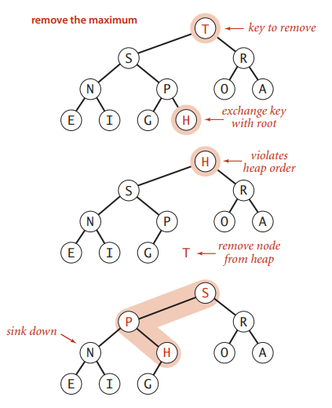

# PRIORITY QUEUES

## API and elementary implementations

### Priority queue

移除的時候是移除最大(或最小)元素  


### API

```
public class MaxPQ<Key extends Comparable<Key>>
        MaxPQ()
        MaxPQ(Key[] a)
void    insert(Key v)
Key     delMax()
boolean isEmpty()
Key     max()
int     size()
```

  ### Priority queue applications

- Event-driven simulation [custom in line, colliding particles]
- Data compresstion       [Huffman codes]
- Graph searching          [Dijkstra’s algorithm, Prim’s algorithm]
- Artificial intelligence      [A* search]
- Operating systems       [load balancing, interrupt handling]

### Priority queue client example

問題一，需求是要找出 N 個元素中最大的 M 個，且 M 很大而 N 更大，因此沒有足夠空間儲存全部 N 個元素，例如銀行要做防盜刷系統，但無法處理所有的交易紀錄，只能處理金額較大的紀錄，使用 priority queue 可以完成

```java
MinPQ<Transaction pq = new MinPQ<Transaction>();

while (StdIn.hasNextLine()) {
    String line = StdIn.readLine();
    Transaction item = new Transaction(line);
    pq.insert(item);
    if (pq.size() > M) {
        pa.delMin();
    }
}
```

解法

| 解法          | time       | space     |
| ------------- | ---------- | --------- |
| sort          | $NlogN$    | N(無法存) |
| elementary PQ | $MN$(偏慢) | M         |
| binary heap   | $NlogM$    | M         |


問題二，有十個接口訪問日誌文件，每個日誌大約 300 MB，每個文件裡的日誌是按時戳由小到大排列；要將這十個日誌文件，合併成一個，並且仍按時戳由小到大排列，但機器的記憶體只有 1GB，如何快速做到?  

每次從十個文件讀取一筆資料，在記憶體依時間戳維護一個最小堆，將最小值寫入新文件，同時從最小值所屬的文件在讀取一筆資料；空間複雜度是常數量級，時間複雜度 $O(N)$  


### Unorder and ordered array implementation

unorder

- 插入 $O(1)$
- 刪除 $O(N)$

order

- 插入 $O(N)$
- 刪除 $O(1)$

```
                     unorder               ordered
insert P             P                     P  
insert Q             P Q                   P Q
insert E             P Q E                 E P Q   
remove max           P E                   E P
insert X             P E X                 E P X
insert A             P E X A               A E P X
insert M             P E X A M             A E M P X
remove MAX           P E A M               A E M P
```

目標是插入跟刪除都 $O(logN)$  


### Unorder array implementation

```java
public class UnorderMaxPQ<Key extends Comparable<Key>>
{
    private Key[] pq;
    private int N;

    public UnorderMaxPQ(int capacity)
    {
    	pq = (key[]) new Comparable[capacity];
    }
    
    public void insert(Key x)
    {
        pq[N++] = x;
    }
    
    public Key delMax()
    {
        int max = 0;
        for (int i = 1; i < pq.length; i++) {
            if (less(max, i)) max = i;
        }
        exch(pq, max, N-1);
        return pq[--N];
    }
}
```

  

## Binary Heaps

Binary heaps 是一種特殊的 tree

- 各層全滿，除了最下層，最下層由左至右排列 (Complete binary tree)
- 每個節點都大於等於(或小於等於)左右子節點
- $N$ 個節點的 complete tree 高度為 $logN$
  - 因為從左到右增加節點，只有在 2 的次方個節點時，樹才會長高  

### Binary heap representations

樹可以用鏈式儲存，也可以用陣列儲存，Binary heap 因為 Complete binary tree 最後一層的葉子節點都靠左的緣故，使用陣列儲存時，中間不會有空著的空間，且使用陣列省下了指標的記憶體空間，所以相當節省記憶體。  

用陣列表示 binary heap 有以下特點

- `a[1]` 是最大的，`a[0]` 空著
- $k$  節點的父節點是 $\dfrac{k}{2}$
- $k$  節點的子節點是 $2k$ 與 $2k + 1$


  

### Promotion in a heap

若子節點比父節點大

- 與父節點互相調換
- 直到比父節點小


```java
private void swim(int k)
{
    while (k > 0 && less(k/2, k))
    {
        exch(k, k/2);
        k = k/2;
    }
}
```

 ### Insertion in a heap

把新節點加在最後一個，然後在確認是否符合 binary heap 規則(比父節點小)，最糟糕情況是從最下層比到最上層，`swim()`需要 $logN$ +1 次比較(15 個節點是四層，這時候插入需要比較四次，$log15 + 1$)


```java
public void insert(Key x)
{
    pq[++N] = x;
    swim(N);
}
```

### Demotion in a heap

若父節點比子節點小

- 找出左右子節點中較大的，互相對調
- 直到比子節點大


```java
private void sink(int k)
{
    while (2 * k <= N)	// 如果有子節點
    {
        int j = 2 * k;
        if (j < N && less(j, j+1)) j++;
        if (less(j, k)) break;
  		exch(j, k)
        k = j;
    }
}
```

### Delete the maximum in a heap

- 最大是pq[1]
- 把最後一個元素放在堆頂
- sink() 維持 heap 結構

刪除最大節點不超過 $2logN$ 次比較(一次找子節點中較大的那個 p，一次用來比較  p 與父節點，看是否對調)



```java
public Key delMax()
{
    Key max = pq[1];
    exch(1, N--);
    sink(1);
    pq[N+1] = null;
    return max;
}
```

  

### Binary Heap: Java implementation

```java
public class MaxPQ<Key extends Comparable<Key>>
{
    private Comparable[] pq;
    private int N;
    
    public MaxPQ(int capacity)	// fixed compacity for simplicity
    {
        pq = (Key[]) new Comparable[capacity+1];
    }
    
    public boolean isEmpty()
    {
        return N == 0;
    }
    
    public void insert(Key key)
    { /* same as before */ }
    
    public Key delMax()
    { /* same as before */ }
    
    private void swim(int k)
    { /* same as before */ }

    private void sink(int k)
    { /* same as before */ }

    private boolean less(int i, int j)
    {
        return pq[i].compareTo(pq[j]) < 0;
    }
    
    private void exch(int i, int j)
    {
        Key t = pq[i];
        pq[i] = pq[j];
        pq[j] = t;
    }
}
```

| implementation  | insert | del Max | max  |
| --------------- | ------ | ------- | ---- |
| unordered array | 1      | N       | N    |
| ordered array   | N      | 1       | 1    |
| binary heap     | $logN$ | $logN$  | 1    |

### Binary heap considerations

- Immutability of keys
  - client 若隨意更改元素的值(大小改變)，會破壞 heap 結構
  - 用 Immutable keys
- Minimum-oriented priority queue
  - 把 `less()` 換成 `greater()` 即可

  

## Heapsort

包含二個步驟

- Heap construction
- Sortdown

### Heap construction

由下往上的建堆

- 找到倒數第二層的節點 (N/2)，最下層就葉子跟自己比沒意義，因此從倒數第二層開始就好
- 每個做 `sink()`

```java
for (int k = N/2; k >= 1; k--) {
    sink(a, k, N);
}
```

### Sortdown

排好之後，堆頂會是最大的元素，因此排序方法為

- 將堆頂與陣列最後端元素調換(對 Heap 而言，放到最後一個元素後就不是 heap 的一員了)
- 此時堆頂可能破壞了結構，所以要 `sink()` 維持結構

```java
while (N > 1) {
    exch(a, 1, N--);
    sink(a, 1, N);
}
```

### java implementation

```java
public class Heap {
    public static void sort(Comparable[] a) {
        int n = a.length;
        for (int i = n/2; i >= 1; i--) {
            sink(a, i, n);
        }
        int k = n;
        while (k > 1) {
            exch(a, 1, k--);
            sink(a, 1, k);
        }
    }

    private static void sink(Comparable[] pq, int k, int n) {
        while (2*k <= n) {
            int j = 2*k;
            if (j < n && less(pq, j, j+1)) j++;
            if (less(pq, j, k)) break;
            exch(pq, k, j);
            k = j;
        }
    }

    private static void exch(Comparable[] a, int i, int j) {
        Comparable v = a[i-1];
        a[i-1] = a[j-1];
        a[j-1] = v;
    }

    private static boolean less(Comparable[] pq, int i, int j) {
        return pq[i-1].compareTo(pq[j-1]) < 0;
    }
}
```

### trace


### mathematical analysis

heap construction 從倒數第二層開始 heapify (`sink()` 操作)

- 第 k 層有 $2^k$ 個節點
- `sink()` 過程交換的節點數與下面還有多少層(高度 - 目前層數)成正比
  - 第 0 層(堆頂): $2^0$ * h
  - 第 1 層        : $2^1$ * h - 1
  - 第 k 層        : $2^k$ * h - k
  - 倒數第二層  : $2^{h-1}$ * 1
  - 總合為 $S_1$ = 1 * h + 2 * (h - 1) + … + $2^k$ * (h-k) + $2^{h-1}$ * 1
- 代數


- 等比數列求和
  - S = - h + $2^h$ - 2 + $2^h$
  - 因為 h = logN 帶入 $S$
  - 因此 $O(N)$
- use <= 2N compares and exchanges  

heapsort 

-  N 次 `sink()` 
- 每次 `sink()` 高度為 $logN$
- 因此是 <= $2NlogN$ compares and exchanges  

heapsort 是 inplace 算法且有 $NlogN$ 的性能保證

- $O(2NlogN)$
- average: $NlogN$

heapsort 理論上是 optimal for both time and space，但實際開發中

- 資料是跳著訪問的，對 cache memory 不友善
- Inner loop longer than quicksort，因為對資料的操作更多(還要先建堆)
- not stable sort

  

## assignment

```java
import java.util.Arrays;
import java.util.LinkedList;

public class Board {
    private static final int SPACE = 0;
    private int[][] board;

    // create a board from an n-by-n array of tiles,
    // where tiles[row][col] = tile at (row, col)
    public Board(int[][] tiles) {
        this.board = copy(tiles);
    }

    private int[][] copy(int[][] blocks) {
        int[][] copy = new int[blocks.length][blocks.length];
        for (int row = 0; row < blocks.length; row++)
            for (int col = 0; col < blocks.length; col++)
                copy[row][col] = blocks[row][col];

        return copy;
    }

    // string representation of this board
    public String toString() {
        StringBuilder str = new StringBuilder();
        str.append(dimension() + "\n");
        for (int[] row : board) {
            for (int col : row) {
                str.append(String.format("%2d", col));
            }
            str.append("\n");
        }
        return str.toString();
    }

    // board dimension n
    public int dimension() {
        return board.length;
    }

    // number of tiles out of place
    public int hamming() {
        int count = 0;
        for (int i = 0; i < board.length; i++) {
            for (int j = 0; j < board.length; j++) {
                if (isWrongBlock(i, j)) count++;
            }
        }
        return count;
    }

    // sum of Manhattan distances between tiles and goal
    public int manhattan() {
        int sum = 0;
        for (int i = 0; i < board.length; i++) {
            for (int j = 0; j < board.length; j++) {
                sum += distance(i, j);
            }
        }
        return sum;
    }

    private boolean isWrongBlock(int i, int j) {
        int block = board[i][j];
        return !isSpace(block) && block != goalNum(i, j);
    }

    private boolean isSpace(int block) {
        return block == SPACE;
    }

    private int goalNum(int i, int j) {
        return i * dimension() + j + 1;
    }

    private int distance(int i, int j) {
        int block = board[i][j];
        return isSpace(block)
                ? 0
                : Math.abs(i - row(block)) + Math.abs(j - col(block));
    }

    private int row(int block) {
        return (block - 1) / dimension();
    }

    private int col(int block) {
        return (block - 1) % dimension();
    }

    // is this board the goal board?
    public boolean isGoal() {
        for (int i = 0; i < board.length; i++)
            for (int j = 0; j < board.length; j++)
                if (isWrongBlock(i, j)) return false;

        return true;
    }

    // does this board equal y?
    public boolean equals(Object y) {
        if (y==this) return true;
        if (y==null || !(y instanceof Board) || ((Board)y).board.length != board.length) return false;
        for (int row = 0; row < board.length; row++)
            for (int col = 0; col < board.length; col++)
                if (((Board) y).board[row][col] != board[row][col]) return false;

        return true;
    }

    // all neighboring boards
    public Iterable<Board> neighbors() {
        LinkedList<Board> neighbors = new LinkedList<>();
        int [] location = spaceLocation();
        int row = location[0];
        int col = location[1];

        int n = dimension() - 1;
        if (row > 0) neighbors.add(new Board(swap(row, col, row-1, col)));
        if (row < n) neighbors.add(new Board(swap(row, col, row+1, col)));
        if (col > 0) neighbors.add(new Board(swap(row, col, row, col-1)));
        if (col < n) neighbors.add(new Board(swap(row, col, row, col+1)));

        return neighbors;
    }

    private int[] spaceLocation() {
        for (int row = 0; row < board.length; row++)
            for (int col = 0; col < board.length; col++)
                if (isSpace(board[row][col])) {
                    int[] location = new int[2];
                    location[0] = row;
                    location[1] = col;

                    return location;
                }
        throw new RuntimeException();
    }

    private int[][] swap (int row1, int col1, int row2, int col2) {
        int[][] copy = board.clone();
        int tmp = copy[row1][col1];
        copy[row1][col1] = copy[row2][col2];
        copy[row2][col2] = tmp;

        return copy;
    }

    // a board that is obtained by exchanging any pair of tiles
    public Board twin() {
        int n = dimension();
        for (int i = 0; i < n; i++) {
            for (int j = 0; j < n - 1; j++) {
                if (!isSpace(board[i][j]) && !isSpace(board[i][j+1])) {
                    return new Board(swap(i, j, i, j+1));
                }
            }
        }
        throw new RuntimeException();
    }

    // unit testing (not graded)
    public static void main(String[] args) {
        int[][] t = {{1,3,5}, {2,4,6}, {9,8, 0}};
        Board b = new Board(t);
        System.out.println(b.dimension());
        System.out.println(b.toString());
        System.out.println(b.hamming());
        System.out.println(b.manhattan());
        System.out.println(b.isGoal());
        System.out.println(b.twin());
        System.out.println(b.equals(b.twin()));
        for (Board bb : b.neighbors()) {
            System.out.println(bb);
        }
    }

}
```

```java
import edu.princeton.cs.algs4.In;
import edu.princeton.cs.algs4.MinPQ;
import edu.princeton.cs.algs4.Stack;
import edu.princeton.cs.algs4.StdOut;

public class Solver {

    private Move lastMove;

    private class Move implements Comparable<Move> {
        private Move prev;
        private Board board;
        private int moveNum;

        public Move(Board board) {
            this.board = board;
        }

        public Move(Board board, Move prev) {
            this.board = board;
            this.prev = prev;
            moveNum = prev.moveNum + 1;
        }

        public int compareTo(Move move) {
            return (this.board.manhattan() - move.board.manhattan()) +
                   (this.moveNum - move.moveNum);
        }
    }

    // find a solution to the initial board (using the A* algorithm)
    public Solver(Board initial) {
        if (initial == null) throw new IllegalArgumentException();

        MinPQ<Move> moves = new MinPQ<>();
        moves.insert(new Move(initial));

        MinPQ<Move> twinMoves = new MinPQ<>();
        twinMoves.insert(new Move(initial.twin()));

        while (true) {
            lastMove = expand(moves);
            if (lastMove != null || expand(twinMoves) != null) return;
        }
    }

    private Move expand(MinPQ<Move> moves) {
        if (moves.isEmpty()) return null;
        Move bestMove = moves.delMin();
        if (bestMove.board.isGoal()) return bestMove;
        for (Board neighbor : bestMove.board.neighbors()) {
            if (bestMove.prev == null || !neighbor.equals(bestMove.prev.board)) {
                moves.insert(new Move(neighbor, bestMove));
            }
        }
        return null;
    }

    // is the initial board solvable? (see below)
    public boolean isSolvable() {
        return lastMove != null;
    }

    // min number of moves to solve initial board
    public int moves() {
        return isSolvable() ? lastMove.moveNum : -1;
    }

    // sequence of boards in a shortest solution
    public Iterable<Board> solution() {
        if (!isSolvable()) return null;
        Stack<Board> moves = new Stack<>();
        while (lastMove != null) {
            moves.push(lastMove.board);
            lastMove = lastMove.prev;
        }
        return moves;
    }

    // test client (see below)
    public static void main(String[] args) {
        // create initial board from file
        In in = new In(args[0]);
        int n = in.readInt();
        int[][] tiles = new int[n][n];
        for (int i = 0; i < n; i++)
            for (int j = 0; j < n; j++)
                tiles[i][j] = in.readInt();
        Board initial = new Board(tiles);

        // solve the puzzle
        Solver solver = new Solver(initial);

        // print solution to standard output
        if (!solver.isSolvable())
            StdOut.println("No solution possible");
        else {
            StdOut.println("Minimum number of moves = " + solver.moves());
            for (Board board : solver.solution())
                StdOut.println(board);
        }
    }
}
```

