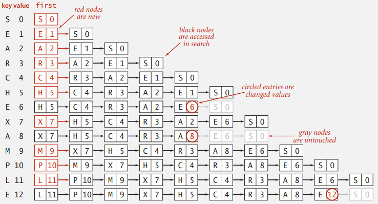
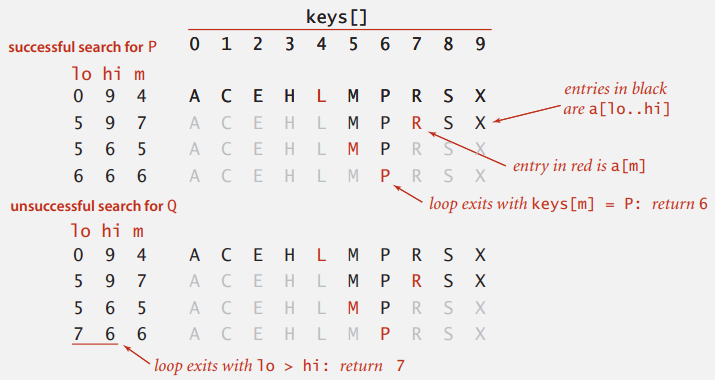
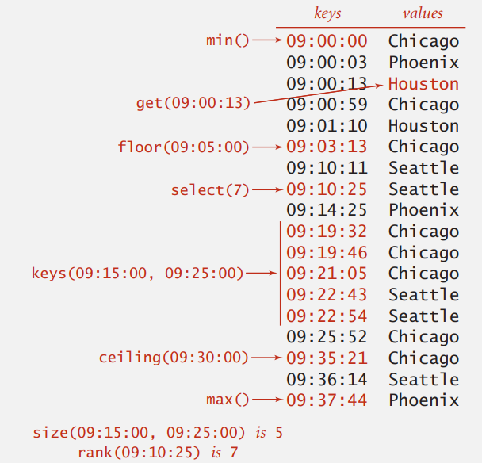

# SYMBOL TABLES

## API

### Basic symbol table API

```
public class ST<Key, Value>
---------------------------------------------------------------------
ST()
void put(Key key, Value val)
Value get(Key key)
void delete(Key key)
boolean contains(Key key)
boolean isEmpty()
int size()
Iterable<Key> keys()
```

  

### Conversions

- `get()` 若沒有值就回傳 null
- `pus()` 會覆蓋舊的值

  

### key 增加 Equality test

```java
public final class Date implements Comparable<Date>
{
    private final int month;
    private final int day;
    private final int year;
    
    public boolean equals(Object y)
    {
        if (y == this) return true;
        if (y == null) return false;
        if (y.getClass() != this.getClass())
            return false;
        
        Date that = (Date) y;
        if (this.day != that.day) return false;
        if (this.month != that.month) return false;
        if (this.year != that.year) return false;
        
        return true;
    }
}
```

**Best practices**

確保 `compareTo()` 跟 `equals()` 的行為一致


### ST test client for analysis

頻率計數器，顯示最常出現的單字

```
% more tinyTale.txt
(it was the best of times
it was the worst of times
it was the age of wisdom
it was the age of foolishness
it was the epoch of belief
it was the epoch of incredulity
it was the season of light
it was the season of darkness
it was the spring of hope
it was the winter of despair)

% java FrequencyCounter 1 < tinyTale.txt
it 10
```

這個計數器如果需要處理很大的資料，線性時間是無法成功運行的  

  

### Frequency conuter implementation

```java
public class FrequencyCounter
{
    public static void main(String[] args)
    {
        int minLen = Integer.parseInt(args[0]);
        ST<String, Integer> st = new ST<>();
        while (!StdIn.isEmpty())
        {
            String word = StdIn.readString();
            if (word.length < minLen) continue;
            
            if (!st.contain(word)) st.put(word, 0);
            else                   st.put(word, st.get(word) + 1);
        }
        
		String max = '';
        st.put(max, 0);
        for (String word : st.keys())
            if (st.get(word) > st.get(max))
                max = word
       
        StdOut.println(max + " " + st.get(max));
    }
}
```

  

## Elementary implementations

### Sequential search in a linked list

用一個(無序) Linked list 來儲存 key-value

- Search : 掃描所有元素
- Insert : 掃描所有元素，找到舊修改值，沒找到就在頭部插入新元素



  

### Binary search in an ordered array

另一種方式是，維護二個有序的陣列，一個儲存 key，另一個儲存 value，這樣就可以使用二分搜尋 key



  

### Binary search: Java implementation

如果搜尋的 `key` 存在 `rank()` 返回 `key` 的索引位置，同時也是表中比 `key` 小的鍵的數量；如果不存在，`key` 還是該返回表中比 `key` 小的鍵的數量。  

```java
public Value get(Key key)
{
    if (isEmpty()) return null;
    int i = rank(key);
    if (i < N && keys[i].compareTo(key) == 0) return vals[i];
    else return null;
}

public int rank(Key key)
{
    int lo = 0, hi = N - 1;
    while (lo <= hi) {
        int mid = lo + (hi - lo) / 2;
        int cmp = key.compareTo(keys[mid]);
        if      (cmp < 0) hi = mid - 1;
        else if (cmp > 0) lo = mid + 1;
        else return mid;
    }
    return lo;
}
```

缺點是要維護有序的陣列，必須在插入時去調整元素

## Ordered operations

更多的 API，但 Binary search 在插入需要 $O(N)$ ，我們需要查找與插入都是對數級的算法與結構



