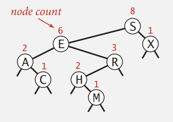
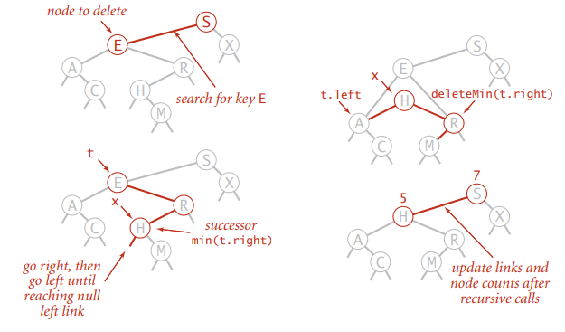
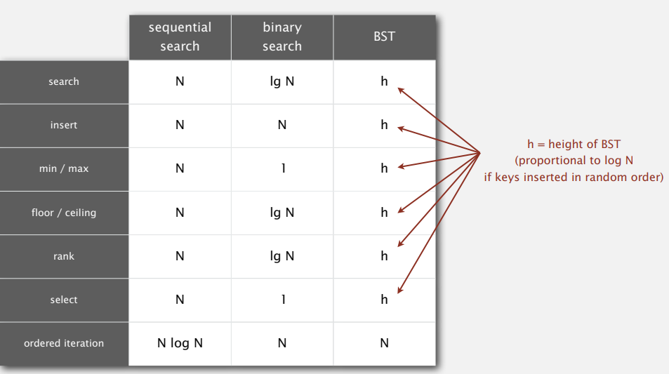
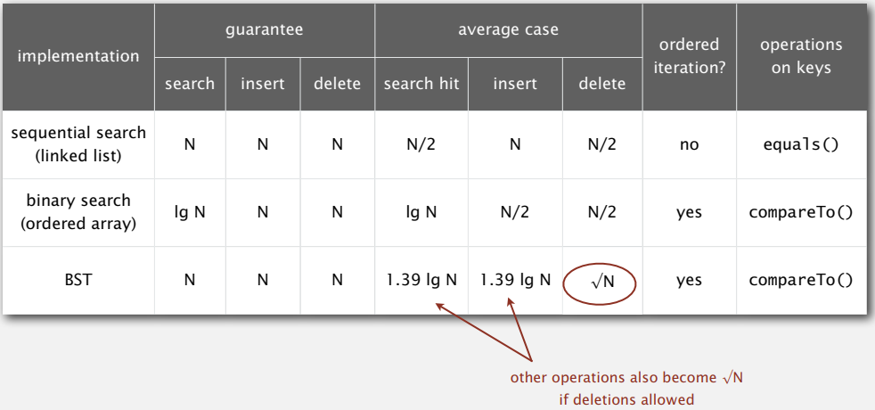

# BINARY SEARCH TREES

## BSTs

### Binary search trees

Binary search tree 是二元樹，且每個節點都大於左子樹的節點，小於右子樹的節點  


### BST representation in Java

```java
private class Node
{
    private Key key;
    private Value val;
    private Node left, right;
    public Node(Key key, Value val)
    {
        this.key = key;
        this.val = val;
    }
}
```

  

### 基於 BST 的 symbol table

```java
public class BST<Key extends Comparable<Key>, Value>
{
    private Node root;
    
    private class Node
    { /* as before*/ }
    
    public void put(Key key, Value val)
    { /* next block */ }
    
    public void get(Key key)
    {
        Node x = root;
        while (x != null)
        {
            int cmp = key.compareTo(x.key);
            if      (cmp < 0) x = x.left;
            else if (cmp > 0) x = x.rigth;
            else              return x.val;
        }
        return null;
    }
    
    public void delete()
    { /**/ }

    public Iterable<Key> iterator()
    { /**/ }
}
```

  

### BST insert: Java implementation

遞迴就像沿著樹往下走，遞迴後就像沿著樹往上爬

```java
public void put(Key key, Value val)
{
    root = put(root, key, val);
}

 private Node put(Node x, Key key, Value val)
{
    if (x == null) return new Node(key, val);
    int cmp = key.compareTo(x.key);
    if (cmp < 0)
        x.left = put(x.left, key, val);
    else if (cmp > 0)
        x.right = put(x.right, key, val);
    else
        x.val = val;

    return x;
}
```

  

### Mathematical analysis

BST 跟 Quicksort 在分析上很類似，root 就像第一個 partition

- best case: search / insert ~$2logN$
- worst case: $N$ 假設按照自然數列插入，會讓 BST 長得像 Linked list 一樣

  

## Ordered operations

### Minimum and maximum

遞迴左子樹找最小

```java
public Key min()
{
    return min(root).key;
}

private Node min(Node x)
{
    if (x.left == null) return x;
    return min(x.left);
}
```

遞迴右子樹找最大

```java
public Key max()
{
    return max(root).key;
}

private Node max(Node x)
{
    if (x.right == null) return x;
    return max(x.right);
}
```

  

### Floor and ceiling

- Floor: $<= a$ 中最大的
- Ceiling: $>= a$ 中最小的

### Computing the floor

- Case 1 : 相等
- Case 2 : $k < root$ 代表 k 在左子樹
- Case 3 : $k > root$ k 在右子樹中(比 x 大，比 key 小)，如果右子樹沒有命中比 key 小的，因為是向下取整所以就返回 root

​    

```java
public Key floor(Key key)
{
    Node x = floor(root, key);
    if (x == null) return null;
    return x.key;
}

private Node floor(Node x, Key key)
{
 	if (x == null) return null;
    int cmp = key.compareTo(x.key);
    if      (cmp == 0) return x;
    else if (cmp < 0)  return floor(x.left, key);

    Node t = floor(x.right, key);
    if (t != null) return t;
    else           return x;
}
```

  

### Subtree counts



修改之前的程式碼，加入 `size`

```java
private class Node
{
    private Key key;
    private Value val;
    private Node left, right;
    private int size;
    public Node(Key key, Value val, size)
    {
        this.key = key;
        this.val = val;
        this.size = size;
    }
}
```

```java
 private Node put(Node x, Key key, Value val)
{
    if (x == null) return new Node(key, val, 1);
    int cmp = key.compareTo(x.val);
    if (cmp < 0)
        x.left = put(x.left, key, val);
    else if (cmp > 0)
        x.right = put(x.right, key, val);
    else
        x.val = val;

    x.size = 1 + size(x.left) + size(x.right);
    return x;
}
```

實作 `size()`

```java
public int size()
{
    return size(root);
}

private int size(Node x)
{
    if (x == null) return 0;
    return x.size;
}
```

有了 `size()` 可以方便實現 `rank()` 與 `select()`

  

### Rank

rank : 有 k 個小於他的鍵

- Case 1 : 相等 rank = 左子樹數量
- Case 2 : $k < root$ 遞迴找左子樹比 k 小的
- Case 3 : $k > root$ 左子樹數量 + 自己 + 遞迴找右子樹比 k 小的

```java
public int rank(Key key)
{
    return rank(root, key);
}

private int rank(Node x, Key key)
{
    if (x == null) return 0;
    int cmp = key.compareTo(x.key);
    
    if      (cmp < 0) return rank(x.left, key);
    else if (cmp > 0) return 1 + size(x.left) + rank(x.right, key);
    else              return size(x.left);
}
```

  

### Inorder traversal

- 遍歷左子樹
- 自己
- 遍歷右子樹

```java
public Iterable<Key> keys()
{
    Queue<Key> q = new Queue<>();
    inorder(root, q);
    return q;
}

private void inorder(Node x, Queue<Key> q)
{
	if (x == null) return;
    inorder(x.left, q);
    q.add(x);
	inorder(x.right, q);
}
```


## Deletion

### Deleting the minimum

- 遞迴左子樹直到個節點的左子樹為 null，代表是最小節點
- 若最小節點有右子樹則返回右子樹，沒有則返回 null
- 父節點指向遞迴返回的節點
- 更新 count

```java
public void deleteMin()
{
    root = deleteMin(root);
}

private Node deleteMin(Node x)
{
    if (x.left == null) return x.right;
    x.left = deleteMin(x.left);
    x.count = 1 + size(x.left) + size(x.right);
    return x;
}
```

  

### Hibbard deletion

刪除 key 對應的節點

- Case 0 : 沒有子樹，直接把 parent node 指向 null
- Case 1 : 一個子樹，把 parent node 指向刪除節點的子樹
- Case 2 : 二個子樹，找到要刪除節點 `t` 右子樹最小節點 `x`，把 `x` 左邊指向 `t` 的左子樹，`x` 右邊指向 `t` 的右子樹(把 BST 映射到直線上，要刪除 `t` ，就用最靠近 `t` 的點 `x` 來取代 `t`，以維持 BST 的結構；選右邊是慣例，沒有特別原因)



```java
public void delete(Key key)
{
    root = delete(root, key);
}

private Node delete(Node x, Key key)
{
    if (x == null) return null;
    int cmp = key.compareTo(x.key);
    if      (cmp < 0) x.left  = delete(x.left, key);
    else if (cmp > 0) x.right = delete(x.right, key);
    else {	// 找到要刪除的 node
        if (x.left == null) return x.right;
        else if (x.right == null) return x.left;
        
        Node t = x;	// t 先記住 x 節點
        x = min(t.right);
        x.right = deleteMin(t.right); // x.right 指向 已刪除掉 x 的右子樹
        x.left = t.left;
    }
    x.count = 1 + size(x.left) + size(x.right);
    return x;
}
```

### BST operations summary



如果按照自然數列插入，BST 會退化成 Linked list；若插入的 key 隨機分布，h = ~$logN$  

以 Complete binary tree 為例，無論是插入、刪除或搜尋，時間複雜度都和樹的高度成正比；所以 BST 操作的時間複雜度就轉化為，如何求一顆包含 N 個節點的 Complete binary tree 的高度?  

Complete binary tree 第一層有 $2^0$  個節點，第二層有 $2^1$ 個節點，第 L-1 層有 $2^{L-2}$ 個節點，最後一層 L 有 1 ~ $2^{L-1}$ 個節點；所以一個 N 個節點的 Complete binary tree 滿足以下關係  

$ 1+2+4+…+2^{L-2}+1 <= N <= 1+2+4+…+2^{L-1}$  

由等比數列求和公式得出，L 介於 $log_2^{n+1}$ 與 $log_2N + 1$ 之間，所以 Complete binary tree 的高度小於等於 $log_2^N$  
但因為樹結構因為資料插入與刪除導致越來越不平衡，造成性能下降，如何避免破壞樹結構的平衡，直到 Hibbard deletion 算法發明後的 50 年才被設計出來，也就是 Balanced search tree

### ST implementations: summary



