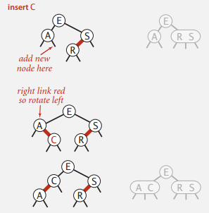

# BALANCED SEARCH TREES

### Symbol table review

Binary search tree 除了刪除會破壞平衡以外，還有個缺陷是若 `insert()` 的 key 是有序的，會退化成 list 造成性能下降，本部分將介紹幾種能夠時間複雜度保證為 logN 的結構，2-3 trees, left-learning red-black BSTs, B-trees    

## 2-3 search trees

- 2-node : 一個 key，二條連接，左子樹的 key 都小於該 key，右子樹的 key 都大於該 key
- 3-node : 二個 key，三條連接，左子樹的 key 都小於該 key，中間子樹的 key 都介於二個 key 之間，右子樹的 key 都大於該 key
- perfect balance : 所有空連接到根結點都距離都相同


insert 的情況

1. 向 2-node 插入
2. 向一顆只有 3-node 的樹插入
3. 向父節點是 2-node 的 3-node 插入
4. 向父節點是 3-node 的 3-node 插入
5. 分解根結點

除了 1 以外，都會發生 Local transformations(局部變換)

  

### Local transformations in a 2-3 tree

局部變換就是將暫時的 4-node 分解成 2-3 tree， 有六種情形，該 4-node 可能是

1. 根結點
2. 2-node 的左子節點
3. 2-node 的右子節點
4. 3-node 的左子節點
5. 3-node 的中間子節點
6. 3-node 的右子節點

重點

- 只有當根結點分裂時，樹的高度才會增加(2-3 tree 比較像往上長)
- Local transformations 無論是在過程中暫時的 4-node 或分解完都不會影響有序性與平衡性

  

### 2-3 tree: performance

Tree Height

- worst case: logN​ (全部是 2-node)
- best case: log3N 大約 .631LogN (全部是 3-node)
  - 100 萬個節點時，相差 12 ~ 20
  - 10 億個節點時，相差 18~30
- 保證對數級的時間複雜度

  

### 2-3 tree: implementation?

2-3 tree 實作很複雜

- 要維護不同類型的節點
- 更多次的節點比較
- 分解時要將資料與連接移動到其他節點
- 分解有多種情況                                    

有更好的實作方式  

  

## Red-black BSTs

紅黑樹是 BST 一種，但使用額外訊息(紅或黑)來表示 2-3 tree，使實作更簡單。表示的方式就是用**左傾的紅連接**來表示 3-node。  

- 所有紅連接都是左連接 ?why
- 沒有任何節點同時有二條紅連接(沒有 4-node)
- 所有空連結到根節點的路徑上的黑色連接數量都相同(2-3 tree 所有空連接到根結點都距離都相同)


  

### Search implementation for red-black BSTs

搜尋的方式與 BST 相同

```java
public Val get(Key key)
{
    Node x = root;
	while (x != null)
    {
   		int cmp = key.compareTo(x.key);
        if (cmp < 0)      x = x.left;
        else if (cmp > 0) x = x.right;
        else              return x.val;
    }
    return null;
}
```

  

### Red-black BST representation

顏色表示

```java
private static final boolean RED = true;
private static final boolean BLACK = false;

private class Node
{
    Key key;
    Value val;
    Node left, right;
    boolean color;
}

private boolean isRed(Node x)
{
    if (x == null) return false;
	return x.color == RED;
}
```

  

### Elementary red-black BST operations

在操作中會暫時破壞紅黑樹結構，因此會需要以下操作來修復

#### 1. 左旋轉


```java
private Node rotateLeft(Node h)
{
    assert isRed(h.right);
    Node x = h.right;
    h.right = x.left;
   	x.left = h;
    x.color = h.color;
    h.color = RED;
    return x;
}
```


#### 2. 右旋轉

左旋轉的圖的順序反過來就是

```java
private Node rotateRight(Node h)
{
    assert isRed(h.left);
    Node x = h.left;
    h.left = x.right;
    x.right = h;
    x.color = h.color;
    h.color = RED; 
    return x;
}
```


#### 3. 顏色轉換


```java
private void flipColors(Node h)
{
    assert !isRed(h);
    assert isRed(h.left);
    assert isRed(h.right);
    
    h.color = RED;
    h.left.color = BLACK;
    h.right.color = BLACK;
}
```

當根節點是紅色時，需要把根節點變成黑色，此時樹的黑連接高度會加一  

補充: 以 2-3 tree 來看，就算根節點是 3-node，以紅黑樹的表示法也是根結點的左連結子節點是紅色，而非根節點是紅色，因此根節點永遠是黑色

  

### Insertion in a LLRB tree: overview

紅黑樹的操作概念可以和 2-3 tree 對應，新插入的節點是紅色的

#### 向根節點 2-node 插入


#### 向底部 2-node 插入



#### 向根節點 3-node 插入

1. 最簡單的狀況是新鍵大於樹中的二個鍵，上層節點同時二條紅連接，進行顏色轉換
2. 若新鍵小於樹中二個鍵會產生連續二條紅連接，將上層節點右旋轉，轉變成第 1 種情況
3. 若新鍵介於樹中二個鍵之間，則先將右傾紅連接左旋轉，轉變為第 2 種情況


#### 向底部 3-node 插入


  

### Insertation in a LLRB tree: Java implementation

旋轉或者顏色轉換，相當於 2-3 tree 的 local transform，而 local transform 是對 3-node 插入時會發生的，因此初始狀態必為下圖中的初始狀態，以左傾紅連接所表示的 3-node 狀態，插入時會有三種情形，新鍵小於，介於中間，或大於樹中二鍵，每種狀態可以依照順序轉變為另一種狀態，最後調整完畢

- 左連接是黑連接，右連接為紅連接，進行左旋轉
- 連續二個紅連接，進行右旋轉
- 左右都是紅連接，進行顏色轉換


```java
private Node put(Node h, Key key, Value val)
{
    if (h == null) return new Node(k, val, RED);
    int cmp = key.compareTo(h.key);
    if      (cmp < 0) h.left = put(h.left, key, val);
    else if (cmp > 0) h.right = put(h.right, key, val);
    else              h.val = val;
    
    if (isRed(h.right) && !isRed(h.left))    h = rotateLeft(h);
    if (isRed(h.left) && isRed(h.left.left)) h = rotateRight(h);
    if (isRed(h.left) && isRed(h.right))     flipColors(h);

    return h;
}
```

  

### ST implementations: summary


Balance search tree 的嚴格定義是***二元樹中任意節點的左右子樹節點的高度相差不能大於一***，AVL 樹就符合這個定義，但很多 Balance search tree 其實不符合嚴格定義，例如紅黑樹就不符合。  

另外，Balance search tree 中的***平衡***代表什麼意思? 所謂平衡就是為了解決二元樹在頻繁的操作後，可能出現高度遠大於 $log_2^N$ 的情況，極端狀況甚至退化成串列，導致性能的下降；而平衡樹就是為了解決這個問題，所以***平衡是指，只要樹的高度仍然是對數量級不會遠大於 $log_2^N$***，儘管不符合嚴格定義，但仍然會認為這是一顆平衡樹。  

工程中為何都應用紅黑樹? 甚至講平衡樹，都會預設是講紅黑樹，儘管 AVL 樹高度平衡，所以查找效率非常高，但為了維持平衡導致插入與刪除都要做調整所以頻繁插入予刪除的資料使用 AVL 樹代價會太高昂；而粗略分析紅黑樹，一個高度 L 的 2-3 tree，最差的情況是全部為 3-node，若用紅黑樹表示則高度為 2L；換句話說 N 個節點的紅黑樹，高度不超過 $2log_2^N$，儘管不算嚴格的平衡樹，但高度僅增加一倍，且維持了插入與刪除的性能，所以在工程應用中更傾向於使用性能穩定的紅黑樹。