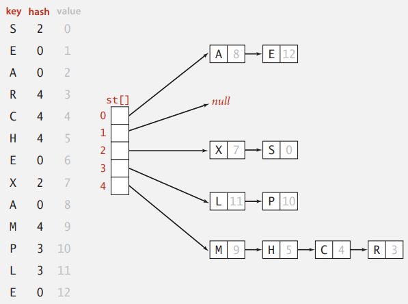
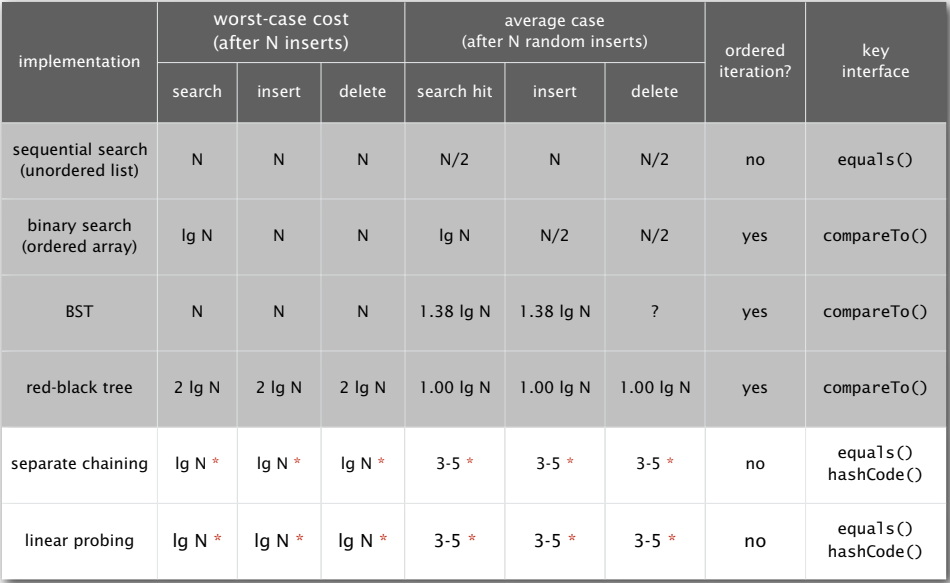

# HASH TABLES

使用 red-black tree 來實作 symbol table 是 $O(logN)$，是否能優化?  

可以，但是需要使用另一種資料結構，而且無法再支持有序操作 e.g. 按照順序打印，如果只需要優化的插入與搜尋可以改用 Hash table。  


### Hash: basic plan

把 symbol table 當成陣列，使用雜湊函式將鍵轉化成陣列的索引


Issue 

- 如何設計 hash function (若鍵是複雜的資料型態會更困難)
- Collision resolution: 處理不同鍵雜湊出相同索引值的情形


經典的時空間權衡問題

- No space limitation: 直接把鍵當索引(超大陣列)
- No time limitation: 碰撞時則按順序查找
- Space and time limitations: 真實世界需要權衡時間與空間


## Hash functions

### Computing the hash function

理想目標是，任何鍵能夠均勻地轉化成陣列的索引

- 轉化(運算)的效能
- 在範圍內均勻分配


### Java’s hash code conventions

以下介紹 Java 對 hash 的實現與規則，所有 Java 的類別都繼承 `hashCode()` 方法，會返回 32 bit 的 int，且 `hashCode()` 必須和 `equlas()` 的結果一致。  

預設 `hashCode()` 返回記憶體位址，但 Java 改寫了常用的類別(Integer, Double, String, File, Url, Date…)。  


### Implementating hash code: integers, booleans, and doubles

```java
pubilc final class Integer
{
	private final int value;
	...
	public int hashCode()
	{
		return value;
	}
}
```

```java
public final class Boolean
{
    pirvate final boolean value;
    ...
    public int hashCode()
    {
        if (value) return 1231;
        else       return 1237;
    }
}
```

```java
public final class Double
{
    private final double value;
    ...
    public int hashCode()
    {
        // convert to IEEE 64-bit represenataion
        long bits = doubleToLongBits(value);
        // xor MSB 32-bits with LSB 32-bits
        return (int) (bits ^ (bits >>> 32));
    }
}
```

備註: 理想上，`hash()` 要讓資料的所有位元都參與到運算中


### Implementating hash code: strings

```java
public final class String
{
	private final char[] s;
	...
	public int hashCode()
	{
		int hash = 0;
		for (int i = 0; i < length(); i++)
			hash = s[i] + (31 * hash);
        return hash;
	}
}
```

- Horner’s method
  - 選一個質數可以減少碰撞機會
  - $h = s[0] * 31^{L-1} + ... + s[L-1] * 31^{0}$


為了提高效能，可以用一個變數去儲存

```java
public final class String
{
	private int hash = 0;
	private final char[] s;
	...
	public int hashCode()
	{
		int h = hash;
		if (h != 0) return h;
        
		for (int i = 0; i < length(); i++)
			h = s[i] + (31 * h);
		hash = h;
        return h;
	}
}
```

  

### Implementating hash code: user-defined types

為自訂類別設計雜湊函式

```java
public final class Transaction implements Comparable<Transaction>
{
    private final String who;
    private final Date when;
    private final double amount;
    ...
    public int hashCode()
    {
        int hash = 17;
        hash = 31*hash + who.hashCode();
        hash = 31*hash + when.hashCode();
        hash = 31*hash + ((Double) amount).hashCode();
        return hash;
    }
}
```


- 確保所有資料參與到雜湊函式
- 好好利用 Java 支援的 `hashCode()`


### Hash code design

hash code 處理方法，這些規則在實踐中很有效，並被許多 Java libraies 使用

- 使用 $31x + y$ 規則來結合
- 如果是 primitive tpye，則使用 wrapper type 的 `hashCode()`
- 如果是 null，則返回 0
- 如果是 reference type，則使用 `hashCode()`
- 如果是陣列，對每個元素使用以上規則，或用 `Arrays.deepHashCode()`


理論上的確有能夠讓每個位置的機率能能均勻相同的 ***universal*** hash functions，但實際應用中並不廣泛


### Modular hashing

我們從 `hashCode()` 中取得了 32 bit 的 int，假設有長度 M 的表，hash function 需要讓結果介於 0 ~ M-1 之間。


第一種方式行不通，因為 hashcode 可能為負

```java
private int hash(Key key)
{
    return key.hashCode() % M;
}
```


第二種方式也行不通，Math 在這有問題，結果可能是 $-2^{31}$

```java
private int hash(Key key)
{
    
    return Math.abs(key.hashCode()) % M;
}
```


正確  

這段算法會先將 MSB 屏蔽，把 32 位整數轉為 31 位非負整數，再計算除以 M 的餘數

```java
private int hash(Key key)
{
    return (key.hashCode() & 0x7fffffff) % M;
}
```

  

## Separate chaining

碰撞的處理主要有二種，一是串列法 Separate chaining，二是線性探測 Linear probing 法。  


Separate chaining 是，將陣列中每個元素指向一個 Linked list，Linked list 中的每個節點儲存了 hash 為該元素索引的鍵值對。  

插入時間複雜度是 $O(1)$，只要將其放到對應的 Linked list 即可；搜尋或刪除則跟 Linked list 長度 k 成正比，也就是 $O(k)$，如果 hash 比較均勻，$k = N/M$，N 是元素數量，M 是陣列長度。




### Separate chaining ST: Java implementation

```java
public class SeparateChaningHashST<Key, Value>
{   
    private static class Node
    {
        private Object key;
        private Object value;
        private Node next;
        public Node(Object key, Object value, Node next) {
            this.key = key;
            this.value = value;
            this.next = next;
        }
    }
    
    private int M;
    private int N;
    private Node[] st;

    public SeparateChaningHashST() {
        this.M = 97;
        this.st = (Node[]) new Object[M];
    }
    
    public Value get(Key key) {
        int i = hash(Key);
        for (Node x = st[i]; x != null; x = x.next)
            if (key.equals(x.key)) 
                return (Value) x.val;
        return null;
    }
    
    public void put(Key key, Value val) {
        int i = hash(key);
        for (Node x = st[i]; x != null; x = x.next) {
            if (key.equals(x.key)) {
                x.val = val; 
                return;
            }
        }
        st[i] = new Node(key, val, st[i]);
    }
    
    private int hash(Key key) {
        return (key.hashCode() & 0x7fffffff) % M;
    }
}
```


## Linear probing

### Collision resolution: open addressing

如果發生碰撞，就往後找，直到空閒位置  

- hash: 將 key 轉換成 0 ~ M-1
- Insert: 如果位置空著就插入，否則就往後 i+1, i+2 插入
- Search: 搜尋陣列索引 i，如果不為空但不相同，就往後 i+1, i+2 找
- Note: 陣列長度 M 必須比 key-value 對數更多


### Linear probing ST implementation

**刪除操作**，不能將該件直接設成 `null` ，這會導致後面的元素無法被查詢，必須要將 cluster 的資料重新插入

```java
public class LinearProbingHashST<Key, Value> {
    private int M = 16;	// Linear probing ST 大小
    private int N; // 鍵值對數量
    private Key[] keys;
    private Value[] vals;
    
    public LinearProbingHashST() {
        keys = (Key[]) new Object[M];
        vals = (Value[]) new Object[M];
    }
    
    public void put(Key key, Value val) {
		if (N >= M/2) resize(2*M);	// 最多半滿狀態
        
        int i;
        for (i = hash(key); keys[i] != null; i = (i+1) % M) {
            if (keys[i].equals(key)) {
                vals[i] = val;
                return;
            }
    	}
        keys[i] = key;
        vals[i] = val;
		N++;
    }
    
    public Value get(Key key)
    {
        int i;
        for (i = hash(key); keys[i] != null; i = (i+1) % M)
            if (keys[i].equals(key))
                return vals[i];
        return null;
    }
    
    public void delete(Key key) {
        if (!contains(key)) return;
        
        int i = hash(key);
        while (!key.equals(key[i])) {
            i = (i + 1) % M;
        }
        keys[i] = null;
        vals[i] = null;
        i = (i + 1) % M;
        while (keys[i] != null) {
            Key keyToRedo = keys[i];
            Value valToRedo = vals[i];
            keys[i] = null;
            vals[i] = null;
            N--;
            put(keyToRedo, valToRedo);
            i = (i + 1) % M;
        }
        N--;
        if (N > 0 && N == M/8) resize(M/2);
    }
    
    private int hash(Key key) {
        return (key.hashCode() & 0x7fffffff) % M;
    }
    
    private void resize(int cap) {
        LinearProbingHashST<Key, Value> t = new LinearProbingHashST<>(cap);
		for (int i = 0; i < M; i++) {
        	if (keys[i] != null)
                t.put(keys[i], vals[i]);
            keys = t.keys;
            vals = t.vals;
            M = t.M;
        }
    }
}
```


### Clustering

Linear probing 效能取決於元素插入陣列後形成的連續元素，稱為 cluster  

無論使用哪種方式，當 Hash table 空閒的位置較少時，碰撞機率會很大，為了保持性能會讓 Hash table 空閒的位置保持在一定數量，用 Load factor 來表示空閒置的多少 Load factor 計算公式為 $N / M$


### Analysis of linear probing

在大小為 $M$ 並含有 $N=\alpha M$ 的線性探測哈希表中，命中與未命中所需的探測次數為  

$\sim\dfrac{1}{2}(1+\dfrac{1}{1-\alpha})$ 和 $\sim\dfrac{1}{2}(1+\dfrac{1}{(1-\alpha)^2})$


- M 太大: 太多空閒空間
- M太小: 搜尋時間太久
- $\alpha = N/M \sim \dfrac{1}{2}$ 攤測次數會在 1.5 ~ 2.5 之間


## Context

### Separate chaining vs. Linear probing

#### Seprate chaining  

優點

- Linked list 對於記憶體的利用率比較高，不像陣列要先申請好
- 對於 Load factor 容忍度高，clustering data 造成影響較小，Linear probing 的 Load factor 接近 1 時會有大量碰撞導致需要探測、再次 hash…而 Seprate chaining 即使 Load factor 是 10，頂多 Linked list 變長而已
- 可以把 Linked list 改造成 Skip list、red-black tree 等，即使在極端狀況，所有資料都 hash 成同一個值，那查找時間複雜度仍保持 $O(logN)$

缺點

- 需要額外儲存指標的空間，如果是比較小的儲存物件，可能會讓記憶體消耗翻倍；除非要儲存的物件本身就很大，那就無所謂指標所占用的空間
- CPU 緩存不友好

#### Linear probing  

優點

- 連續記憶體位置，better cache performance
- 沒有指標，容易序列化

缺點

- 衝突的代價很高，因此會維持 Load factor 在一定數字之下，導致較浪費空間

#### 總結

當資料量小，Load factor 小的時候，適合用 Linear Probing，例如 Java ThreadLocatMap；當要儲存的物件比較大，還有資料量大的時候，建議使用 Seprate chaining，而且還能採用優化策略。


### Hashing: variations on the theme

許多改進的研究  

#### 1. Two-probe hashing

hash 到二個位置，將 key 插入到較短的 linked list 中


#### 2. Double hashing

基於 linear probing，但移到變動數量的位置，而非固定 n 個


#### 3. Cuckoo hashing


### Hash tables vs. balanced search trees

Hash tables

- Hash table 實作較複雜，要考量 hash 函數設計、衝突處理，擴大或縮小容量；而 Search tree 只需要考慮平衡性問題
- 理論上 Hash table 的插入、刪除與搜尋是常數等級，但 Hash table 擴大容量會很耗時，遇到衝突時效能不穩定，而 Balanced search tree 時間複雜度穩定 $logN$，實際工程中，因為 hash 函數本身的耗時與衝突的存在，導致不一定比 $logN$ 快
- Java 中對 String 有優化(cached hash code)

Search trees

- 性能保障，沒有 clusting data 問題
- 提供有序操作，例如Binary search tree 使用中序走訪就可以由小到大輸出資料序列
- 比較操作 `compareTo()`, `equals()` 比較沒有坑，hash function 要考慮效能，均勻分布等等

Java

- Red-black BSTs: java.util.TreeMap, java.util.TreeSet
- Hash tables: java.util.HashMap, java.util.IdentityHashMap


### ST implementations: summary




## Map、Set

實際使用上比較常用從 Hash map 中抽象出來的 Map、Set。  


### Map

key-value 成對，key 不重複

```java
new HashMap();
map.set(key, value);
map.get(key);
map.has(key);
map.size();
map.clear();
```


### Set

不重複的元素集合

```java
new HashSet();
set.add(value);
set.delete(value);
set.hash(value);
```

