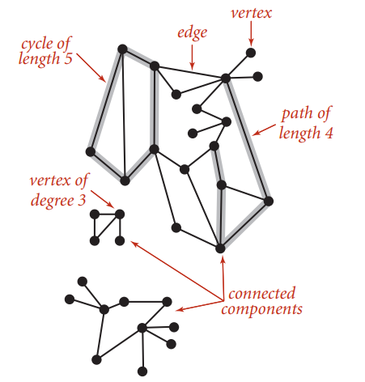
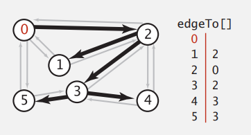
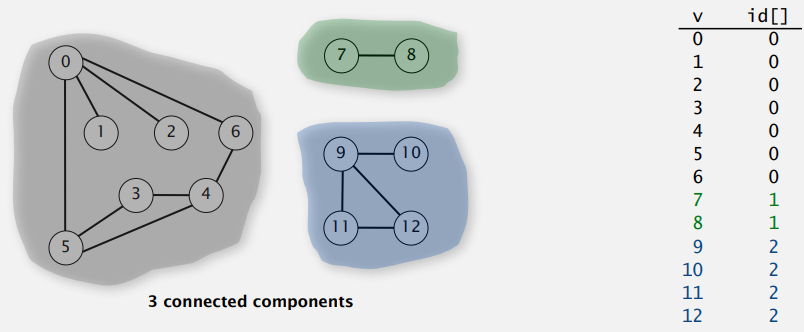

# Undirected graphs

## Introduction

### 圖的術語

**Graph**. Set of **vertices** connected pairwise by **deges**.  圖是由一組頂點和一組能夠將二個頂點相連的邊組成的  

**度**，該頂點的邊的個數  

**連通圖**，圖中任意頂點都存在一條路徑到達另一個頂點  

**連通子圖**，非連通圖由幾個連通的部分組成，每個連通的部分稱為連通子圖，例如下圖有三個連通子圖

**Cycle**. Path whose first and last vertices are the same.



### Some graph-processing problems

**Path**. Is there a path between `s` and `t`?  

**Shortest path**. What is the shortest path between `s` and `t`?  


**Cycle**. Is there a cycle in the graph?  

**Euler tour**. Is there a cycle that uses each edge exactly once? 能不能不重複就走訪完所有的邊?  

**Hamilton tour**. Is there a cycle that uses each vertex exactly once?  


**Connectivity**. Is there a way to connect all of the vertices?   

**MST**. What is the best way to connect all of the vertices? 用最短的邊的集合連接所有點   

**Biconnectivity**. Is there a vertex whose removal disconnects the graph?  


**Planarity**. Can you draw the graph in the plane with no crossing edges  

**Graph isomorphism**. Do two adjacency lists represent the same graph?  


圖的相關問題很多，主要的挑戰是去了解這些問題有多複雜? 有些很簡單，有些很複雜，有些我們並不清楚，處理圖的問題時，首先要想的是這個問題是否能夠求解。  

## Undirected graph API

```
public class Graph
-----------------------
                  Graph(int V) 創建含有 V 個頂點不含邊的圖
                  Graph(In in)
             void addEdge(int v, int w) 添加一條邊 v-w
Iterable<Integer> adj(int v) 和 v 相鄰的所有頂點
	          int V() 頂點數
	          int E() 邊數
           string toString() 圖的字串表示
```

### 常見的圖運算

計算 `v` 的度數

```java
public static int degree(Graph G, int v) {
    int degree = 0;
    for(int w : G.adj(v))
        degree++;
    return degree;
}
```


計算所有頂點的最大度數

```java
public static int maxDegree(Graph G) {
    int max = 0;
    for(int v = 0; v < G.V(); v++)
        if (degree(G, v) > max)
            max = degree(G, v);        
    return max;
}
```


計算所有頂點的平均度數

```java
public static double averageDegree(Graph G) {
    return 2.0 * G.E() / G.V();
}
```


計算 self-loops 個數

```java
public static int numberOfSelfLoops(Graph G) {
    int count = 0;
    for (int v = 0; v < G.V(); v++)
    	for (int w : G.adj(v))
            if (v == w) count++;
    return count/2;               
}
```


圖的字串表示

```java
public String toString() {
    String s = V + " vertices, " + E + " edges\n";
    for (int v = 0; v < V; v++) {
        s += v + ": ";
        for (int w : this.adj(v))
            s += w + " ";
        s += "\n";
    }
    return s;
}
```


## graph representation

### Adjacency-matrix 

**相鄰矩陣**，用 V 乘 V 的布林值矩陣，陣列索引代表頂點，當頂點 `v` 與頂點 `w` 之間有連接的邊時，`adj[v][w]` 為 `true`，否則為 `false`；用這種方法需要耗費 $V^2$ 的空間，因此大圖不適合用此種方式儲存。

### Adjacency-list graph representation

**相鄰串列**，使用一個以頂點為索引的陣列，陣列指向一個串列，串列中的元素都是與該頂點相鄰的頂點。


### Java 實作 Adjacency-list graph 

稀疏矩陣的標準表示方式為相鄰串列，使用 `Bag` ADT 來實作，這種實作具有以下特點

- 使用空間與 $V + E$ 成正比
- 增加一條邊需要的時間為常數
- 走訪 `v` 的所有相鄰頂點的時間，與 `v` 的度數成正比

```java
public class Graph {
    private final int V; // 頂點數量
    private int E;	// 邊數量
    private Bag<Integer>[] adj;
    
    public Graph(in V) {
        this.V = V;
        this.E = 0;
		adj = Bag<Integer>[V];
        for (int v = 0; v < V; v++) {
            adj[v] = new Bag<Integer>();
        }
    }

    public int V() {
        return V;
    }
    
    public int E() {
        return E;
    }
    
    // undirected graph
    public void addEdge(int v, int w) {
        adj[v].add(w);
        adj[w].add(v);
        E++;
    }
    
    public Iterable<Integer> adj(int v) {
        return adj[v];
    }
}
```

### Graph 不同實現方式的性能

| 資料結構         | 空間  | add edge | edge between v and w? | iterate over vertices adjacent to v? |
| ---------------- | ----- | -------- | --------------------- | ------------------------------------ |
| adjacency matrix | E     | 1        | 1                     | V                                    |
| adjacency lists  | $V^2$ | 1        | degree(v)             | degree(v)                            |

## Depth-first search

DFS 指的是在搜尋時，如果遇到一個節點有子節點與兄弟節點，那先搜尋子節點再搜尋兄弟節點；類似走迷宮，迷宮的路口抽象為圖的頂點，通道抽象為邊，走的時候會一直往迷宮深處走，遇到死路就退回路口  

虛擬碼

```
DFS(to visit a vertex v)
Mark v as visited.
Recursively visit all unmarked
      vertices w adjacent to v.
```

使用 DFS 找到頂點 v 的所有相連頂點

```java
public class DepthFirstSearch {
    private boolean[] marked;
    private int count;
    
    public DepthFirstSearch(Graph G, int s) {
        marked = new boolean[G.V()];
        dfs(G, s);
    }
    
    // 使用 DFS 找出 G 圖中頂點的所有相通頂點
    private void dfs(Graph G, int v) {
        marked[v] = true;
        count++;
        for (int w : G.adj(v)) {
            if (!marked[w]) {
                dfs(G, w);   
            }
        }
    }
    
    // w 是否與 s 相通
    public boolean marked(int w) {
        return marked[w];
    }

    // 與 s 相通的頂點數量
    public int count() {
        return count;
    }
}
```

DFS 每條邊最多被走訪二次，一次是走訪一次是回退，時間複雜度為 $O(E)$，$E$ 代表邊的數量  

DFS 消耗的記憶體主要是 `marked[]`、`edgeTo[]` 與頂點數量 $V$ 成正比，function stack 最大深度不超過頂點個數，空間複雜度 $O(V)$

### 尋找路徑

路徑 API

```
public class Paths
-----------------------
                  Paths(Graph G, int s) 在 G 中找出以 s 為起點的所有路徑
                  boolean hasPathTo(int v) 是否存在 s 到 v 的路徑
Iterable<Integer> pathTo(int v) s 到 v 的路徑
```


DFS 搜尋圖中的路徑

```java
public calss DepthFirstPaths {
    private bool[] marked;
    private int[] edgeTo;
    private int s;
    
    public DepthFirstPaths(Graph G, int s) {
        marked = new boolean[G.V()];
        edgeTo = new int[G.V()];
        this.s = s;
        dfs(G, s);
    }
    
    private void dfs(Graph G, int v) {
        marked[v] = true;
        for (int w : G.adj[v]) {
            if (!marked[w])  {
                edgeTo[w] = v;
                dfs(G, w);                
            }
        }
    }
    
    public boolean hasPathTo(int v) {
        return marked[v];
    }
    
    public Iterable<Integer> pathTo(int v) {
        if (!hasPathTo(v)) return null;
        Stack<Integer> path = new Stack<>();
        for (int x = v; x != s; x = edgeTo[x]) {
            path.push(x);
        }
        path.push(s);
        return path;
    }
}
```



## Breadth-first search

BFS 指的是在搜尋時，如果遇到一個節點有子節點與兄弟節點，那先搜尋兄弟節點再搜尋子節點  

DFS 將尚未走訪的頂點放在 stack；而 BFS 則是將尚未走訪的頂點放在 queue  

另外，BFS 因為是由離起點最近的那些頂點開始檢查，因此也解決了，搜尋 `s`  到 `t` 的最短路徑問題( `s` 到 `t` 最少的邊)


使用 BFS 找到頂點 v 的所有相連頂點

```java
public class BFS {
    private boolean[] marked;
    private int count;
    private Queue<Integer> queue;

    public void BFS(Graph G, int s) {
        marked = new boolean[G.V()];
        count = 0;
        queue = new Queue<Integer>();

        bfs(G, s);
    }

    private void bfs(Graph G, int s) {
        queue.enqueue(s);
        marked[s] = true;
        count++;
        while (!queue.isEmpty()) {
            Integer v = queue.dequeue();
            for (Integer w : G.adj(v)) {
                if (!marked[w]) {
                    queue.enqueue(w);
                    marked[w] = true;
                    count++;
                }
            }
        }
    }

    // w 是否與 s 相通
    public boolean marked(int w) {
        return marked[w];
    }

    // 與 s 相通的頂點數量
    public int count() {
        return count;
    }
}
```


### 尋找路徑

虛擬碼

```
BFS(from source vertex v)
Put s onto a FIFO queue, and mark s as visited
Repeat until the queue is emtpy:
	- remove the least recently added vertex v
    - add each of v's unvisited neighbors to the queue, and marked them as visited.
```


```java
public class BreadthFirstPaths {
    private boolean[] marked;
    private int[] edgeTo;
    private final int s;
    
    public BreadthFirstPaths(Graph G, int s) {
        marked = new Boolean[G.V()];
        edgeTo = new int[G.V()];
        this.s = s;
        bfs(G, s);
    }
    
    private void bfs(Graph G, int s) {
        Queue<Integer> queue = new Queue<Integer>();
        marked[s] = true;
        queue.enqueue(s);
        while (!queue.isEmpty()) {
            int v = queue.dequeue();
            for (int w : G.adj(v)) {
                if (!marked[w]) {
                    edgeTo[w] = v;
                    marked[w] = true;
                    queue.enqueue(w);                    
                }
            }
        }
    }
    
    public boolean hasPahtTo(int v) {
        return marked[v];
    }
    
    public Iterable<Integer> pathTo(int v) {
        /* as before */
    }
}
```

## Connected components

DFS 另一個應用是找出途中所有連接的點  



思路是循環每一個點，首先是 `s`，DFS 走訪所有與 `s` 連接的點，並在 `id[]` 中紀錄為同一個數字

```java
public class CC {
    private boolean[] marked;
    private int[] id;
    private int count;
    
    public CC(Graph G) {
        marked = new boolean[G.V()];
        id = new int[G.V()];
        // 一次循環會走訪完一個連通子圖
        for (int s; s < G.V(); s++) {
            if (!marked[s]) {
                dfs(G, s);
                count++;
            }
        }
    }
    
    private void dfs(Graph G, int v) {
        marked[v] = true;
        for (int w : G.adj(v)) {
            if (!marked[w]) {
	            id[w] = count;                
                dfs(G, w);
            }
        }
    }
}
```

CC 與 union-find 算法相比，只要經過預處理，之後就僅需常數時間就能求出二個點是否相連；但在實際應用中，當插入點、插入邊與查尋是否相連，混合在一起操作時，比較適合用動態算法 union-find，而 DFS 比較適合圖的 ADT，因為可以更有效利用已知的結構

## Symbol graph

前面都是用 `int` 來表達圖的結構，通常實際應用會用字串來當頂點，

- 符號表 `st`，key 為 `String` (頂點名)，值為 `int` (索引)；對應後就跟之前用 `int` 當 key 一樣
- `keys[]` 用來當反向索引

API

```
public class SymbolGraph
-----------------------
           SymbolGraph(String filename, String delim) 依檔案構造圖，用 delim 分隔
   boolean conatins(String key) key 是否為頂點
       int index(String key) key 的索引
    String name(int v) 索引 v 的頂點名
     Graph G()
```

```java
public class SymbolGraph {
    private ST<String, Integer> st;
    private String[] keys;
    private Graph G;
    
    public SymbolGraph(String filename, String delim) {
        st = new ST<>();
        In in = new In(filename);
        while (in.hasNextLine()) {
            String[] a = in.readLine.split(delim);
            for (int i = 0; i < a.length; i++) {
                if (!st.contains(a[i])) {
                    st.put(a[i], st.size());
                }
            }
        }
        
        // 反向索引 0 => key
        keys = new String[st.size()];
        for (String name : st.keys()) {
            keys[st.get(name)] = name;
        }
        
        G = new Graph(st.size());
        in = new In(filename);
        while (in.hasNextLine()) {
            String[] a = in.readLine.split(delim);
            int v = st.get(a[0]);
            for (int i = 1; i < a.length; i++) {
                G.addEdge(v, st.get(a[i]));
            }
        }
    }
    
    public boolean contains(String s) {
        return st.contains(s);
    }
    
    public int index(String s) {
        return st.get(s);
    }
    
    public String name(int v) {
        return keys[v];
    }
    
    public Graph G() {
        return G;
    }
}
```


另一個常見的問題是，社交網路中二個人的間隔度數

```java
public class DegreeOfSeparation {
    public static void main(String[] args) {
        SymbolGraph sg = new SymbolGraph(args[0], args[1]);
        Graph G = sg.G();
        String source = args[2];
        if (!sg.contains(source)) {
            System.out.println("not in database");
            return;
        }
        
        int s = sg.index(source);
        BreadFirstPaths bfs = new BreadFirstPaths(G, s);
        while (!StdIn.isEmpty()) {
            String sink = StdIn.readLine();
            if (sg.contains(sink)) {
                int t = sg.index(sink);
                if (bfs.hasPathTo(t)) {
                    for (int v : bfs.pathTo(t)) {
                        System.out.println(" " + sg.name(v));
                    }
                } else {
                    System.out.println("Not connected");
                }
            } else {
            	System.out.println("not in database");   
            }
        }
    }
}
```

