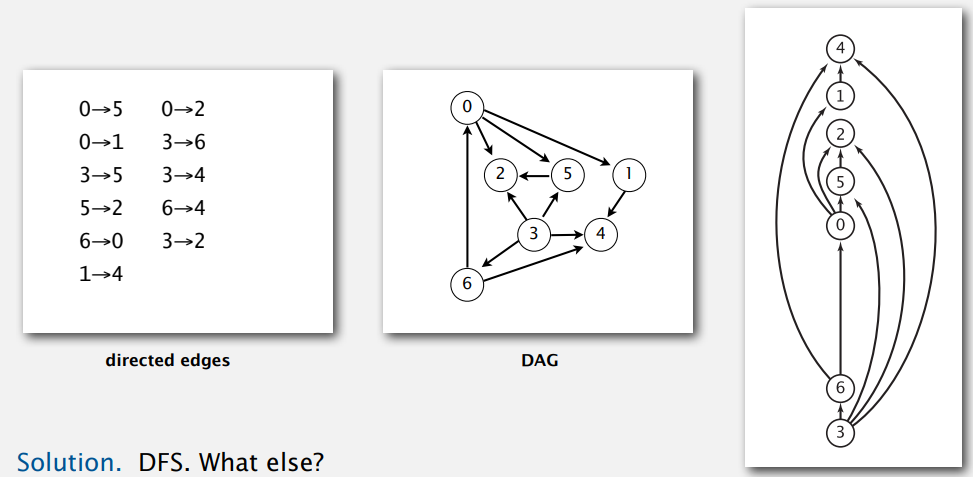
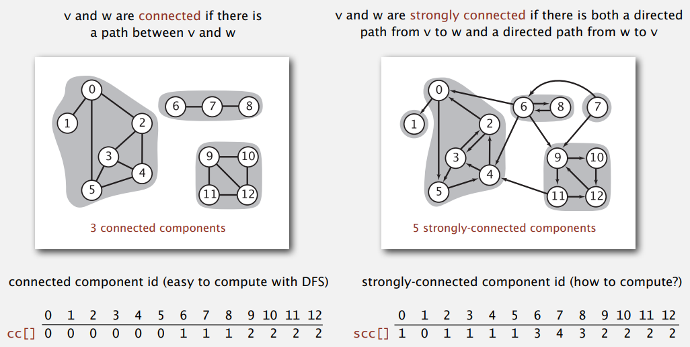
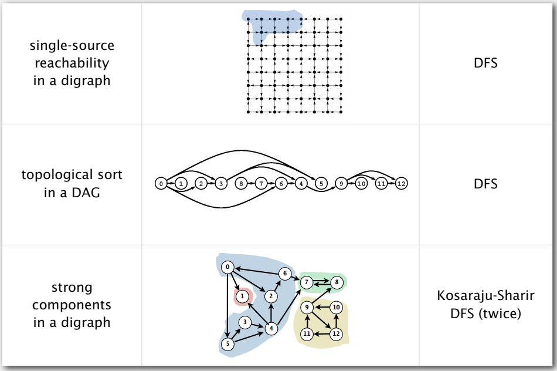

# Directed Graphs

## Introduction

在有向圖中，邊是單向的  

有向圖的常見問題

- 可達性
- 最短路徑
- Topological sort 拓撲排序
- Strong connectivity
- Transitive closure
- PageRank. What is the importance of a web page?

## Digraph API

Digraph API

```
public class Digraph
-----------------------
                  Digraph(int V) 創建含有 V 個頂點不含邊的圖
                  Digraph(In in)
             void addEdge(int v, int w) 添加一條邊 v->w
Iterable<Integer> adj(int v) v 指出的邊連接的所有頂點
	          int V() 頂點數
	          int E() 邊數
	      Digraph reverse() 反向圖
           string toString() 圖的字串表示
```

```java
public class Digraph {
    private final int V; // 頂點數量
    private int E;	// 邊數量
    private Bag<Integer>[] adj;
    
    public Digraph(int V) {
        this.V = V;
        this.E = 0;
		adj = Bag<Integer>[V];
        for (int v = 0; v < V; v++) {
            adj[v] = new Bag<Integer>();
        }
    }

    public int V() {
        return V;
    }
    
    public int E() {
        return E;
    }
    
    public void addEdge(int v, int w) {
        adj[v].add(w);
        // adj[w].add(v); Digraph 不需要
        E++;
    }
    
    public Digraph reverse() {
        Digraph R = new Digraph(V);
        for (int v = 0; v < V; v++) {
            for (int w : adj(v) {
                R.addEdge(w, v);	// v->w 改成 w->v
            }
        }
        return R;
    }
    
    public Iterable<Integer> adj(int v) {
        return adj[v];
    }
}
```

| 資料結構         | 空間    | add edge | edge between v and w? | iterate over vertices adjacent to v? |
| ---------------- | ------- | -------- | --------------------- | ------------------------------------ |
| adjacency matrix | $V^2$   | 1        | 1                     | V                                    |
| adjacency lists  | $E + V$ | 1        | outdegree(v)          | outdegree(v)                         |

## Digraph search

有向圖的可達性問題，頂點 `s` 與 `t` 是否有一條路徑，可以用 DFS 解決，應用在 Java 的 GC 機制  

而最短路徑問題，可以用 BFS 解決；二種算法的實作方式都與無向圖相同

## Topological sort

拓撲排序，是對有向圖的頂點排序，使所有的有向邊都是從前面頂點指向後面頂點  

實際應用在優先級排序問題，例如依照優先等級調度任務、編譯檔案的順序…  



### 檢測有向圖的環

一個優先級問題若存在有向環，那這個問題是無解的；無法對 $x > y$, $y > z$, $z > x$ 的圖進行拓撲排序  

API

```
public class DirectedCycle
-----------------------
                  DirectedCycle(Digraph G)
          boolean hasCycle()
Iterable<Integer> cycle() 有向環中的所有頂點(如果存在的話)
```

DFS 遞迴過程中，function stack 表示的是目前正在走訪的路徑上的頂點，所以增加一個 `onStack[]` 保存遞迴呼叫過程中 function stack 的所有頂點，當找到一條邊 `v -> w` 且 `w` 已經在棧中，代表找到一個有向環 `w-> … -> v -> w`

```java
public class DirectedCycle {
    private boolean[] marked;
    private int[] edgeTo;
    private Stack<Integer> cycle;	// 有向環中所有頂點(如果存在有向環)
    private boolean[] onStack;
    
    public DirectedCycle(Digraph G) {
		marked = new boolean[G.V()];
        edgeTo = new int[G.V()];
        onStack = new boolean[G.V()];
		for (int v = 0; v < G.V(); v++) {
            if (!marked[v]) {
                dfs(G, v);
            }
        }
    }
    
    private void dfs(Digraph G, int v) {
        onStack[v] = true;
        marked[v] = true;
        for (int w : G.adj(v)) {
            if (this.hasCycle()) {
                return;
            } else if (!marked[w]) {
                edgeTo[w] = v;
                dfs(G, w);
            } else if (onStack[w]) {
                // 找到有向環，將環中的頂點存到 cycle
            	cycle = new Stack<>();
                for (int x = v; x != w; x = edgeTo[x]) {
                    cycle.push(x);
                }
                cycle.push(w);
                cycle.push(v);
            }
        }
        onStack[v] = false;
    }
    
    public boolean hasCycle() {
        return cycle != null;
    }
    
    public Iterable<Integer> cycle() {
        return cycle;
    }
}
```

### Depth-first search order

#### Directed Acyclic Graph 基於 DFS 的頂點排序

利用 DFS 只會走訪頂點一次，將走訪的頂點記錄到某個資料結構中，就能透過遍歷這個資料結構訪問到圖中所有頂點，而遍歷的順序取決於紀錄的方式，如下

- 前序，在遞迴前加入 queue
- 後序，在遞迴後加入 queue
- 逆後序，在遞迴前入 stack


```java
public class DepthFirstOrder {
    private boolean[] marked;
    private Queue<Integer> pre;		// 前序排列
    private Queue<Integer> post;	// 後序排列
    private Stack<Integer> reversePost;	// 逆後序排列
    
    public DepthFirstOrder(Digraph G) {
        marked = new boolean[G.V()];
        pre = new LinkedList<>();
        post = new LinkedList<>();
        reversePost = new Stack<>();        
		for (int v = 0; v < G.V(); v++) {
            if (!marked[v]) {
                dfs(G, v);
            }
        }
    }
    
    private void dfs(Digraph G, int v) {
        marked[v] = true;
        pre.offer(v);
        for (int w : G.adj(v)) {
            if (!marked[w]) {
                marked[w] = true;
                dfs(G, v);
            }
        }
        post.offer(v);
        reversePost.push(v);
    }

    public Iterable<Integer> pre() {
    	return pre;    
    }
    
    public Iterable<Integer> post() {
    	return post;    
    }
    
    public Iterable<Integer> reversePost() {
        return reversePost;
    }
}
```

#### 拓撲排序

API

```
public class Topological
-----------------------
                  Topological(Digraph G)
          boolean isDAG() 是否為有向無環圖
Iterable<Integer> order() 拓撲有序的所有頂點
```

使用 `DirectedCycle`、`DepthFirstOrder` 來返回一個有向無環圖的拓撲排序

```java
public class Topological {
    private Iterable<Integer> order;
    
    public Topological(Digraph G) {
		DirectedCycle cycleFinder = new DirectedCycle(G);
        if (!cycleFinder.hasCycle()) {
            DepthFirstOrder dfs = new DepthFirstOrder(G);
            order = dfs.reversePost();
        }
    }
       
    public Interable<Integer> order() {
        return order;
    }
    
    public boolean isDAG() {
        return order != null;
    }
    
    public static void main(String[] args) {
        String filename = args[0];
        String separator = args[1];
        SymbolDigraph sg = new SymbolDigraph(fielname, separator);
        
        Topological top = new Topological(sg);
        for (int v : top.order()) {
            System.out.println(sg.name(v));
        }
    }
}
```

### 基於 Kahn 算法的頂點排序

Kahn 算法實現拓撲排序，思想是

- 找出入度為 0 的頂點 `t`，即為排在最尾的頂點
- 將 `t` 儲存在資料結構中，然後將其刪除(`t` 指向的所有頂點的入度都減 1)
- 資料結構按順序輸出即為拓撲排序後的順序

```java
public class TopologicalKahn {
    private Stack<Integer> order;
    private int[] inDegree;	// 頂點的入度

    public TopologicalKahn(Digraph G) {
        order = new Stack<>();

        // 計算所有頂點的入度
        inDegree = new int[G.V()];
        for (int v = 0; v < G.V(); v++) {
            for (Integer w : G.adj(v)) {
                inDegree[w]++;
            }
        }

        // 由入度為 0 的頂點開始
        Queue<Integer> queue = new LinkedList<>();
        for (int v = 0; v < G.V(); v++) {
            if (inDegree[v] == 0) {
                queue.add(v);
            }
        }

        while (!queue.isEmpty()) {
            int v = queue.poll();
            order.push(v);
            for (Integer w : G.adj(v)) {
                inDegree[w]--;
                if (inDegree[w] == 0) {
                    queue.add(w);
                }
            }
        }
    }

    public Iterable<Integer> order() {
        return order;
    }
}
```


### 複雜度分析

- DFS，每個頂點訪問一次，每條邊訪問一次，時間複雜度 $O(V + E)$
- Kahn，每個頂點訪問一次，每條邊訪問一次，時間複雜度 $O(V + E)$


因為圖可能是由多個連通子圖構成，邊數 $V$ 不一定大於頂點數 $E$ 因此都要考慮，無法省略

## Strong components

 強連通性指的是有像圖中有一條 `v->w` ，同時也有 `w->v`  

應用在食物鏈

### 無向圖的連接 vs. 有向圖的強連接



### Kosaraju-Sjairi algorithm

思路是

1. 對給定的正向圖 $G$ ，使用 DFS 計算反向圖 $G^R$ 取得逆後序頂點序列 reverse postorder
2. 依照 reverse postorder 順序而非標準順序，對正向圖 $G$ 做 DFS

這個算法正確性需要證明，`dfs(G, s)` 走訪到的任意頂點 `v`，都是與 `s` 為強連接；首先必然有一條連接由 `s->v` ，因此需要證明有另一條連接 `v->s`，而這等價於在在 $G^R$ 中有一條連接是 `s->v`，因此證明在 $G^R$ 中有一條連接是 `s->v`，就說明 `s` 與 `v` 為強連接

```java
public class KosarajuSCC {
    private boolean[] marked;
    private int[] id;	// 強連接分量的群組 id
    private count;	// 強連接分量的數量
    
    public KosarajuSCC(Digraph G) {
        marked = new boolean[G.V()];
        id = new int[G.V()];
        DepthFirstOrder order = new DepthFirstOrder(G.reverse());
        for (int s : order.reverseOrder()) {
            if (!marked[s]) {
                dfs(G, s);
                count++;
            }
        }
    }
    
    private void dfs(Digraph G, int v) {
        marked[v] = true;
        id[v] = count;
        for (int w : G.adj(v)) {
            if (!marked[w]) {
                dfs(G, w);
            }
        }
    }
    
    public boolean stronglyConnected(int v, int w) {
        return id[v] == id[w];
    }
    
    public int id(int v) {
        return id[v];
    }
    
    public int count() {
        return count;
    }
}
```

## Summary

