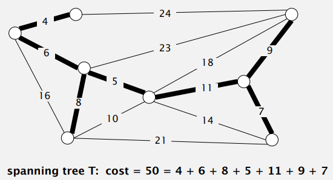
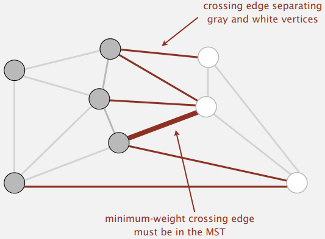

# Minimum Spanning Trees

## 最小展開樹

### 最小展開樹定義及約定

圖的展開樹是一個含有其**所有頂點**的**無環**連通子圖，而最小展開樹則是權重值最小的展開樹  

約定

- 只考慮聯通圖，如果圖不連通就只能算出所有連通分量的最小展開樹，合併在一起稱為最小生成森林
- 所有邊的權重各不相同，若有相同權重的邊則最小展開樹不唯一

### 最小展開樹原理

#### 樹的性質

- 用一條邊連接任意二個頂點都會產生環
- 刪去任意一條邊將會得到二顆獨立的樹



#### 切分定理

- ***切分***，是將圖的所有頂點分為非空且不重疊的二個集合
- ***橫切邊***，是一條連接二個屬於不同集合的頂點的邊

- ***切分定理***，給定任意切分，他的橫切邊中最小者必為圖的最小展開樹



### Greedy algorithm

使用切分定理找到最小展開樹的一條邊，不斷重複直到找到最小展開樹的所有邊；最小展開樹的邊的數量為頂點數量減一

## Edge-weighted graph API

加權無向圖的表示，是擴展 Undirected graph 的 API ，並取代 int，用更通用的 API 來處理 Edge 物件

加權邊的 API

```
public class Edge implements Comparable<Edge>
-----------------------
              Edge(int v, int w, double weight)
       double weight()
	      int either() 其中一個頂點
	      int other() 另一個頂點
	      int compareTo(Edge that)
       String toString()
```

```java
public class Edge implements Comparable<Edge> {
    private final int v;	// 其中一個頂點
    private final int w;	// 另一個頂點
    private final double weight;
    
    public Edge(int v, int w, double weight) {
        this.v = v;
        this.w = w;
        this.weight = weight;
    }
    
    public double weight() {
        return weight;
    }
    
    public int either() {
        return v;
    }
    
    public int other(int vertex) {
		if (vertex == v) return w;
		else if (vertex == w) return v;
        else throw new RuntimeException();
    }
    
    public boolean compareTo(Edge that) {
        if (this.weight() < that.weight) return -1;
		if (this.weight() > that.weight) return +1;
        else return 0;
    }
    
    public String toString() {
        return String.format("%d-%d-%.2f", v, w, weight);
    }
}
```


加權無向圖的 API

```
public class EdgeWeightGraph
-----------------------
               EdgeWeightGraph(int V)
               EdgeWeightGraph(In in)
  	       int V()
	       int E()
	      void addEdge(Edge e)
Iterable<Edge> adj(int v) 和 v 相鄰的所有邊
Iterable<Edge> edges() 圖的所有邊
        String toString()
```

```java
public class EdgeWeightGraph {
    private final int V;
    private int E;
    private Bag<Edge>[] adj;
    
    public EdgeWeightGraph(int V) {
        this.V = V;
        this.E = 0;
        adj = (Bag<Edge>[]) new Bag[V];
        for (int v = 0; v < V; v++) {
            adj[v] = new Bag<Edge>();
        }
    }
    
    public int V() {
        return V;
    }
    
    public int E() {
        return E;
    }
    
    public void addEdge(Edge e) {
        int v = e.either(), w = e.other(v);
        adj[v].add(e);
        adj[w].add(e);
        E++;
    }
    
    public Iterable<Edge> adj(int v) {
		return adj[v];
    }
}
```

## Prim’s algorithm

每一步會為一棵生長中的樹添加一條邊；一開始這棵樹只有一個頂點，之後會添加 $V-1$ 條邊；每一次都會從樹中的頂點與不在樹中的頂點所連接的邊之中，選擇權重最小的邊加入樹中

### Prim algorithm API

```
public class PrimMST
-----------------------
                  PrimMST(EdgeWeightGraph G, int v)
   Iterable<Edge> edges() 取得 MST 的所有邊
```

### Java implementation

```java
public class PrimMST {
	private Edge[] edgeTo;	// 距離樹最近的邊
    private double[] distTo;	// distTo[w] = edgeTo[w].weight()
    private boolean[] marked;	// 如果 v 在樹中則為 true
    private IndexMinPQ<Double> pq;	// 有效的橫切邊
    
    public PrimMST(EdgeWeightGraph G) {
        edgeTo = new Edge[G.V()];
        distTo = new double[G.V()];
        marked = new boolean[G.V()];
        for (int v = 0; v < G.V(); v++) {
            distTo = Double.POSITIVE_INFINITY;
        }
        pq = new IndexMinPQ<>(G.V());
        
        // 先把頂點 0 加入 MST 中
        distTo[0] = 0.0;
        
        // MST 目前沒有邊，頂點 0 的權重為 0.0
        pq.insert(0, 0.0);
        
        // 將橫切邊頂點加入 MST
        while (!pq.isEmpty()) {
            visit(G, pq.delMin());
        }
    }
    
    private void visit(EdgeWeightGraph G, int v) {
        marked[v] = true;
        for (Edge e : G.adj(v)) {
            int w = e.other(v);
            if (marked[w]) continue;
            if (e.weight() < distTo[w]) {
                edgeTo[w] = e;
                distTo[w] = e.weight();
                if (pq.contains(w))
                    pq.change(w, distTo[w]);
                else
                    pq.insert(w, distTo[w]);
            }
        }
    }
    
    public Iterable<Edge> edges() {
		Queue<Edge> q = new Queue<>();
        for (int i = 0; i < edgeTo.length; i++) {
            if (edgeTo[i] != null)
                q.enqueue(edgeTo[i]);
        }
        return q;
    }
}
```

## Kruskal’s algorithm

Kruskal 是計算加權無向圖的最小展開樹的另一種算法，主要思路是，按照邊的權重由小到大加入到樹中，加入的邊不會構成環，直到樹中含有 $V-1$ 條邊


**Kruskul 與 Prim 算法區別是**，Kruskul 會先將每個頂點看成一棵樹，每次會將二棵樹合併成一棵樹，直到圖中只剩一棵樹

### Java implementation

```java
public class KruskalMST {
    private Queue<Edge> mst = new Queue<>();
    
    public KruskalMST(EdgeWieghtGraph G) {
        MinPQ<Edge> pq = new MinPQ<>();
        for (Edge e : G.edges()) {
            pq.insert(e);
        }
        
        UF uf = new UF(G.V());
        // 從最小權重的邊開始處理
        while (!pq.isEmpty() && mst.size() < G.V() - 1) {
            Edge e = pq.delMin();
            int v = e.either(), w = e.other(v);
            // 判斷是否在同一棵樹中
            if (!uf.connected(v, w)) {
                uf.union(v, w);
                mst.enqueue(e);
            }
        }
    }
    
    public Iterable<Edge> edges() {
        return mst;
    }
}
```