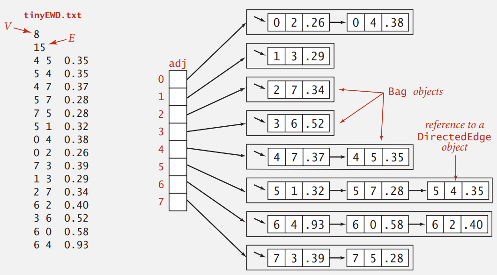
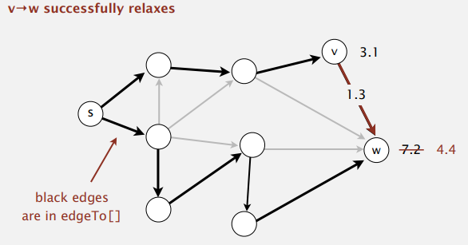

# Shortest Paths

## API

### Weighted directed edge

```java
public class DirectedEdge {
    private final int v;	// 起點
    private final int w;	// 終點
    private final double weight;
    
    public DirectedEdge(int v, int w, double weight) {
        this.v = v;
        this.w = w;
        this.weight = wight;
    }
    
    public double weight() {
        return weight;
    }
    
    public int form() {
        return v;
    }
    
    public int to() {
        return w;
    }
    
    public String toString() {
        return String.format("%d->%d %.2f", v, w, weight);
    }
}
```

### Edge-weighted digraph



```java
public class EdgeWeightedDigraph {
    private final int V;	// 頂點總數
    private int E;
    private Bag<DirectedEdge>[] adj;
    
    public EdgeWeightedDigraph(int V) {
        this.V = V;
        this.E = 0;
        adj = (Bag<DirectedEdge>[]) new Bag[V];
        for (int v = 0; v < V; v++)
            adj[v] = new Bag<DirectedEdge>();
    }
    
    public int V() {
        return V;
    }
    
    public int E() {
        return E;
    }
    
    public void addEdge(DirectedEdge e) {
        adj[e.from()].add(e);
        E++;
    }
    
    public Iterable<DirectedEdge> adj(int v) {
        return adj[v];
    }
    
    public Iterable<DirectedEdge> edges() {
        Bag<DirectedEdge> bag = new Bag<DirectedEdge>();
        for (int v = 0; v < V; v++)
            for (DirectedEdge e : adj[v])
                bag.add(e);

        return bag;
    }
}
```

### Single-source shortest paths API

```
public class SP
                              SP(EdgeWeightedDigraph G, int s)
                      double  distTo(int v)		// s 到 v 的距離(權重)
                      boolean hasPathTo(int v)	// 是否存在 s 到 v 的路徑
       Iterable<DirectedEdge> pathTo(int v)		// s 到 v 的路徑
```

## Shortest-paths properties

加權有向圖***最短路徑***，是從頂點 `s` 到頂點 `t` 的路徑中，總權重最小的路徑  

***最短路徑樹 (SPT)***，給定一副加權有向圖 `G` 與頂點 `s`，以 `s` 為起點的一顆最短路徑樹是圖 `G` 的子圖，它包含 `s` 與 `s` 可達的所有頂點；樹的根結點為 `s`，樹的每條路徑都是有向圖 `G` 中的一條最短路徑

### Data structures for single-source shortest paths

目標是找到起點 `s` 到其他頂點的最短路徑  

- `distTo[]` 儲存起點到該頂點的最短路徑距離，例如 `distTo[v]` 儲存 `s` 到 `v` 的最短路徑距離
- `edgeTo[]` 儲存最短路徑中指向該頂點的父節點，例如 `w = edgeTo[v]` 表示 `w`  指向 `v` 是最短路徑

### Edge relaxation

relax edge `e = v->w`

- `distTo[v]` 為 $3.1$ 加上 edge `e` 的權重 $1.3$
- 比 `distTo[w]` $7.2$ 小，則更新 `distTo[w]` 為 $4.4$



### vecetor relaxtion

鬆弛頂點就是鬆弛頂點指出的所有邊，鬆弛後的頂點會加入到最短路徑樹中

```java
private void relax(EdgeWeightedDigraph G, int v) {
	for (DirectedEdge e : G.adj(v)) {
		// e = form v to w
        int w = e.to();
        if (distTo[v] + e.weight() < distTo[w]) {
            distTo[w] = distTo[v] + e.weight();
            edgeTo[w] = e;
        }
    }
}
```

## Dijkstra algorithm

初始化將除了起點 `s` 外的每個頂點設為最大值，所以 `distTo[]` 會小於 `e.weight()`，運算過程會更新每個頂點的 `distTo[]` 與 `edgeTo[]`

```java
public class DijkstraSP {
    private DirectedEdge[] edgeTo;
    private double[] distTo;
    private IndexMinPQ<Double> pq;
    
    public DijkstraSP(EdgeWeightedDigraph G, int s) {
        edgeTo = new DirectedEdge[G.V()];
        distTo = new double[G.V()];
        pq = new IndexMinPQ<>(G.V());
        
        for (int i = 0; i < distTo.length; i++) {
            distTo[i] = Double.POSITIVE_INFINITY;
        }        
        // 先將 s 加入 SPT 中
        distTo[s] = 0.0;
        
        pq.insert(s, 0.0);
        while (!pq.isEmpty()) {
        	relax(G, pq.delMin());
        }
    }
    
    private void relax(DirectedEdgeDigraph G, int v) {
        for (DirectedEdge e : G.adj(v)) {
			int w = e.to();
            if (distTo[v] + e.weight() < distTo[w]) {
                distTo[w] = distTo[v] + e.weight();
                edgeTo[w] = e;
                if (pq.contains(w))
                    pq.change(w, distTo[w]);
                else
                    pq.insert(w, distTo[w]);
            }
        }
    }
    
    public double distTo(int v) {
        return distTo[v];
    }
    
    public boolean hasPathTo(int v) {
        return distTo[v] < Double.POSITIVE_INFINITY;
    }
    
    public Queue<DirectedEdge> pathTo(int v) {
        if (!hasPathTo(v)) return null;
        
        Stack<DirectedEdge> path = new Stack<>();
        for (DirectedEdge e = edgeTo[v]; e != null; e = edgeTo[e.from()]) {
            path.push(e);
        }
        return path;
    }
}
```


