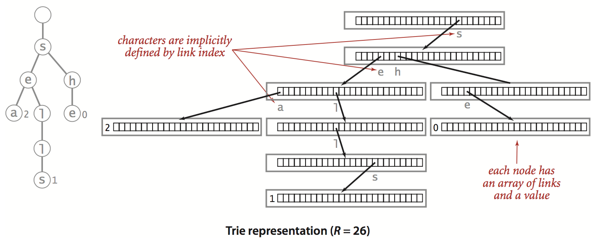

# Tries

Trie 又稱為字典樹，是用來專門處理字串匹配的樹形資料結構，能在一組字串集合中快速搜尋某個字串；當然也可以用 Hash table、紅黑樹解決，但 Trie 在這個問題上有其特性

## R-way trie

有點類似 hash table 儲存方式，每個陣列中存放一個指標，指向下一個陣列；假設字串是 26 個英文字母，那就用長度 26 的陣列儲存，所以是 26-way trie



### 節點表示

```java
private static class Node {
    private Object value;
    private Node[] next = new Node[R];
}
```

### 基於 trie 的 symbol table

用 String 當 key，儲存 Value 的 Symbol table，之前用 Hash table，現在用 trie 的方式實作

```java
public class TrieST<Value> {
    private static final int R = 256;	// extended ASCII
    private Node root = new Node();
    
    private static class Node {
        /* as previous */
    }
    
    public void put(String key, Value val) {
    	root = put(root, key, val, 0);
    }
    
    // d = 搜尋字的第 d 個字符
    private Node put(Node x, String key, Value val, int d) {
        if (x == null) return new Node();
		// 掃描完畢
        if (d == key.length()){
          	x.val = val;
            return x;  
        }
        char c = key.charAt(d);
        x.next[c] = put(x.next[c], key, val, d+1);
        return x;
    }
    
    public boolean contains(String key) {
        return get(key) != null;
    }
    
    public Value get(String key) {
        Node x = get(root, key, 0);
        if (x == null) return null;
        return (Value) x.val;
    }
    
    private Value get(Node x, String key, int d) {
        if (x == null) return null;
        if (d == key.length()) return x;
        char c = key.charAt(d);
        return get(x.next[c], key, d+1);
    }
}
```

### 複雜度分析

#### 時間

插入時需要掃描插入的字串，時間複雜度為 $O(N)$，$N$ 表示字串長度  

假設要搜尋的字串長度為 $k$，就需要比對 $k$ 個節點，時間複雜度 $O(k)$；對於未命中的搜尋的預期時間界限，例如發現搜尋的鍵的第一個字符在根結點字母表中對應的指標為空，就只需要檢查一個節點；若字母表大小為 $R$ ，在一棵由 $N$ 個隨機鍵構造的 Trie 中，未命中查找的平均檢查的節點數為 $log_RN$  

#### 空間

Trie 的連接總數在 $RN$ 與 $RNw$ 之間，$w$ 是鍵的平均長度

- 當所有鍵均較短時，連接總數接近 $RN$
- 當所有鍵均較長時，連接總數接近 $RNw$


Trie 需要龐大的儲存空間，例如，儲存網址 `www.google.com` 平均長度約為 15，字母表大小為 256，一百萬個鍵所構造的 Trie 就需要約 38 億的連接數，如果能夠負擔龐大的儲存空間，R-way trie 的性能是無敵的，但若想降低存空間，則需要另一種資料表示方法，三向字典樹 ternary search trie


補充: 每個連接需要 4(或 8) byte，且假設字母表大小為 26，即使只用到 2、3 個還是需要維護整個陣列

## ternary search tries

三向字典樹的每個節點有三個連接，需要的空間遠少於 R-way trie

```java
private class Node {
    private Value val;
    private char c;
    private Node left, mid, right;
}
```

```java
public class TST<Value> {
    private Node root;
    private class Node {
        /* as previous */
    }
    
    public void put(String key, Value val) {
        root = put(root, key, val, 0);
    }
    
    private Node put(Node x, String key, Value val, int d) {
        char c = key.charAt(d);
        if (x == null) {
            x = new Node();
            x.c = c;
        }
        if (c < x.c) x.left = put(x.left, key, val, d);
        else if (c > x.c) x.right = put(x.right, key, val, d);
        else if (d < key.length()-1) x.mid = put(x.mid, key, val, d+1);
        else x.val = val;
        return x;
    }
    
    public boolean contains(String key) {
        return get(key) != null;
    }
    
    public Value get(String key) {
        Node x = get(root, key, 0);
        if (x == null) return null;
        return x.val;
    }
    
    private Node get(Node x, String key, int d) {
        if (x == null) return null;
       	char c = key.charAt(d);
        if (c < x.c) return get(x.left, key, d);
        else if (x > x.c) return get(x.right, key, d);
        else if (d < key.lenght() - 1) return get(x.mid, key, d+1);
        else return x;
    }
}
```

由 $N$ 個平均長度為 $w$ 的字串構建的 ternary search tries 需要的連接數在 $3N$ 到 $3Nw$ 之間  

