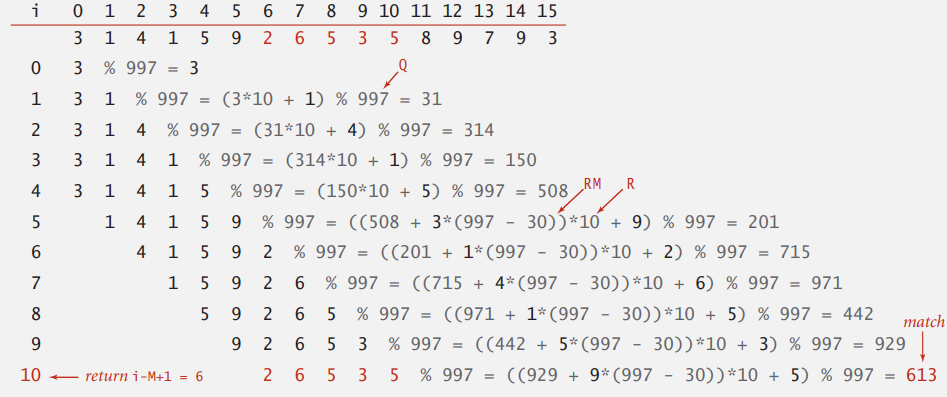

# Substring search

## Introduction

## Brute-Force


```java
public static int search(String pat, String txt) {
    int M = pat.length();
    int N = txt.length();
    for (int i = 0; i <= N - M; i++) {
        int j;
        for (j = 0; j < M; j++) {
            if (txt.charAt(i+j) != pat.charAt(j))
                break;
            if (j == M)
                return i; // index in text where pattern starts
        }
    }
    return N;	// not found
}
```

### BF worst case

極端情況下，假設 text 是 `aaaaaab`，pattern 是 `aaab` 每次都需要比對 $M$ 個字符，總共比對 $N - M + 1$ 次，時間複雜度 $O(N \times M)$ 

```
aaaaaab
aaab
 aaab
  aaab
   aaab
```

## Rabin-Karp

RK 算法的思路是，將 text 中的 $N - M + 1$ 個子串做 hashing，然後逐個與 pattern 的 hash 值做比較  


### Hash function

- **使用 K 進制表示子串，再轉成十進制**；例如假設只有 `a` ~ `z` 映射到 0 ~ 25 ，若字串為 `cba`，hash 值為 $2 * 26 ^ 2 + 1 * 26^1 + 0 * 26^0 = 1353$ 
- 第二種，**Horner’s method**

```java
// 計算 key[0..M-1] 的 hash
// R 基數
private long hash(String key, int M) {
    long h = 0;
    for (int j = 0; j < M; j++) {
        h = (h * R + key.charAt(j)) % Q;
    }
    return h;
}
```

Horner’s method 對字串進行 hash，會比 BF 還慢，因為 hash 需要走訪每個字符，比單純對字符做比較還耗時，因此 RK 發明了一種能在**常數時間內計算出 $M$ 個字符的子字串 hash 值的方法**

### Efficiently compute the hash function

RK 算法的關鍵是，常數時間內計算子字串 hash 值，利用相鄰的二個子串的關係，將子串向右移等於減去第一個數字的值，乘以基數 $R$，再加上最後一個數字的值；透過這種方式能在常數時間不斷的向右一個一個的計算 hash


```
  4 1 5 9 2 6 7
  4 1 5
    1 5 9

  4 1 5		current value
- 4 0 0		減去開頭位數
    1 5     
  * 1 0		乘以基數
    1 5 0	
      + 9	加新的尾數
    1 5 9	
```

### Implement



```java
public class RabinKarp {
    private long patHash;	// pattern hash value
    private int M;			// pattern length
    private long Q;			// modulus
    private int R;			// radix
    private long RM;		// R^(M-1) % Q
    
    public RabinKarp(String pat) {
        M = pat.length();
        R = 26;
        Q = longRamndomPrime();
        
        // 先計算 R^(M-1) mod Q
        RM = 1;
        for (int i = 1; i < M-1; i++) {
            RM = (R * RM) % Q;
        }
        patHash = hash(apt, M);
    }
    
    public int search(String txt) {
        int N = txt.length();
        int txtHash = hash(txt, M);
        if (patHash == txtHash) return 0;
        for (int i = M; i < N; i++) {
            txtHash = (txtHash + Q - RM*txt.chatAt(i-M) % Q) % Q;
            txtHash = (txtHash*R + txt.charAt(i)) % Q;
            if (patHash == txtHash) return i - M + 1;
        }
        return N;
    }
    
	private long hash(String key, int M) {
        /* as previous */
    }
}
```

### Rabin-Karp analysis

**蒙地卡羅版本**，選擇一個足夠大的 modulus $Q$ (但不能大到造成 overflow)，發生雜湊衝突的機率為 $\dfrac{1}{Q}$  

**Las Vegas 版本**，在 hash 值相同時，再暴力比對子串與模式串以確保結果正確

