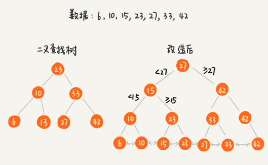
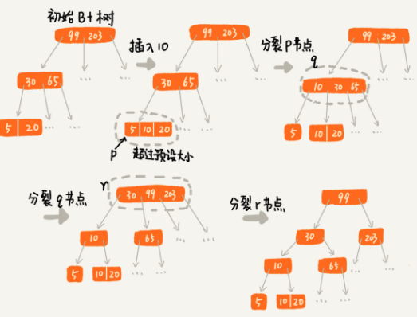
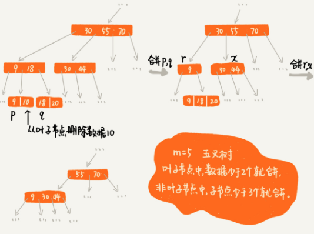

# B+Tree

B+ Tree 是由 binary search tree 改進而來，應用在資料庫與 OS 檔案系統中，以資料庫而言會需要

- `select * from table where id = 1234`
- `select * from table where id > 1234 and id < 5678`

也就是根據值與值的區間來查找資料，因此我們可以考慮以下幾種資料結構

- Hash table，搜尋的時間複雜度 $O(1)$，但無法支持區間查找
- Balance search tree，搜尋的時間複雜度 $O(logN)$，但無法支持區間查找
  - 提供有序操作, ceil, floor, rank 不等於區間查找
- Skip list 可以支持快速插入、搜尋、刪除，時間複雜度 $O(logN)$，也支持區間搜尋
  - 但其實資料庫與 OS 檔案系統用的是 B+ Tree，因為 B+ Tree 比 Skip list 更早被發明出來，所以當初是採用 B+ Tree

## B+ Tree 結構

### 支持區間查找

非葉子節點只儲存索引，不儲存資料本身；資料都儲存在葉子節點，並將所有葉子節點串在一條串列上，串列的資料是有序排列的

要查找某了區間的值，只要拿起始值在樹中搜尋，直到搜尋到某個葉子節點後，再順著串列往後走訪直到串列中節點的值大於區間的終止值。

### 降低 IO 操作

資料庫與 OS 的檔案容量較大，需要儲存在硬碟中，因此搜尋資料過程中走訪節點就有硬碟 IO 操作，導致非常耗時，為了減少 IO 操作次數，就需要降低樹的高度，因此每個節點不能只存二個節點，而是 m (多)個節點；假設 m 為 100，就算為一億筆資料構建索引也只需要 3 次 IO 操作(根結點通常還是存在記憶體中)  

那 m 的大小設計為多少比較合適呢? 不管是記憶體或是硬碟中的資料，作業系統都是按頁(通常一頁 4 KB)來讀取的，因此設計 m 的大小時需要讓每個節點的大小等於一個頁的大小，讀取一個節點只需要一次 IO 操作  

## B+ Tree 操作

前面講到索引應用在資料庫，那對資料庫的資料構造索引時有沒有缺點呢? 答案是在插入時速度會變慢，原因在於每次的寫入過程都需要更新索引(維持 B+ Tree 的結構)，這就是索引的缺點  

對於一個 B+ Tree 而言，m 值是根據頁的大小事先計算好的，也就是說每個節點最多只能有 m 個子節點，但在插入資料過程中可能導致子節點個數超過 m，而讀取這個節點就會需要多次 IO 操作，為了避免這個問題，就需要維持B+ Tree 的結構

### 節點分裂 split

節點超過 m 個就進行分裂，分裂後父節點的子節點也可能超過 m 個，所以分裂會由下往上

### 節點合併 borrow

索引不只會讓插入資料變慢，刪除資料也會受影響，因為刪除資料會導致某些節點的子節點數量非常少，而影響搜尋的效率；因此需要設定一個閥值，B+ Tree 的閥值為 $\dfrac{m}{2}$ ，若節點的子節點數量少於  $\dfrac{m}{2}$ 就跟兄弟節點進行合併

## Summary

B+ Tree 的特點

- 每個節點的子節點數不超過 $m$，也不可少於 $\dfrac{m}{2}$
  - 除了根節點可以少於 $\dfrac{m}{2}$
- m 元樹只指儲存索引，不儲存資料本身
- 透過串列連接葉子節點，支援搜尋區間值
- 通常根節點儲存在記憶體，其他節點存在硬碟

B Tree

- B-Tree = B- 樹 = B Tree = B 樹，這個 `-` 只是連接符號跟 B+ Tree 的 `+` 不同
- B Tree 的節點會儲存資料本身
- B Tree 的葉子節點不使用串列連接
- 綜合以上，B Tree 就是一個子節點數量不可少於 $\dfrac{m}{2}$ 的 m 元樹

思考

- B+ Tree 連接葉子節點的串列是單向還是雙向?
  - 雙向，以支援 DESC 操作
- 用串列連接葉子節點就能支持按區間查詢；其實 Hash table 與 Linked list 常常搭配使用，如果把這二者結合，那 Hash table 能不能支援按區間值搜尋呢?
  - 可以，但插入時就需要維持串列的有序性，時間複雜度 $O(N)$