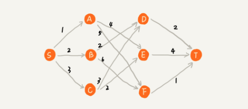

# Greddy

## 概念

貪心算法是四大算法思想其中之一，困難點在於如何將待解決的問題抽象成貪心算法的模型，當看到什麼樣的問題，我們需要聯想到貪心算法呢?

在應用的步驟上，

1. 當針對一組資料，定義了期望值與限制值，希望能從中選出幾個資料，在限制的範圍內，期望值最大
2. 嘗試看這個問題是否能用貪心算法解決；每次選擇對貢獻值同等中，期望值最大的資料
3. 驗證結果是否為最優；貪心算法的證明複雜，實際應用中，能解決的問題的正確性都較明顯，可以舉一些例子驗證即可

### 錯誤



以這個圖而言，若使用貪心算法求最短路徑為 `S -> A -> E -> T` 長度為 9 ，但正確答案是 `S -> B -> D -> T` 長度為 6  

錯誤的原因是，前面的選擇會限制後面的選擇；導致無法找出全局最優解

## 應用

掌握貪心算法還是需要多練習，以下看幾個例子

### 1. 分糖果

有 m 個糖果和 n 個小孩，糖果的大小不同從 $s_1$ … $s_m$，每個小孩的需求也不同，從 $g_1$ … $g_m$，如何分配糖果以滿足最多小孩?  

把這個問題抽象為，在限制值 m 個糖果個數內，讓滿足的小孩個數(期望值)最多  

對一個小孩而言，如果用小糖果能滿足就不需要用大糖果，儘量降低對限制值的貢獻；每次都從需求最小的小孩開始分配，因為滿足一個需求小的和需求大的對期望值貢獻是一樣的

### 2. 找零錢

有 1 、 2 、 5 、 10 、 50 、 100，張數分別為 c1、c2、c5、c10、c20、c50 現在要用這些錢來付 K 元，最少要用多少張?  

在貢獻相同期望值(張數)下，希望多貢獻點金額  

其實找零錢使用貪心算法會有錯誤，例如有 100、99、1，要找 396，正確答案是 4 個 99，但貪心算法會求出 3 個 100、96 個 1 元

### 3. 區間覆蓋

有 n 個區間，每個區間的起始值與結束值不同，在這 n 個區間中選出一部分，不可互相重疊況下(允許端點重疊)，最多選出多少個區間?  

```
區間      [6,8] [2,4] [3,5] [1,5] [5,9] [8,10]
不相交區間 [2,4] [6,8] [8,10]
```

解決思路是，設所有區間的最左端為 `lmin`，最右端為 `rmax` ，選擇不相交的區間將 `[lmin,rmax]` 覆蓋；首先將所有區間依照起始點大小排序，每次選擇和前面已覆蓋區間不重疊的，且結束值(限制值)最小的，讓剩下還沒覆蓋的區間盡量大，就可以放更多區間  

任務調度、教師排課都是類似的思路