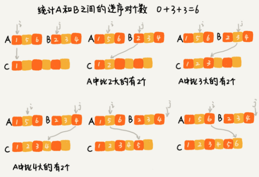

# Divide and Conquer

分治算法，是一種處理問題的思想，常常配合遞迴這種編碼技巧使用，通常每一層遞迴的計算過程會包括

- **分解**，將原問題分解為一系列子問題
- **解決**，當子問題足夠小時直接求解
- **合併**，將子問題的答案合併為源問題的答案


分治算法解決的問題，需要滿足以下條件

- 原問題與分解的子問題具有相同的模式
- 子問題可以獨立求解，彼此之間沒有相關性；這點是和 DP 的明顯區別
- 具有分解的終止條件，也就是子問題足夠小時能夠求解
- 子問題能夠合併成原問題，且合併做複雜度不能太高


### 應用

有序度與逆序度的概念  

完全有序的 n 個數的有序度是 $n \times (n-1) / 2$，逆序度為 0；相反倒序排列的有序度為 0，逆序度為 $n \times (n-1)/2$

```
2 4 3 1 5 6
(2 1), (4 3), (4 1), (3 1)
```


#### 1. 如何法求解逆序數列個數?

BF 算法，每個數字都與後面的數字做比較，時間複雜度 $O(N^2)$  

使用分治算法，假設求陣列 A，可以將其分成 A1 與 A2，分別計算 A1 的逆序數列個數 K1 與 A2 的逆序數列個數 K2，再計算 A1 與 A2 之間的逆序數對個數 K3，那陣列 A的逆序數對個數為 K1 + K2 + K3  

藉由 Merge sort，在 merge 的操作中累計逆序數對個數



```java
public class MergeSortCount {
    private static int count;

    public static int count(Comparable[] a) {
        count = 0;
        Comparable[] aux = new Comparable[a.length];
        count(a, aux, 0, a.length - 1);

        return count;
    }

    public static void count(Comparable[] a, Comparable[] aux, int lo, int hi) {
        if (hi <= lo) return;
        int mid = lo + (hi - lo) / 2;
        count(a, aux, lo, mid);
        count(a, aux, mid + 1, hi);
        merge(a, aux, lo, mid, hi);
    }

    private static void merge(Comparable[] a, Comparable[] aux, int lo, int mid, int hi) {
        for (int k = lo; k <= hi; k++) {
            aux[k] = a[k];
        }

        int i = lo, j = mid+1;
        for (int k = lo; k <= hi; k++) {
            if (i > mid) {
                a[k] = aux[j++];
            } else if (j > hi) {
                a[k] = aux[i++];
            } else if (less(aux[j], aux[i])) {
                a[k] = aux[j++];
                // lo ~ mid 區間有 mid - i + 1 個數字比 aux[j] 大
                count += mid - i + 1;
            } else {
                a[k] = aux[i++];
            }
        }
    }

    private static boolean less(Comparable v, Comparable w) {
        return v.compareTo(w) < 0;
    }
}    
```


#### 2. 二維平面上有 n 個點，計算距離最近的點對

#### 3. 有二個 n\*n 的矩陣 A、B，如何快速求解二個矩陣的乘積 C=A*B？