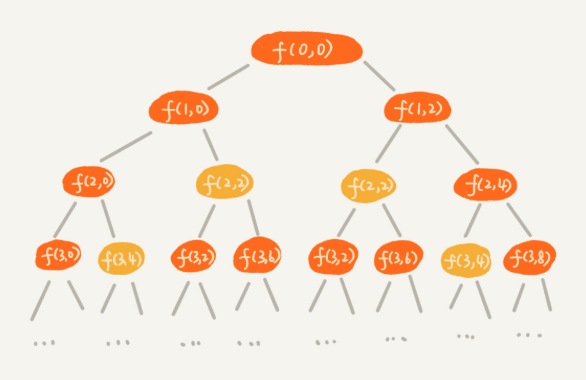
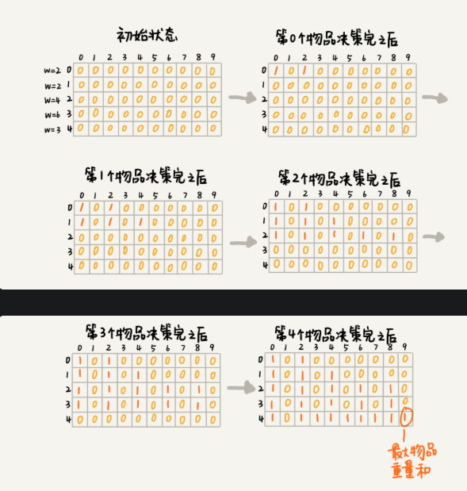
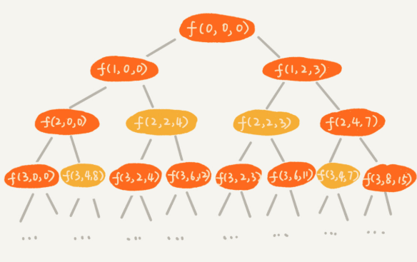

# Dynamic Programming 1

## 0-1 背包問題

之前用回溯算法是窮舉所有可能的裝法，但複雜度是指數級別

```JAVA
private int maxW = Integer.MIN_VALUE;
private int[] weight = {2, 2, 4, 6, 3}; // 物品重量
private int n = 5;	// 物品個數
private int w = 9;	// 背包限重

public void f(int i, int cw) {
    if (i == n || cw == w) {
        if (cw > maxW) {
            maxW = cw;
        }
        return;
    }
    
    f(i+1, cw);
    if (cw + weight[i] <= w) {
        f(i+1, cw + weight[i]);
    }
}
```



用遞迴樹表示遞迴的過程，每個節點表示一種狀態，比如 `f(2,2)` 表示即將決策第 2 個物品是否裝入背包，決策前的背包目前重量是 2  

遞迴樹中，某些子問題的求解是重複的，重複狀態的子節點也會是重複的，因此可以使用快取的方式避免多餘計算

```java
private int maxW = Integer.MIN_VALUE;
private int[] weight = {2, 2, 4, 6, 3}; // 物品重量
private int n = 5;	// 物品個數
private int w = 9;	// 背包限重
private boolean[][] mem = new boolean[n][w+1];

public void f(int i, int cw) {
    if (i == n || cw == w) {
        if (cw > maxW) {
            maxW = cw;
        }
        return;
    }
    
    if (mem[i][cw] == true) {	// 重複計算
        return;
    }
    mem[i][cw] = true;	// 紀錄 (i, cw) 狀態

    f(i+1, cw);
    if (cw + weight[i] <= w) {
        f(i+1, cw + weight[i]);
    }
}
```


## 動態規劃

將整個求解過程分為 n 個階段，某個階段會決策一個物品是否放到背包中，決策完後背包的重量會有多種情況，對應到遞迴樹中就是不同的節點  

將每一層重複的狀態(節點)合併，只記錄不同的狀態，並**基於上一層的狀態集合來推導下一層的狀態集合，動態的往前推進**；透過合併每一層重複的狀態，保證了每一層狀態的種類不超過 w 個，避免了每層狀態數量的指數型成長  

透過一個二維陣列來記錄每層的各種狀態

- 第 0 個
  - 裝 `states[0][2] = true`
  - 不裝 `states[0][0] = true`
- 第 1 個物品基於之前的背包狀態
  - 有三種狀態 0(0+0), 2(0+2, 2+0), 4(2+2)
  - `states[1][0] = true`
  - `states[1][2] = true`
  - `states[1][4] = true`
- 檢查完所有物品後，`states` 狀態陣列就計算完成



```java
// weight 物品重量, n 物品數, w 背包限重
public int knapsack(int[] weight, int n, int w) {
    boolean[][] states = new boolean[n][w+1];
    states[0][0] = true;	// 第一行資料要特殊處理，可以用哨兵方式優化
    if (wieght[0] <= w) {
        state[0][weight[0]] = true;
    }
    
    for (int i = 1; i < n; i++) {	// DP 狀態轉移，基於上一層的(重量)狀態做推導
        for (int j = 0; j <= w; j++) {	// 不放入第 i 個物品
            if (states[i-1][j] == true) {
                states[i][j] = states[i-1][j];
            }
        }
        for (int j = 0; j <= w-weight[i]; j++) {	// 放入第 i 個物品
            if (states[i-1][j] == true) {			// j 表示重量，只更新狀態到 w-當前物品重量即可，因為最多只能再放該重量
                states[i][j+weight[i]] = true;
            }
        }
    }
    for (int i = w; i >= 0; --i) {
        if (states[n-1][i] == true) {
            return i;
        }
    }
    return 0;
}
```

前面提到使用回溯算法的複雜度是 $O(2^n)$  

而動態規劃的時間複雜度為，程式碼中的二層迴圈 $O(n*w)$  

假設有 10000 個物品，重量分布在 1 ~ 15000 之間，背包限重是 30000，如果用回溯算法時間複雜度為 $2^10000$，如果用 DP 則是 $10000 * 30000$，比起來小很多  

### 空間優化

上一個做法需要額外的 $n * (w-1)$ 陣列，因此有時會說 DP 是空間換時間的作法  

有一種方式優化，只需要 $w + 1$ 大小的一維陣列

```java
public static int kanpsack2(int[] items, int n, int w) {
    boolean[] states = new boolean[w+1];
    states[0] = true;
    if (items[0] <= w) {
        states[items[0]] = true;
    }
    for (int i = 1; i < n; i++) {
        for (int j = w-item[i]; j >= 0; j--) {	// 放入第 i 個物品，由大到小處理重量
            if (states[j] == true) {
                states[j+items[i]] = true;
            }
        }
    }
    for (int i = w; i >= 0; i--) {
        if (states[i] == true) {
            return i;
        }
    }
    return 0;
}
```

> 比如 j = 0, item[i] = 5, w=10，如果正向循环，j=0 时会设置 state[5] = true, 而当遍历至 j=5时，由于 state[5]=true，会设置 state[10] = true，但是实际上将 5 这个重量使用了两次，所以导致了重量的重复使用

重量 j 是由大到小處理，因為不同層(物品)的狀態(重量)都在同一維陣列，若由小到大處理會造成無法確認是上一層的狀態，還是當前層所更新的狀態

## 0-1 背包問題進階

除了物品重量與背包重量，增加**物品價值**這個變數，在不超過限重的情況下，背包能裝的最大物品價值為?  

回溯算法

```java
private int maxV = Integer.MIN_VALUE;
private int[] items = {2, 2, 4, 6, 3};	// 物品重量
private int[] value = {3, 4, 8, 9, 6};	// 物品價值
private int n = 5;	// 個數
private int w = 9;	// 背包限重

public void f(int i, int cw, int cv) {
    if (i == n || cw == w) {
        if (cv > maxV) {
            maxV = cv;
        }
        return;
    }
    
    f(i+1, cw, cv);
    if (cw + items[i] <= w) {
        f(i+1, cw+items[i], cv+value[i]);
    }
}
```



將遞迴過程化成遞迴樹如上，有幾個節點如 `f(2,2,4)`、`f(2,2,3)` 在背包物品重量相同下，可以捨棄價值較低的狀態，只需要沿著價值較高的路線往下決策即可  

**動態規劃**，一樣將整個求解過程分為 n 個階段，某個階段會決策一個物品是否放到背包中，決策完後背包的重量與價值會有多種情況  

使用一個 `states[n][w+1]` 記錄每層的狀態，但不再是 boolean 類型二維陣列，而是當前狀態對應的最大價值；將每一層中 `(i, cw)` 狀態(節點)重複的合併，只記錄 `cv` 最大的狀態，然後基於這些狀態來推導下一層的狀態

```java
public static int knapsack3(int[] weight, int[] value, int n, int w) {
    int[][] states = new int[n][w+1];
    for (int i = 0; i < n; i++) {	// 初始化
        for (int j = 0; j < w+1; j++) {
            states[i][j] = -1;
        }
    }
    
    states[0][0] = 0;
    if (weight[0] <= w) {
        states[0][weight[0]] = value[0];
    }
    
    for (int i = 1; i < n; i++) {	// DP，狀態轉移
        for (int j = 0; j <= w; j++) {	// 不選擇第 i 個物品
            if (states[i-1][weight[j]] >= 0) {
                states[i][j] = states[i-1][j];
            }
        }
        
        for (int j = 0; j <= w-weight[i]; j++) {	// 選擇第 i 個物品
            if (states[i-1][j] >= 0) {
            	int v = states[i-1][j] + value[i];
                if (v > states[i][j+weight[i]]) {	// 只記錄最大價值
                    states[i][j+weight[i]] = v;
                }
            }
        }
    }
    
    int maxValue = -1;
    for (int j = 0; j <= w; j++) {	// 找出最大值
        if (states[n-1][j] > maxValue) {
            maxValue = states[n-1][j];
        }
    }
    return maxValue;
}
```


## 應用

> 淘宝的“双十一”购物节有各种促销活动，比如“满 200 元减 50 元”。假设你女朋友的购物车中有 n 个（n>100）想买的商品，她希望从里面选几个，在凑够满减条件的前提下，让选出来的商品价格总和最大程度地接近满减条件（200 元），这样就可以极大限度地“薅羊毛”。作为程序员的你，能不能编个代码来帮她搞定呢？

回溯算法可以窮舉所有組合，找大於等於 200 且最接近 200 的組合，但時間複雜度高  

DP 的思路則是和前面問題相比，將重量換成了價格，購物車有 n 個商品，對每個商品進行決策是否購買，每次決策後有不同的狀態集合；這裡還是用 `states[n][x]` 來記錄狀態，不過 `x` 是?  

在背包問題中，要找的是小於等於 `w` 的最大值，`x` 就是 `w+1`；而限這個問題則是找大於等於 200 免運中最小的，如果買的東西太貴，那就沒差那一點運費了，因此 `x`  可以設為 1001

另外，還需要找出這個最小總價格是對應那些商品，可以利用 `states` 反推出來

```java
// items 商品價格, n 商品數, p 免運價格
public static void solve(int[] items, int n, int p) {
    boolean[][] states = new boolean[n][3 * p + 1];
    
    if (items[0] <= 3*p) {	// 第一行特殊處理
	    states[0][items[0]] = true;
    }
    
    for (int i = 1; i < n; i++) {	// DP
    	for (int j = 0; j <= 3*p; j++) {	// 不買第 i 個商品
            if (states[i-1][j] == true) {
                states[i][j] = states[i-1][j];
            }
        }
        
        for (int j = 0; j <= 3*p - items[i]; j++) {	// 買第 i 個商品
            if (states[i-1][j] == true) {
                states[i][j+items[i]] = true;
            }
        }
    }
    
    int j;
    for (int j = w; j < 3*p+1; j++) {	// 找出大於等於 w 的最小值
        if (states[n-1][j] == true) {
            break;
        }
    }
    
    if (j == 3*p) {	// 無解
        return
    }
    for (int i = n-1; i > 0; i--) {
		if (j - items[i] >= 0 && states[i-1][j-items[i]] == true) {
            System.out.print(item[i] + " ");	// 買第 i 個商品
            j = j - items[i];
        } // else 沒有買第 i 個商品
    }
    if (j != 0) {
        System.out.println(items[0]);
    }
}
```

解釋一下後半段，狀態 `(i, j)` 只有可能基於 `(i-1, j)`(不買第 i 個商品)、`(i-1, j-items[i])` (買第 i 個商品)推導出來；從中選擇一個可達的狀態(如果二個都可達可以隨意選)，然後繼續檢查其他商品是否有選擇購買


https://www.itread01.com/content/1573700643.html