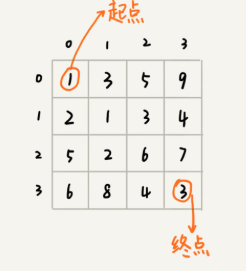

# Dynamic Programming 2

## 一個模型三個特徵

如何判斷一個問題是否可以用 DP 解決? 什麼問題適合用 DP 解決? 如何找到能用 DP 解決的問題的規律? 

### 多階段決策最優解模型

動態規劃一般是用來解決最優問題，解決過程中會經歷多個決策階段，每個階段都對應著一組狀態。我們尋找一組決策序列，能夠產生最優值


### 1. 最優子結構

optimal substructure  

問題的最優解，包含子問題的最優解；反過來說就是能透過前面的狀態，推導出後面的狀態

### 2. 無後效性

- 只關心前面階段的狀態值，不關心值是如何被推導出來
- 某階段狀態確定後，不受後續階段的決策影響

### 3. 重複子問題

不同的決策序列，到達某個相同階段時，可能產生重複的狀態

## 範例
> 假设我们有一个 n 乘以 n 的矩阵。矩阵存储的都是正整数。棋子起始位置在左上角，终止位置在右下角。我们将棋子从左上角移动到右下角。每次只能向右或者向下移动一位。从左上角到右下角，会有很多不同的路径可以走。我们把每条路径经过的数字加起来看作路径的长度。那从左上角移动到右下角的最短路径长度是多少呢？



**多階段決策最優解模型**，從 `(0,0)` 走到 `(n-1,n-1)` 要走 $2 \times (n-1)$ 步，也就是有 $2 \times (n-1)$ 個階段，每個階段有向右走或向左走二種決策，且每個階段會對應一個狀態集合；把狀態定義為 `min_dist(i,j)`，表示從 `(0,0)` 到 `(i,j)` 的最短路徑，因此這是一個多階段決策最優解模型  


**最優子結構**，`(i,j)` 只能經由 `(i-1,j)` 或 `(i,j-1)` 到達，也就是說 `(i,j)` 的最小距離可以透過 `(i-1,j)` 與 `(i,j-1)` 推導出來；`min_dist(i, j) = w[i][j] + min(min_dist(i-1, j), min_dist(i, j-1))` 符合最優子結構  

**無後效性**，`(i,j)` 是經由 `(i-1,j)` 或 `(i,j-1)` 到達，我們只關心 `(i-1,j)` 與 `(i,j-1)` 的值，不關心他是透過甚麼路線到達這二個位置；另外，因為只允許往下走或往右走，不能後退，因此前面階段的狀態確定後，不會被後面階段的決策影響；符合無後效性  

**重複子問題**，畫一下遞迴樹就會發現重複的節點，例如 `(1,1)` 可以經由 `(0,1)->(1,1)` 或者 `(1,0)->(1,1)` ，而我們只合併重複的節點，只記錄最短路徑即可；符合重複子問題  

## DP 思路總結

判斷完問題是否能用 DP 解決後，該如何想出解決的思路呢?

### 狀態轉移表法

能用 DP 解的問題，一般都能用 backtracking 暴力解，可以先用 backtracking 解並且畫出對應的遞迴樹，看是否存在重複子問題以及重複子問題如何產生，以觀察規律  

發現重複子問題後，第一種方式是用 backtracking 加上快取備忘錄的方式，第二種方式是用 DP 的狀態轉移表法；二者的執行效率基本相同  

狀態轉移表，是根據決策的過程，分階段的推導狀態表中的每個狀態；大部分狀態表都是二維的，包含行、列、狀態值(可以想成二維陣列)，但如果問題較複雜，可能是多維的狀態表，就不適合用狀態轉移表法，因為不好畫圖表示，而且人腦不擅長思考多維運算  


接下來用狀態轉移表法來解決矩陣最短路徑問題  

#### 1. 回溯算法實現

首先，從起點到終點有很多走法，可以窮舉所有解法以找出最短路徑，如何不遺漏且不重複的窮舉所有走法呢? 可以用回溯算法實現

```java
private int minDist = Integer.MAX_VALUE;

// 呼叫方式 minDistBT(0, 0, dist, w, n);
public void minDistBT(int i, int j, int dist, int[][] w, int n) {
	if (i == n && j == n) {
        if (dist < minDist) {
            minDist = dist;
        }
        return;
    }
    
    if (i < n) {	// 往右走
        minDistBT(i+1, j, dist+w[i][j], w, n);
    }
    
    if (j < n) {	// 往下走
        minDistBT(i, j+1, dist+w[i][j], w, n);
    }
}
```

#### 2. 畫遞迴樹找重複子問題

接下來畫出對應的遞迴樹


遞迴樹中的 `(i,j,dist)`， `i`、`j` 表示行與列，`dist` 表示路徑長總和；對於 `(i,j)` 重複的點，只需要選擇最小的 `dist` 繼續遞迴求解，其他節點可以捨棄  

#### 3. 畫狀態轉移表

接下來嘗試用狀態表推導出各位置的最短路徑


#### 4. 將表翻譯成程式碼

最後將推導的過程翻譯成程式碼

```java
public int minDistDP(int[][] matrix, int n) {
	int[][] states = new int[n][n];
    int sum = 0;
    for (int i = 0; i < n; i++) {
        sum += matrix[i][0];
        states[i][0] = sum;
    }
    sum = 0
    for (int j = 0; j < n; j++) {
        sum += matrix[0][j];
        states[0][j] = sum;
    }
    
    for (int i = 1; i < n; i++) {
        for (int j = 1; j < n; j++) {
            states[i][j] = matrix[i][j] + Math.min(states[i-1][j], states[i][j-1]);
        }
    }
    
    return states[n-1][n-1];
}
```


### 狀態轉移方程法

#### 1. 找最優子結構

狀態轉移方程法是透過最優子結構的特性，思考問題如何透過仔問題來遞迴求解，有點類似遞迴的解題思路；一般可透過二種實作方式，**遞迴 + 備忘錄快取**與**迭代遞推**


#### 2. 寫狀態轉移方程式

以前面例子而言，狀態轉移方程式為

```
states[i][j] = matrix[i][j] + Math.min(states[i-1][j], states[i][j-1]);
```

狀態轉移方程式是解 DP 問題的關鍵，如果寫出狀態轉移方程式基本上 DP 問題已經解了一半，不過很多 DP 的問題的狀態不好定義，因此狀態轉移方程式也不容易想到  


#### 3. 將狀態轉移方程式翻譯成程式碼

這裡使用 遞迴 + 備忘錄快取 來實現

```java
private int[][] matrix = {{1，3，5，9}, {2，1，3，4}，{5，2，6，7}，{6，8，4，3}};
private int n = 4;
private int[][] mem = new int[4][4];
public int minDist(int i, int j) {
    if (i == 0 && j == 0) {
        return matrix[0][0];
    }
    if (mem[i][j] > 0) {
        return mem[i][j];
    }
    
    int minLeft = Integer.MAX_VALUE;
    if (j-1 > 0) {
        minLeft = minDist(i, j-1);
    }
    int minTop = Integer.MAX_VALUE;
    if (i-1 > 0) {
        minTop = minDist(i-1, j);
    }
    
    int currentMinDist = matrix[i][j] + min(minLeft, minTop);
	mem[i][j] = currentMinDist;
    return currentMinDist;
}
```

使用迭代遞推的程式碼與前面狀態轉移表法相同，只是思考過程不同  

關於狀態轉移表法與狀態轉移方程法，不是每個問題都同時適合用這二種思考方式，要選擇適合的


## 四種算法思想比較

大致上能將回溯、動態規劃、貪心分為一類，分治為另一類，因為前三者都能抽象為多階段決策最優解模型  

回溯算法算萬用，基本上能用動態規劃與貪心解決的問題，回溯算法也可以解決；回溯算法就相當於窮舉所有情況找最優解，但時間複雜度是指數級別  


動態規劃比回溯高效，但問題必須符合前面所說的三個特性；其中重複子問題特性上，動態規劃與分治算法有明顯區別，分治算法要求分割成的子問題不能有重複子問題，而動態規劃剛好相反，它的效率建立在解決回溯算法中的重複子問題上  


貪心算法則是動態規劃的一種特殊情況，效率更高，但能解的問題也更受限；貪心能解決的問題特性需要滿足最優子結構、無後效性與貪心選擇性，前面二個特性與動態規劃無異，而貪心選擇性是透過每一次的局部最優選擇能夠得到全局最優解