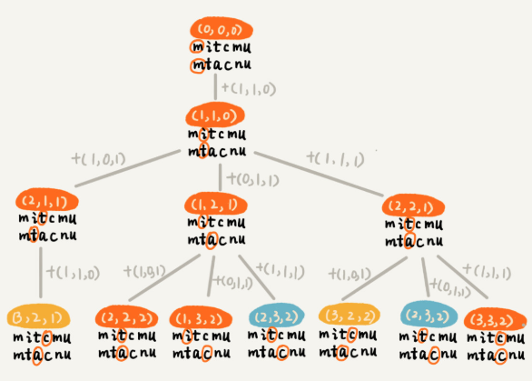
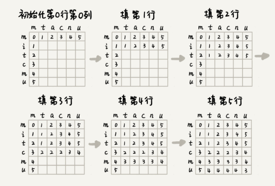

# Dynamic Programming 3

## Levenshtein distance

依次檢查每個字符是否匹配，如果匹配該如何處理? 不匹配又該如何處理? 符合多階段決策最優解模型  

先用回溯解決，回溯是一個遞迴處理的過程，若 `a[i]` 與 `b[j]` 匹配就繼續遞迴檢查 `a[i+1]` 與 `b[j+1]`；如果不匹配則有多種處理方式

- 刪除 `a[i]`，繼續遞迴檢查 `a[i+1]` 與 `b[j]`
- 刪除 `b[j]`，繼續遞迴檢查 `a[i]` 與 `b[j+1]`
- 將 `a[i]` 替換成 `b[j]` 或 `b[j]` 替換成 `a[i]`，繼續遞迴檢查 `a[i+1]` 與 `b[j+1]`
- 在 `a[i]` 前加一個和 `b[j]` 相同的字符，繼續遞迴檢查 `a[i]` 與 `b[j+1]`
- 在 `b[j]` 前加一個和 `a[i]` 相同的字符，繼續遞迴檢查 `a[i+1]` 與 `b[j]`
  - 當檢查到 `a[1]` `b[1]` 時，可以在 `b[1]` 前加一個 `t`，然後檢查 `a[1+1]` 與 `b[1]`

```
a: m t a
b: m   a
```


```java
private char[] a = "mitcmu".toCharArray();
private char[] b = "mtachu".toCharArray();
private int n = 6;
private int m = 6;
private int minDist = Integer.MAX_VALUE;

public lwstBT(int i, int j, int edist) {
    if (i == n || j == m) {
        if (i < n) edist += (n-i);
        if (j < m) edist += (m-j);
        if (edist < minDist) {
            minDist = edist;
        }
        return;
    }
    
    if (a[i] == b[j]) {
        lwstBT(i+1, j+1, edist);
    } else {
        lwstBT(i+1, j, edist+1);	// 删除a[i]或者b[j]前加字符
        lwstBT(i, j-1, edist+1);	// 删除b[j]或者a[i]前加字符
        lwstBT(i+1, j+1, edist+1);	// a[i]和b[j]替换為相同字符
    }
}
```


再來畫出對應遞迴樹



遞迴樹中有 `(i,j,edist)`，若 `i` `j` 相同，只需要保留最小的 `edist` 即可  

在之前 n 乘 n 矩陣中，要到 `(i,j)` 只能由上面或左邊到達；但現在這個問題比較複雜，狀態 `(i,j)` 可能從 `(i-1, j)`、`(i, j-1)`、`(i-1, j-1)` 中轉移過來，因此狀態轉移方程為

```
if a[i] == b[j]
  min_edist(i, j) = min(edist(i-1, j)+1, edist(i, j-1)+1, edist(i-1, j-1))
  
if a[i] != b[j]
  min_edist(i, j) = min(edist(i-1, j)+1, edist(i, j-1)+1, edist(i-1, j-1)+1) 
```


知道狀態轉移的推導方式後，可以畫出狀態轉移表




最後翻譯成程式碼

```java
public int lwstDP(char[] a, int n, char[] b, int m) {
    int[][] minDist = new int[n][m];
    for (int i = 0; i < n; i++) {
        if (a[i] == b[0]) minDist[i][0] = i;
        else if (i != 0) minDist[i][0] = minDist[i-1][0] + 1;
        else minDist[i][0] = 1;	// 第一個字不同
    }
   	for (int j = 0; j < m; j++) {
        if (b[j] == a[0]) minDist[0][j] = j;
        else if (j != 0) minDist[0][j] = minDist[0][j-1] + 1;
        else minDist[0][j] = 1
    }
    
    for (int i = 1; i < n; i++) {
        for (int j = 1; j < m; j++) {
            if (a[i] == b[i]) {
                minDist[i][j] = min(minDist[i-1, j]+1, minDist[i, j-1]+1, minDist[i-1, j-1]);
            } else {
                minDist[i][j] = min(minDist[i-1, j]+1, minDist[i, j-1]+1, minDist[i-1, j-1] + 1);
            }
        }
        return minDist[n-1][m-1];
    }
}

private int min(int x, int y, int z) {
    int min = Integer.MAX_VALUE;
    if (x < min) min = x;
    if (y < min) min = y;
    if (z < min) min = z;
    return min;
}
```


## 最長公共子串長度

longest common substring length  

最長公共子串也屬於編輯長度的一種，只允許增加、刪除二種操作，長度越長代表二個字串越相似  


一樣先用回溯來解決，依序檢查二個字串的字符是否匹配

- 如果 `a[i]` 與 `b[j]` 匹配，則將最長公共子串加一，並繼續檢查 `a[i+1]` 與 `b[j+1]`
- 如果 `a[i]` 與 `b[j]` 不匹配，則有二種方式處理
  - 刪除 `a[i]` 或在 `b[j]` 前加上一個字符 `a[i]`，並繼續檢查 `a[i+1]` 與 `b[j]`
  - 刪除 `b[j]` 或在 `a[i]` 前加上一個字符 `b[j]`，並繼續檢查 `a[i]` 與 `b[j+1]`


因此 `(i,j)` 的 `max_lsc` 可能通過下面三個狀態推導出來

- `(i-1, j-1, max_lcs)`
- `(i-1, j, max_lcs)`
- `(i, j-1, max_lcs)`


狀態方程式

```
if a[i] == b[j]
	max(max_lcs(i-1, j-1)+1, max_lcs(i-1, j), max_lcs(i, j-1));
if a[i] != b[j]
	max(max_lcs(i-1, j-1), max_lcs(i-1, j), max_lcs(i, j-1));
```


實作

```java
public int lcs(char[] a, int n, char[] b, int b) {
    int[][] maxlcs = new int[n][m];
    for (int i = 0; i < n; i++) {
        if (a[i] == b[0]) {
            maxlcs[i][0] = 1;
        } else if (i != 0) {
            maxlcs[i][0] = maxlcs[i-1][0];
        } else {
            maxlcs[i][0] = 0;
        }
    }
    for (int j = 0; j < m; j++) {
        if (b[j] == a[0]) {
            maxlcs[0][b] = 1;
        } else if (j != 0) {
            maxlcs[0][j] = maxlcs[0][j-1];
        } else {
            maxlcs[0][j] = 0;
        }
    }
    
    for (int i = 1; i < n; i++) {
        for (int j = 1; j < m; j++) {
            if (a[i] == b[j]) {
                maxlcs[i][j] = max(maxlcs[i-1][j-1]+1, maxlcs[i-1][j], maxlcs[i][j-1]);
            } else {
                maxlcs[i][j] = max(maxlcs[i-1][j-1], maxlcs[i-1][j], maxlcs[i][j-1]);
            }
        }
    }
    
    return maxlcs[n-1][m-1];
}

private int max(int x, int y, int z) {
    int maxv = Integer.MIN_VALUE;
    if (x > maxv) maxv = x;
    if (y > maxv) maxv = y;
    if (z > maxv) maxv = z;
    
    return maxv;
}
```

