# GEOMETRIC APPLICATIONS OF BSTS

介紹為了解決各種問題而產生的 binary search tree 變種

- 點是否在區間內? > 線段是否相交?
- 二維的 key > 點是否在範圍內? > 多維 kd tree
- 區間是否相交? > 矩形是否相交?

## 1d range search

### 1d range search

symbol table 的其他操作

- Range search: 找 k1, k2 之間所有的 key
- Range count: k1, k2 之間 key 的數量

> 應用在 Database queries

### 1d range search: elementary implementations

| data struct    | insert | range count | renge search |
| -------------- | ------ | ----------- | ------------ |
| unordered list | 1      | N           | N            |
| ordered array  | N      | logN        | logN         |
| goal           | logN   | logN        | logN         |

  

### 1d range count: BST implementation

```java
public int size(Key lo, Key hi)
{
  if (contains(hi)) return rank(hi) - rank(lo) + 1;
  else return rank(hi) - rank(lo);
}
```

### 1d range search: BST implementation

先補充一下中序走訪(左>根>右)，按照大小遍歷所有節點

```java
private void print(Node x)
{
    if (x == null) return;
    print(x.left);
    StdOut.println(x.key);
    print(x.right);
}
```


range search 找到 lo 和 hi 之間所有 keys  
可以用 queue 來儲存符合條件的節點

- lo 小於左子樹節點，遞迴左子樹
- 該節點在 lo, hi 之間，加入該節點
- 右子樹節點大於 hi，遞迴右子樹

```java
public Interable<Key> keys()
{
    return keys(min(), max());
}

public Interable<Key> keys(Key lo, Key hi)
{
    Queue<Key> q = new Queue<>();
    keys(root, q, lo, hi);
    return q;
}

private void keys(Node x, Queue<Key> q, Key lo, Key hi)
{
    if (x == null) return;
    int cmplo = lo.compareTo(x.key);
    int cmphi = hi.compareTo(x.key);
    if(cmplo < 0) keys(x.left, q, lo, hi);
    if (cmplo <= 0 && cmphi >= 0) q.enqueue(x.key);
    if (cmp > 0) keys(x.right, q, lo, hi);
}
```

  

## kd trees

k dimensinonal 指的是 k 維  


### 2-d orthogonal range search

symbol table 的 key 是 2d 的

- 求被方形包含的 keys
- 求被方形包含的 key 數量

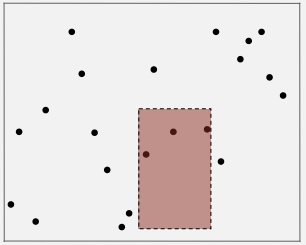 

  

### Space-partitioning trees

幾種用樹結構來表現空間的方式

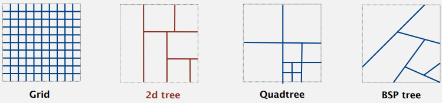

用 Grid 的方式雖簡單但是有缺點

- 如果是 clustered data，集中分布的資料會使那一格用來儲存點資料的 list 太長，會造成效能急遽下降
- 實際上 geometric data 很常出現集群資料


### 2d tree construction

奇數層用垂直線切割，偶數層用水平線切割，這樣的資料結構能夠有效的尋找二維中的的某個範圍

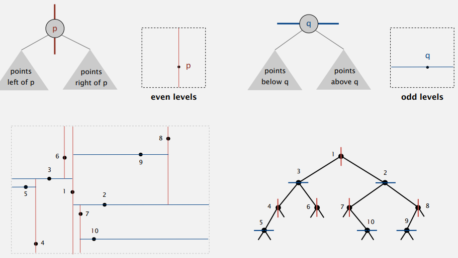

  

### Range search in a 2d tree

- 確認 node 代表的點是否在方形內
- 若方形範圍在點(左/下方)，遞迴確認右子樹(左/下方的點)
- 若方形範圍在點(右/上方)，遞迴確認右子樹(右/上方的點)

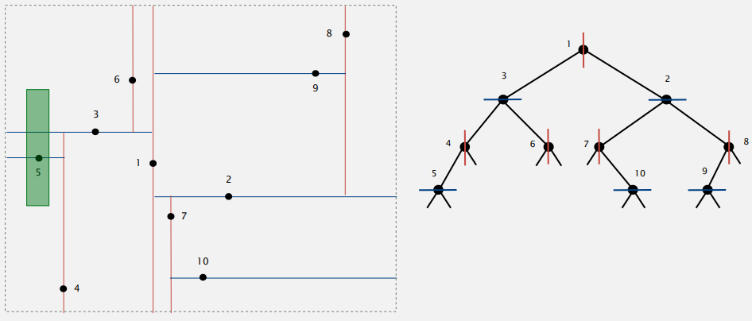

  

### Nearest neighbor search in a 2d tree

另一個類似問題是循找最近的點

- 計算 query point 與 node point 的距離，並紀錄最近距離
- 遞迴計算左子樹(若左/上方可能包含更近的點)
- 遞迴計算右子樹(若右/下方可能包含更近的點)

補充過程 : 

1. 從 root 開始，首先計算 query point 與 1 距離
2. 遞迴左子樹，計算 query point 與 3 的距離，發現 3 比 1 更近，這代表 1 的右側不可能比有點比 3 更近，所以不需要遞迴 root 右子樹

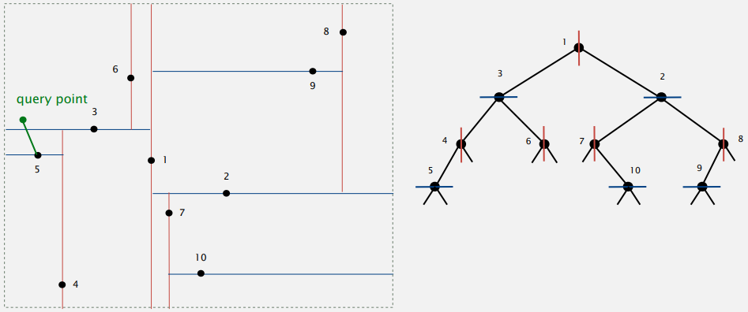

  

### Kd tree

將 2 維擴展到 k 維，雖然是多維但計算中會遞迴分割成 2 維，並使用 2d tree 方式計算；譬如 key 包含 x, y, z ，就分成 (x, y) (x, z) (y, z)

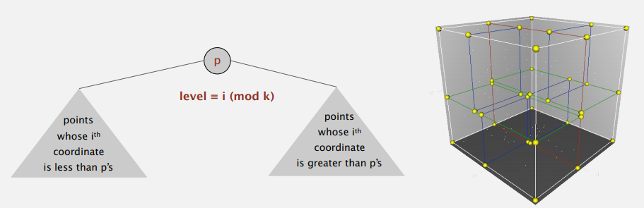

這解決了再多維空間中的 clustered data 問題，因為 clustered 分布的資料會造成運算效能急遽下降

  

## interval search trees

 1d interval search

- Insert an interval (lo, hi)
- Search for an interval (lo, hi)
- Delete an interval(lo, hi)
- **Interval intersecion query** : 輸入 (lo, hi)，搜尋所有(或一個) 相交的區間

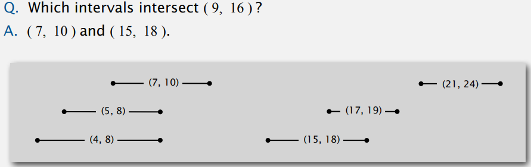


API

```
public class IntervalST<Key extends Comparable<Key, Value>>

IntervalST()
void            put(Key lo, Key hi, Value val)
Value           get(Key lo, Key hi) 
void            delete(Key lo, Key hi)
Iterable<Value> intersects(Key lo, Key hi)
```

  

### Interval search trees

- 每個 node 儲存一個區間資料 (lo, hi)
- 使用 left endpoint 作為 BST 的 key
- 額外儲存子樹中的最大 end point 資料

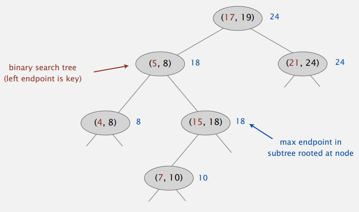

以上圖為例，假設 `put(16, 22)` 就會是 (15, 18) 的右子樹  

  

### Search for an intersection interval implementation

搜尋 (lo, hi) 是否有相交的區間

- 如果節點與搜尋區間相交，則返回該節點
- 若左子樹為空，則搜尋右子樹
- 若左子樹儲存的 max endpoint 比 lo 還小，搜尋右子樹
- 以上皆非，搜尋左子樹

```java
Node x = root;
while (x != null) {
    if      (x.interval.intersects(lo, hi)) return x.interval;
    else if (x.left == null)                x = x.right;
    else if (x.left.max < lo)               x = x.right;
    else                                    x = x.left;
}
return null;
```

  

### Search for an intersecting interval analysis

**Case 1** : 如果搜尋右子樹，則左子樹不會有相交的區間?

**Pf.** : 搜尋右子樹有以下情形

- 左子樹為 null，所以左子樹不會有相交的區間
- 左子樹的 max endpoint 比 lo 還小，所以左子樹所有區間都不會有相交

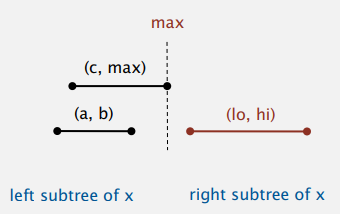

  

**Case 2 :** 如果左子樹沒相交，則右子樹也不會有相交區間?

**Pf. : **

- 如果左邊沒相交代表，左邊最小點 c 大於 hi
- BST 左右子樹是依 left point 大小，所以右子樹所有區間的 left endpoint (例如 a) 都大於 c
- 右子樹所有區間的 left endpoint 都大於 hi，所以右子樹所有區間都不會有相交

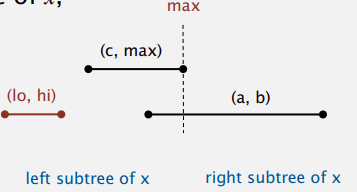

  

### Interval search tree: analysis

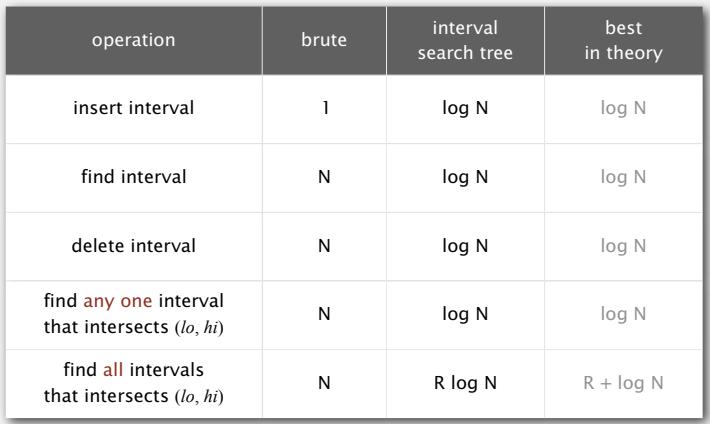

  

## rectangle intersection

### Orthogonal rectangle intersection

找出有相交的矩形(不考慮有重疊的點)?  

暴力解是檢查每一對矩形是否相交  

  

### Orthogonal rectangle intersection : sweep-line algorithm

用一條垂直線由左向右掃描

- 用 interval search tree 紀錄與 sweep line 相交的矩形的 y 區間
- 碰觸到矩形 Left endpoint : search interval (y 區間)，insert interval (y 區間)
- 碰觸到矩形 Right endpoint : delete interval (y 區間)

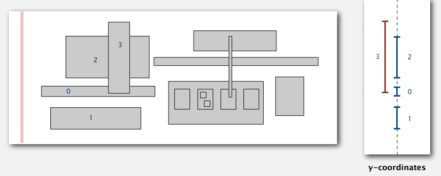

  

### Orthogonal rectangle intersectin: sweep-line analysis

**Proposition** : sweep-line algorithm 在 N 個矩形找出 R 個相交，時間複雜度為 $NlogN$ + $RlogN$

**Pf.** : 

- Put x-coordinates on PQ (or sort) <– $NlogN$

- Insert y-intervlas into ST <– $NlogN$

- Delete y-intervals from ST <– $NlogN$

- Interval searches for y-intervals <– $NlogN$ + $RlogN$

  

### Geometric application of BSTs

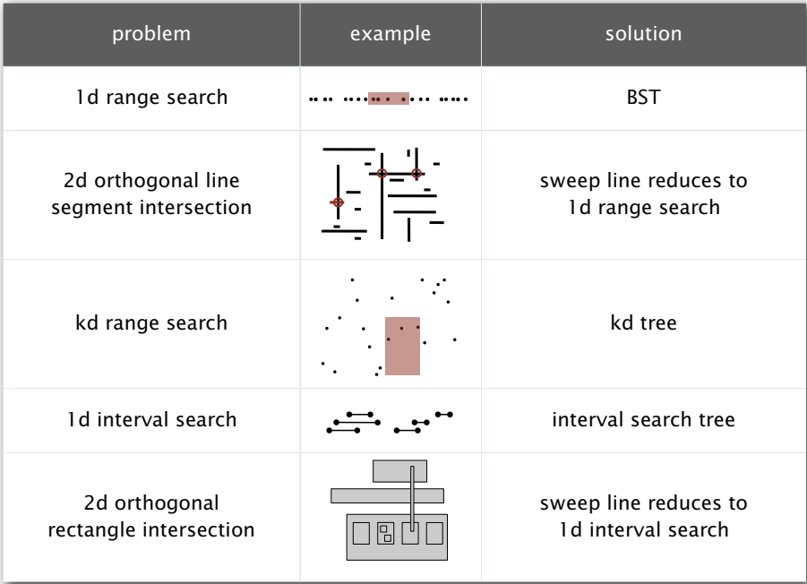

- 基於 1d range search + sweep-line 解決 2d orthigonal line segement intersection search
- 基於 1d interval search + sweep-line 解決 2d orthigonal rectangle intersection